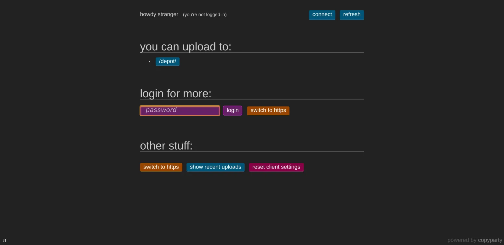
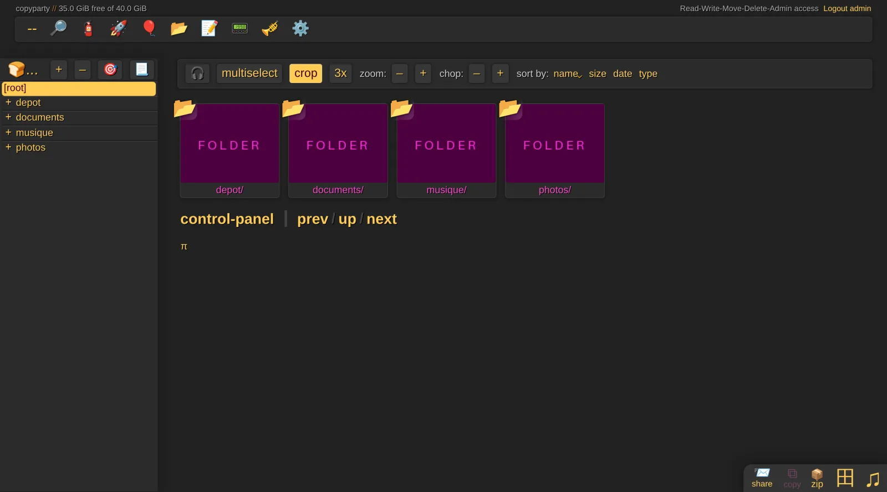
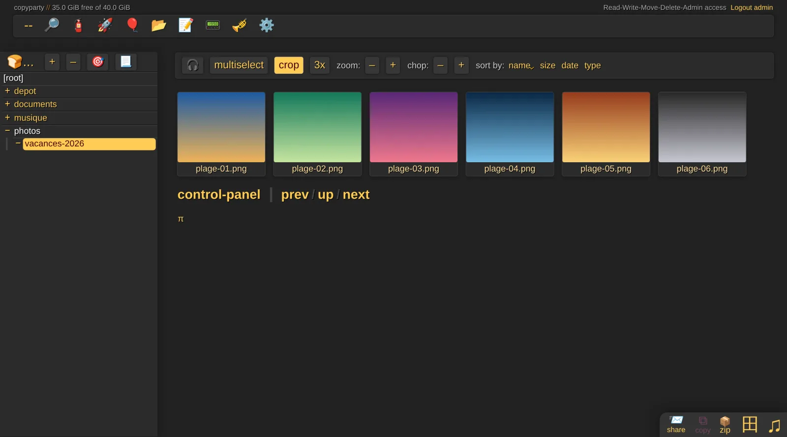
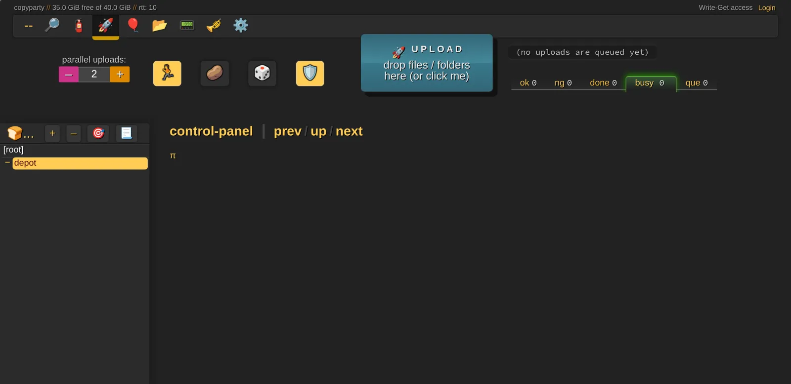
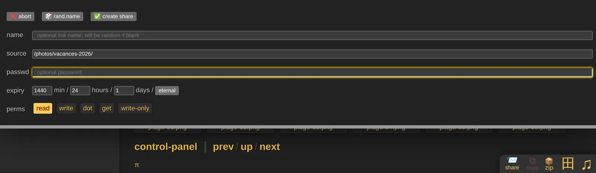

> 💡 **TL;DR**
> - Droppy est archivé depuis 2020. Copyparty, un serveur de fichiers en Python sous licence MIT et très actif, couvre le même besoin et beaucoup plus.
> - Le cas d'usage qui le distingue : un dossier de dépôt où n'importe qui peut t'envoyer des fichiers, sans voir ce qu'il contient, avec un lien direct protégé par une clé.
> - Attention à la configuration par défaut : sans fichier de config, tout le dossier partagé est ouvert en lecture et en écriture à tout le monde.

## Pourquoi remplacer Droppy

J'avais présenté [Droppy](/droppy-partage-images-auto-heberge/) pour partager des captures et des photos sans passer par Imgur. Le problème : son auteur a archivé le projet en octobre 2020. L'image fonctionne encore, mais plus aucune mise à jour ni correctif de sécurité n'arrivera.

Copyparty reprend l'idée et la pousse beaucoup plus loin. C'est un serveur de fichiers écrit en Python par un développeur qui signe 9001, publié sous licence MIT, avec près de 47 000 étoiles sur GitHub et une nouvelle version toutes les deux à trois semaines. Dans le même programme : interface web, envois rapides et reprenables, miniatures, liens de partage, et même WebDAV, SFTP ou FTP si tu en as besoin.

## Table des matières

## Copyparty en bref

Ce qu'on retrouve dans l'interface web :

- **Navigation et téléchargement**, y compris d'un dossier entier en zip ou en tar.
- **Envois par glisser-déposer**, découpés en morceaux et reprenables si la connexion coupe.
- **Miniatures** pour les images, et pour les vidéos et l'audio avec l'image `ac`, qui embarque FFmpeg.
- **Liens de partage** avec mot de passe et date d'expiration.
- **Annulation d'un envoi** : un visiteur peut supprimer ce qu'il vient d'envoyer par erreur, dans un délai de 12 heures par défaut.
- **Recherche** dans les fichiers indexés.

L'interface ne ressemble à aucune autre, avec ses barres d'icônes et ses couleurs vives. On s'y fait vite, et elle reste rapide même avec beaucoup de fichiers.

Si tu cherches plutôt un gestionnaire de fichiers classique, multi-utilisateur, pour organiser ton serveur, [FileBrowser Quantum](/filebrowser-quantum-docker-gestionnaire-fichiers/) est plus adapté. Copyparty brille dès qu'il s'agit de faire circuler des fichiers : en recevoir, en partager, en envoyer de gros.

## Prérequis

- Un serveur Linux avec Docker et Docker Compose. Si tu débutes, mon [guide Docker pour débutants](/docker-debutant-services-auto-heberger/) pose les bases.
- Un dossier **sur disque** à partager, par exemple `/srv/partage`.
- Un reverse proxy si tu veux l'ouvrir sur Internet, comme [Caddy](/caddy-docker-reverse-proxy-guide/).

## Choisir son image

Copyparty publie plusieurs variantes de son image Docker, du plus léger au plus complet :

| Image | Taille | Contenu |
|---|---|---|
| `copyparty/min` | 57 Mo | Copyparty seul |
| `copyparty/im` | 70 Mo | + miniatures d'images et lecture des métadonnées |
| `copyparty/ac` | 163 Mo | + FFmpeg : miniatures vidéo et audio, transcodage. **Recommandée** |
| `copyparty/iv` | 211 Mo | + vips, pour plus de formats de miniatures |
| `copyparty/dj` | 309 Mo | + détection du tempo et de la tonalité des morceaux |

Prends `ac`, et épingle sa version : le projet publie souvent, et un tag explicite évite les surprises.

## Installer Copyparty Docker

Crée un dossier pour le service, avec un sous-dossier `cfg` pour la configuration :

```bash
mkdir -p ~/copyparty/cfg && cd ~/copyparty
```

### Le fichier de configuration

L'image charge tous les fichiers en `.conf` présents dans `/cfg`. Crée `cfg/copyparty.conf` :

```yaml
[global]
  e2dsa             # indexe les fichiers (recherche, annulation d'envoi)
  e2ts              # lit les métadonnées des médias
  shr: /partages    # active les liens de partage
  name: partage     # nom affiché en haut de l'interface
  grid              # affiche les miniatures par défaut

[accounts]
  admin: un-mot-de-passe-solide

[/]
  /w
  accs:
    A: admin        # tout pour admin, rien pour les autres

[/depot]
  /w/depot
  accs:
    wG: *           # tout le monde peut envoyer, sans voir le contenu
    A: admin
  flags:
    fk: 8           # clé de 8 caractères exigée pour télécharger
```

Ce n'est pas tout à fait du YAML : les commentaires doivent être précédés de **deux espaces** avant le `#`.

**Ne lance jamais Copyparty sans ce fichier.** Sans configuration, l'image partage `/w` en lecture **et en écriture** pour n'importe qui. C'est pratique pour un transfert ponctuel entre deux machines, pas pour un service qui reste en ligne.

Ici, deux volumes :

- **`/`** : tout le dossier partagé, réservé à `admin`.
- **`/depot`** : un sous-dossier où n'importe qui peut t'envoyer des fichiers. On y revient plus bas.

### Le docker-compose.yml

```yaml
services:
  copyparty:
    image: copyparty/ac:1.20.24
    container_name: copyparty
    user: "1000:1000"
    restart: unless-stopped
    ports:
      - "3923:3923"
    volumes:
      - ./cfg:/cfg
      - /srv/partage:/w
    environment:
      PYTHONUNBUFFERED: 1
    stop_grace_period: 15s
    healthcheck:
      test: ["CMD-SHELL", "wget --spider -q 127.0.0.1:3923/?reset=/._"]
      interval: 1m
      timeout: 2s
      retries: 5
      start_period: 15s
```

- Le conteneur tourne avec l'UID et le GID 1000 : il doit pouvoir écrire dans `cfg` et dans le dossier partagé.
- `/srv/partage:/w` : ton dossier, monté là où la configuration l'attend.
- `PYTHONUNBUFFERED` fait apparaître les logs immédiatement dans `docker logs`.
- Le healthcheck et le délai d'arrêt viennent de l'exemple officiel : le générateur de miniatures a quelques secondes pour finir son travail à l'arrêt.

Prépare les dossiers et leurs droits, puis démarre :

```bash
sudo mkdir -p /srv/partage/depot
sudo chown -R 1000:1000 cfg /srv/partage
docker compose up -d
docker logs copyparty
```

### Le piège du dossier en mémoire

Si le dossier partagé est en mémoire vive, par exemple sous `/tmp` qui est un `tmpfs` sur beaucoup de systèmes, Copyparty le détecte et **retire tous les droits d'écriture**, avec ce message dans les logs :

```text
WARNING: write-access was removed from the following volumes because they are not mapped to an actual HDD for storage!
```

C'est une protection : tout ce qui serait envoyé disparaîtrait au prochain redémarrage. Je suis tombé dessus en testant ce guide dans `/tmp`. Monte un dossier qui est vraiment sur disque.

## Première connexion

Ouvre `http://IP_DU_SERVEUR:3923`. Un visiteur qui n'est pas connecté ne voit qu'une chose : le dossier de dépôt, et un champ pour se connecter.



Remarque que la connexion ne demande **qu'un mot de passe**, pas de nom d'utilisateur : c'est le mot de passe qui identifie le compte. Donne donc un mot de passe différent à chaque compte. Copyparty bannit pendant 24 heures une adresse qui se trompe 9 fois en une heure.

Une fois connecté en `admin`, tu as accès à tout le dossier partagé :



Les dossiers d'images s'affichent en grille avec leurs miniatures, générées à la volée :



## Les permissions : la vraie force de Copyparty

Chaque volume définit qui peut faire quoi, avec des lettres combinables :

| Lettre | Permission |
|---|---|
| `r` | lire : parcourir le dossier, télécharger, récupérer en zip |
| `w` | écrire : envoyer des fichiers, en copier ou en déplacer **vers** ce dossier |
| `m` | déplacer des fichiers **depuis** ce dossier |
| `d` | supprimer |
| `g` | télécharger seulement, sans voir le contenu du dossier |
| `G` | comme `g`, mais celui qui envoie un fichier reçoit son lien direct |
| `a` | administrer : voir l'heure et l'IP des envois, recharger la config |
| `A` | tout : `rwmda` plus les fichiers cachés |

`*` désigne tout le monde, connecté ou non. `@acct` regroupe tous les comptes connectés. Tu peux aussi déclarer des groupes dans une section `[groups]`.

Exemples :

- `r: *` : un dossier public en lecture seule.
- `r: alice, bob` puis `rw: claire` : lecture pour deux comptes, écriture pour une troisième.
- `w: *` : tout le monde peut envoyer, mais sans voir ni télécharger quoi que ce soit.

## Le dossier de dépôt : recevoir des fichiers de n'importe qui

C'est le cas d'usage qui remplace Droppy, en mieux. Dans la configuration ci-dessus, `/depot` a la permission `wG` pour tout le monde. Un visiteur anonyme arrive sur une page d'envoi :



Il dépose ses fichiers, et Copyparty lui renvoie un lien direct pour chacun. Il ne voit pas ce que les autres ont envoyé, et n'a accès à aucun autre dossier.

Le flag `fk: 8` ajoute une **clé de fichier** : le lien renvoyé contient un paramètre `?k=…` de 8 caractères, sans lequel le téléchargement est refusé. Sans ce flag, n'importe qui pourrait récupérer un fichier du dépôt en devinant son nom. J'ai vérifié les deux cas sur l'instance de test :

```bash
# Envoi anonyme : Copyparty répond avec le lien, clé comprise
curl -T facture.pdf http://IP_DU_SERVEUR:3923/depot/
# → http://IP_DU_SERVEUR:3923/depot/facture.pdf?k=kHeskcm4

curl -o /dev/null -w "%{http_code}\n" "http://IP_DU_SERVEUR:3923/depot/facture.pdf?k=kHeskcm4"   # 200
curl -o /dev/null -w "%{http_code}\n" "http://IP_DU_SERVEUR:3923/depot/facture.pdf"              # 403
```

C'est aussi la preuve qu'on peut envoyer un fichier depuis un script avec un simple `curl -T`.

## Les liens de partage

Pour envoyer un dossier à quelqu'un sans lui créer de compte, utilise les partages, activés par la ligne `shr: /partages`. Depuis l'interface, connecte-toi, ouvre le dossier (ou sélectionne des fichiers), puis clique sur **share** en bas à droite :



Tu choisis :

- **Un nom** pour le lien, ou un nom aléatoire.
- **Un mot de passe**, optionnel.
- **Une durée** : 24 heures par défaut, ou « eternal ». Garde une durée, un lien éternel finit toujours par traîner quelque part.
- **Les permissions** : lecture, écriture, ou dépôt seul (*write-only*) si tu veux que ton destinataire t'envoie des fichiers dans ce dossier.

Tu retrouves et supprimes tes partages depuis le panneau de contrôle. La documentation insiste sur un point : les partages ne remplacent pas les permissions des volumes. Un dossier que tu ne veux pas rendre public doit rester fermé dans `copyparty.conf`, partage ou pas.

## Ouvrir Copyparty sur Internet

La documentation recommande de donner à Copyparty **son propre sous-domaine** derrière un reverse proxy, plutôt qu'un sous-chemin, et d'ignorer son HTTPS intégré au profit de celui du proxy. Avec Caddy, sur le même réseau Docker :

```caddy
partage.mondomaine.fr {
    reverse_proxy copyparty:3923
}
```

Derrière un proxy, Copyparty voit toutes les requêtes arriver de la même adresse. Or il s'en sert pour bannir les tentatives de mot de passe ratées : sans réglage, un seul attaquant ferait bannir tout le monde. Il faut lui indiquer l'en-tête qui porte la vraie IP du visiteur, et l'adresse du proxy à qui faire confiance. Dans `[global]` :

```yaml
  xff-hdr: x-forwarded-for   # en-tête qui contient l'IP du visiteur
  xff-src: 172.16.0.0/12     # adresse ou plage du reverse proxy (ici, les réseaux Docker)
  rproxy: 1                  # l'en-tête ne contient qu'une IP
```

Adapte `xff-src` au réseau de ton proxy. Au démarrage et à la première requête, Copyparty écrit dans ses logs, en rouge ou en jaune, ce qu'il manque si le réglage n'est pas bon : lis-les après avoir branché le proxy.

Si seuls toi et tes proches utilisez le service, pas besoin de l'exposer : un VPN comme [Tailscale](/tailscale-vpn-mesh-homelab/) ou [WireGuard](/wireguard-docker-vpn-homelab/) suffit. Et si tu l'exposes uniquement sur ton réseau local, la ligne `ipa: lan` dans `[global]` refuse les adresses publiques.

## Durcir la configuration

Quelques réglages en plus, une fois que tout fonctionne :

- **Ne garde pas les mots de passe en clair.** Avec `ah-alg: argon2` dans `[global]`, Copyparty affiche au démarrage la version hachée de chaque mot de passe en clair, que tu recopies ensuite à la place dans `[accounts]`.
- **Restreins les droits du fichier** : `chmod 600 cfg/copyparty.conf`.
- **Limite l'espace disque** consommé par les envois : `df: 16` dans `[global]` arrête d'accepter les fichiers quand il reste moins de 16 Go libres.
- **Sauvegarde** le dossier `cfg` (configuration, certificats et état) et le dossier partagé avec ton outil habituel, [Restic](/restic-docker-sauvegarde-moderne/) par exemple.

## Mettre à jour

Copyparty publie souvent, parfois avec des correctifs de sécurité. Suis les versions sur GitHub, change le tag dans le `docker-compose.yml`, puis :

```bash
docker compose pull
docker compose up -d
```

## Conclusion

Copyparty n'a pas la sobriété de Droppy, et son interface demande quelques minutes d'adaptation. Mais là où Droppy se contentait d'héberger des images, Copyparty sait recevoir des fichiers de n'importe qui sans rien exposer d'autre, partager un dossier pour 24 heures avec un mot de passe, et encaisser des envois de plusieurs gigaoctets qui reprennent après une coupure. Le tout dans un seul conteneur, sans base de données à gérer, et avec un projet qui vit.

La seule règle à ne jamais oublier : pas de démarrage sans `copyparty.conf`. Avec les permissions bien posées, c'est l'un des services les plus utiles qu'on puisse ajouter à un homelab.
