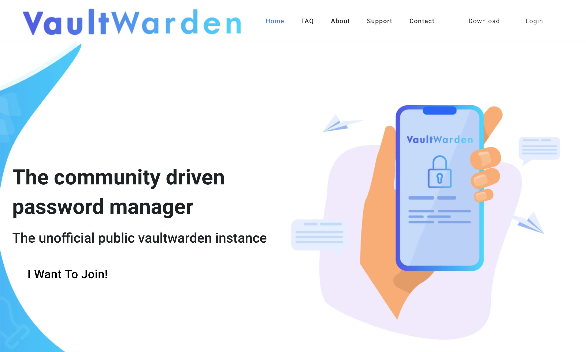
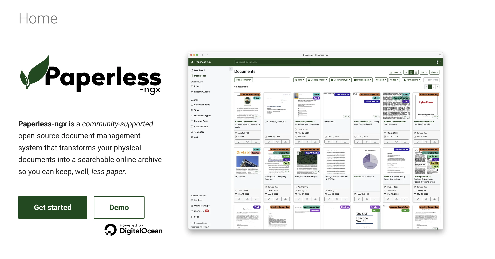

Tu as entendu parler de Docker partout. « C’est l’avenir », « Tous les devs l’utilisent », « Tu devrais apprendre Docker ».

Mais quand tu cherches des tutos, tu tombes sur des explications cryptiques avec des schémas de conteneurs, d’images, de volumes, et tu te demandes pourquoi faire simple quand on peut faire compliqué ?

**Bonne nouvelle :** Docker, c’est en fait super simple. Et dans cet article, on va le prouver en déployant 10 services concrets en quelques lignes de commandes.

Pas de théorie inutile. Que du concret.

- - - - - -

TL;DR : Docker en 3 phrases

- **C’est quoi ?** Une façon de lancer des applications dans des « boîtes » isolées
- **Pourquoi ?** Installation en 2 minutes, pas de conflit entre logiciels, facile à supprimer
- **Comment ?** Un fichier `docker-compose.yml` + une commande = service opérationnel

- - - - - -


- [Docker, c’est quoi (sans le jargon de dev)](#docker-cest-quoi-sans-le-jargon-de-dev)
  - [Comment ça marche ?](#comment-ca-marche)
- [Pourquoi Docker change tout pour l’auto-hébergement](#pourquoi-docker-change-tout-pour-lauto-hebergement)
  - [Les avantages de Docker pour ton homelab](#les-avantages-de-docker-pour-ton-homelab)
- [Installation de Docker (Ubuntu/Debian)](#installation-de-docker-ubuntu-debian)
  - [Étape 1 : Installer Docker Engine](#etape-1-installer-docker-engine)
  - [Étape 2 : Vérifier que Docker fonctionne](#etape-2-verifier-que-docker-fonctionne)
  - [Étape 3 : Utiliser Docker sans sudo (optionnel mais recommandé)](#etape-3-utiliser-docker-sans-sudo-optionnel-mais-recommande)
- [Docker Compose : Le fichier magique](#docker-compose-le-fichier-magique)
  - [Structure d’un fichier docker-compose.yml](#structure-dun-fichier-docker-compose-yml)
  - [Commandes Docker Compose essentielles](#commandes-docker-compose-essentielles)
- [Organisation des fichiers (bonne pratique)](#organisation-des-fichiers-bonne-pratique)
- [Les 10 services essentiels à déployer](#les-10-services-essentiels-a-deployer)
  - [1. Uptime Kuma — Monitoring visuel 🟢](#1-uptime-kuma-monitoring-visuel-%F0%9F%9F%A2)
      - [Installation](#installation)
  - [2. Portainer — Interface de gestion Docker 🟢](#2-portainer-interface-de-gestion-docker-%F0%9F%9F%A2)
      - [Installation](#installation-1)
  - [3. Nginx Proxy Manager — Reverse proxy facile 🟡](#3-nginx-proxy-manager-reverse-proxy-facile-%F0%9F%9F%A1)
      - [Installation](#installation-2)
  - [4. Vaultwarden — Gestionnaire de mots de passe 🟢](#4-vaultwarden-gestionnaire-de-mots-de-passe-%F0%9F%9F%A2)
      - [Installation](#installation-3)
  - [5. Nextcloud — Ton cloud personnel 🟡](#5-nextcloud-ton-cloud-personnel-%F0%9F%9F%A1)
      - [Installation](#installation-4)
  - [6. Jellyfin — Serveur média (Netflix maison) 🟡](#6-jellyfin-serveur-media-netflix-maison-%F0%9F%9F%A1)
      - [Installation](#installation-5)
  - [7. Homer — Dashboard central 🟢](#7-homer-dashboard-central-%F0%9F%9F%A2)
      - [Installation](#installation-6)
  - [8. Immich — Alternative Google Photos 🟡](#8-immich-alternative-google-photos-%F0%9F%9F%A1)
      - [Installation](#installation-7)
  - [9. Paperless-ngx — GED personnelle 🟡](#9-paperless-ngx-ged-personnelle-%F0%9F%9F%A1)
      - [Installation](#installation-8)
  - [10. FreshRSS — Agrégateur RSS 🟢](#10-fresh-rss-agregateur-rss-%F0%9F%9F%A2)
      - [Installation](#installation-9)
- [Commandes Docker essentielles (antisèche)](#commandes-docker-essentielles-antiseche)
  - [Gestion des conteneurs](#gestion-des-conteneurs)
  - [Gestion des images](#gestion-des-images)
  - [Logs et debug](#logs-et-debug)
  - [Nettoyage](#nettoyage)
- [Erreurs fréquentes et solutions](#erreurs-frequentes-et-solutions)
  - [❌ Erreur : « Port already allocated »](#%E2%9D%8C-erreur-port-already-allocated)
  - [❌ Erreur : « permission denied » sur les volumes](#%E2%9D%8C-erreur-permission-denied-sur-les-volumes)
  - [❌ Conteneur qui redémarre en boucle](#%E2%9D%8C-conteneur-qui-redemarre-en-boucle)
  - [❌ « Cannot connect to Docker daemon »](#%E2%9D%8C-cannot-connect-to-docker-daemon)
- [Bonnes pratiques pour ton homelab Docker](#bonnes-pratiques-pour-ton-homelab-docker)
  - [1. Toujours utiliser des versions fixes](#1-toujours-utiliser-des-versions-fixes)
  - [2. Utiliser des volumes nommés ou des bind mounts](#2-utiliser-des-volumes-nommes-ou-des-bind-mounts)
  - [3. Configurer restart: unless-stopped](#3-configurer-restart-unless-stopped)
  - [4. Un réseau Docker par « projet »](#4-un-reseau-docker-par-projet)
  - [5. Documenter tes docker-compose](#5-documenter-tes-docker-compose)
- [Sauvegarder tes services Docker](#sauvegarder-tes-services-docker)
  - [Stratégie de backup simple](#strategie-de-backup-simple)
- [Aller plus loin avec Docker](#aller-plus-loin-avec-docker)
  - [Docker Swarm ou Kubernetes ?](#docker-swarm-ou-kubernetes)
  - [Watchtower : Mises à jour automatiques](#watchtower-mises-a-jour-automatiques)
- [Ressources pour aller plus loin](#ressources-pour-aller-plus-loin)
  - [📚 Articles complémentaires sur ce site](#%F0%9F%93%9A-articles-complementaires-sur-ce-site)
  - [🌐 Ressources externes](#%F0%9F%8C%90-ressources-externes)
  - [📺 Chaînes YouTube recommandées](#%F0%9F%93%BA-chaines-you-tube-recommandees)
- [Conclusion : Docker, ton meilleur allié homelab](#conclusion-docker-ton-meilleur-allie-homelab)
- [FAQ : Les questions Docker qui reviennent souvent](#faq-les-questions-docker-qui-reviennent-souvent)
  - [Docker vs LXC vs VM, quelle différence ?](#faq-question-1761141773689)
  - [Mes conteneurs Docker utilisent beaucoup de RAM, c’est normal ?](#faq-question-1761141812359)
  - [Puis-je faire tourner Docker sur un Raspberry Pi ?](#faq-question-1761141878940)
  - [Docker Compose vs Docker Swarm vs Kubernetes ?](#faq-question-1761141887625)
  - [Comment migrer mes conteneurs Docker vers un autre serveur ?](#faq-question-1761141901118)
  - [Docker consomme-t-il beaucoup de ressources ?](#faq-question-1761142003766)


Docker, c’est quoi (sans le jargon de dev)

Imagine que tu veuilles installer Nextcloud sur ton serveur.

**Sans Docker :**

1. Installer PHP 8.2 (ou 8.3 ?)
2. Installer Apache (ou Nginx ?)
3. Installer MySQL (ou PostgreSQL ?)
4. Configurer les permissions
5. Éditer 15 fichiers de config
6. Croiser les doigts
7. Débugger pendant 2h parce que PHP.ini ne charge pas le bon module

**Avec Docker :**

1. Créer un fichier `docker-compose.yml`
2. Taper `docker compose up -d`
3. C’est tout. Nextcloud tourne.

### Comment ça marche ?

Docker prend une **image** (= un modèle d’application prêt à l’emploi) et crée un **conteneur** (= une instance en cours d’exécution).

**Analogie simple :**

- L’**image** = la recette d’un gâteau
- Le **conteneur** = le gâteau cuit qu’on peut manger

Tu peux créer 10 conteneurs à partir de la même image. Chaque conteneur est isolé des autres.

**À savoir :**  
Docker n’est pas de la virtualisation comme Proxmox ou VMware. C’est beaucoup plus léger : les conteneurs partagent le noyau Linux du système hôte. Résultat : c’est ultra-rapide.

- - - - - -

Pourquoi Docker change tout pour l’auto-hébergement

Si tu as lu mon guide sur [l’auto-hébergement](https://brandonvisca.com/auto-hebergement-guide-complet-2025/), tu sais qu’on peut héberger plein de services. Mais Docker rend ça 10x plus facile.

### Les avantages de Docker pour ton homelab

**1. Installation ultra-rapide**  
Pas besoin de passer 3h à installer des dépendances. Un `docker compose up`, et c’est prêt.

**2. Isolation complète**  
Chaque service tourne dans sa bulle. Si Nextcloud plante, ton serveur mail continue de fonctionner.

**3. Portabilité**  
Tu changes de serveur ? Tu copies ton dossier de configs, tu relances Docker, et tout remarche.

**4. Mises à jour simplifiées**

```bash
docker compose pull   # Télécharger la nouvelle version
docker compose up -d  # Redémarrer avec la nouvelle version

```

# Mise à jour du système
sudo apt update && sudo apt upgrade -y

# Installation des prérequis
sudo apt install -y ca-certificates curl gnupg lsb-release

# Ajout de la clé GPG officielle Docker
sudo mkdir -p /etc/apt/keyrings
curl -fsSL https://download.docker.com/linux/ubuntu/gpg | sudo gpg --dearmor -o /etc/apt/keyrings/docker.gpg

# Ajout du dépôt Docker
echo \
  "deb [arch=$(dpkg --print-architecture) signed-by=/etc/apt/keyrings/docker.gpg] https://download.docker.com/linux/ubuntu \
  $(lsb_release -cs) stable" | sudo tee /etc/apt/sources.list.d/docker.list > /dev/null

# Installation de Docker
sudo apt update
sudo apt install -y docker-ce docker-ce-cli containerd.io docker-compose-plugin


### Étape 2 : Vérifier que Docker fonctionne

```bash
sudo docker run hello-world

```

sudo usermod -aG docker $USER


Déconnecte-toi et reconnecte-toi pour que ça prenne effet. Ensuite, tu pourras faire `docker ps` sans `sudo`.

**Sécurité :**  
Ajouter ton user au groupe Docker lui donne des droits équivalents à root. Sur un serveur de prod, réfléchis-y à deux fois. Pour ton homelab perso, aucun souci.

- - - - - -

Docker Compose : Le fichier magique

Docker Compose, c’est ce qui rend Docker vraiment puissant pour l’auto-hébergement.

Au lieu de lancer des commandes `docker run` à rallonge, tu définis tout dans un fichier YAML, et Docker s’occupe du reste.

### Structure d’un fichier docker-compose.yml

```bash
services:
  nom-du-service:
    image: nom-de-limage:version
    container_name: mon-conteneur
    ports:
      - "port-externe:port-interne"
    volumes:
      - /chemin/local:/chemin/conteneur
    environment:
      - VARIABLE=valeur
    restart: unless-stopped

```

# Démarrer tous les services
docker compose up -d

# Voir les conteneurs en cours
docker compose ps

# Voir les logs
docker compose logs -f nom-du-service

# Arrêter tout
docker compose down

# Mettre à jour
docker compose pull
docker compose up -d


- - - - - -

Organisation des fichiers (bonne pratique)

Avant de déployer tes services, crée une structure propre :

```bash
# Créer le dossier principal
mkdir -p ~/docker
cd ~/docker

# Pour chaque service, un dossier
mkdir -p uptime-kuma nextcloud vaultwarden jellyfin

```

cd ~/docker/uptime-kuma
mkdir data
nano docker-compose.yml


Colle ce contenu :

```bash
services:
  uptime-kuma:
    image: louislam/uptime-kuma:2.0.1
    container_name: uptime-kuma
    volumes:
      - ./data:/app/data
    ports:
      - "3001:3001"
    restart: unless-stopped
```

docker compose up -d


**Accès :** `http://ton-serveur:3001`

**Résultat :** Interface magnifique, création du compte admin, et tu peux commencer à monitorer tes services.

- - - - - -

### 2. Portainer — Interface de gestion Docker 🟢

**C’est quoi ?**  
Une interface web pour gérer tous tes conteneurs Docker sans ligne de commande.

**Pourquoi ?**  
Voir d’un coup d’œil tous tes conteneurs, les logs, les stats CPU/RAM. Indispensable.

**Difficulté :** 🟢 Débutant

#### Installation

```bash
cd ~/docker/portainer
mkdir data
nano docker-compose.yml

```

services:
  portainer:
    image: portainer/portainer-ce:2.35.0
    container_name: portainer
    ports:
      - "9000:9000"
    volumes:
      - /var/run/docker.sock:/var/run/docker.sock
      - ./data:/data
    restart: unless-stopped


```bash
docker compose up -d

```

cd ~/docker/nginx-proxy-manager
mkdir data letsencrypt
nano docker-compose.yml


```bash
services:
  nginx-proxy-manager:
    image: jc21/nginx-proxy-manager:2.12.6
    container_name: nginx-proxy-manager
    ports:
      - "80:80"
      - "443:443"
      - "81:81"
    volumes:
      - ./data:/data
      - ./letsencrypt:/etc/letsencrypt
    restart: unless-stopped

```

docker compose up -d


**Accès :** `http://ton-serveur:81`

**Identifiants par défaut :**

- Email : `admin@example.com`
- Password : `changeme`

**Important :** Change immédiatement le mot de passe après la première connexion.

- - - - - -

### 4. Vaultwarden — Gestionnaire de mots de passe 🟢

**C’est quoi ?**  
Une version allégée et auto-hébergée de Bitwarden (compatible avec toutes les apps officielles).

**Pourquoi ?**  
Fini les mots de passe réutilisés partout. Et contrairement à LastPass, **tu gardes le contrôle**.

**Difficulté :** 🟢 Débutant

#### Installation

```bash
cd ~/docker/vaultwarden
mkdir data
nano docker-compose.yml

```

services:
  vaultwarden:
    image: vaultwarden/server:1.34.3
    container_name: vaultwarden
    volumes:
      - ./data:/data
    ports:
      - "8080:80"
    environment:
      - SIGNUPS_ALLOWED=true
      - ADMIN_TOKEN=ton_token_super_secret
    restart: unless-stopped


```bash
docker compose up -d

```

cd ~/docker/nextcloud
mkdir data
nano docker-compose.yml


```bash
services:
  nextcloud-db:
    image: mariadb:10.11
    container_name: nextcloud-db
    command: --transaction-isolation=READ-COMMITTED --log-bin=binlog --binlog-format=ROW
    volumes:
      - ./db:/var/lib/mysql
    environment:
      - MYSQL_ROOT_PASSWORD=motdepasse_root_securise
      - MYSQL_PASSWORD=motdepasse_nextcloud
      - MYSQL_DATABASE=nextcloud
      - MYSQL_USER=nextcloud
    restart: unless-stopped

  nextcloud:
    image: nextcloud:32
    container_name: nextcloud
    ports:
      - "8081:80"
    volumes:
      - ./data:/var/www/html
    environment:
      - MYSQL_HOST=nextcloud-db
      - MYSQL_PASSWORD=motdepasse_nextcloud
      - MYSQL_DATABASE=nextcloud
      - MYSQL_USER=nextcloud
    depends_on:
      - nextcloud-db
    restart: unless-stopped

```

docker compose up -d


**Accès :** `http://ton-serveur:8081`

**Premier lancement :**

1. Crée ton compte admin
2. Sélectionne MySQL/MariaDB
3. Utilise les identifiants du docker-compose
4. Installe les apps recommandées

**Astuce :** Active la prévisualisation des fichiers et l’app Memories pour gérer tes photos comme sur Google Photos.

- - - - - -

### 6. Jellyfin — Serveur média (Netflix maison) 🟡

**C’est quoi ?**  
Un serveur de streaming pour tes films, séries, musique. Open source, sans télémétrie, sans pub.

**Pourquoi ?**  
Parce que c’est satisfaisant d’avoir son propre Netflix avec sa bibliothèque perso.

**Difficulté :** 🟡 Intermédiaire

#### Installation

```bash
cd ~/docker/jellyfin
mkdir -p config cache
nano docker-compose.yml

```

services:
  jellyfin:
    image: jellyfin/jellyfin:10.11.0
    container_name: jellyfin
    ports:
      - "8096:8096"
    volumes:
      - ./config:/config
      - ./cache:/cache
      - /chemin/vers/tes/films:/media/films:ro
      - /chemin/vers/tes/series:/media/series:ro
    restart: unless-stopped


**Importante :** Remplace `/chemin/vers/tes/films` par le vrai chemin où sont stockés tes médias.

```bash
docker compose up -d

```

cd ~/docker/homer
mkdir assets
nano docker-compose.yml


```bash
services:
  homer:
    image: b4bz/homer
    container_name: homer
    volumes:
      - ./assets:/www/assets
    ports:
      - 8082:8080
    user: 1000:1000 # utilisateur par défaut, adapte en fonction
    environment:
      - INIT_ASSETS=1 # status 1 créer le fichier de config
    restart: unless-stopped
```

docker compose up -d


**Accès :** `http://ton-serveur:8082`

**Configuration :** Édite le fichier `./assets/config.yml` pour ajouter tes services.

- - - - - -

### 8. Immich — Alternative Google Photos 🟡

**C’est quoi ?**  
Une app de backup et d’organisation de photos avec reconnaissance faciale, géolocalisation, et recherche intelligente.

**Pourquoi ?**  
Google Photos c’est pratique, mais tes photos servent à entraîner leurs algos. Immich fait pareil, mais chez toi.

**Difficulté :** 🟡 Intermédiaire

#### Installation

```bash
cd ~/docker/immich
wget -O docker-compose.yml https://github.com/immich-app/immich/releases/latest/download/docker-compose.yml
wget -O .env https://github.com/immich-app/immich/releases/latest/download/example.env

```

docker compose up -d


**Accès :** `http://ton-serveur:2283`

**Apps mobiles :** Disponibles sur iOS et Android pour synchroniser automatiquement tes photos.

- - - - - -

### 9. Paperless-ngx — GED personnelle 🟡

**C’est quoi ?**  
Un système de gestion documentaire qui scanne, indexe et organise tous tes documents (factures, contrats, etc.).

**Pourquoi ?**  
Fini les classeurs qui débordent. Scanne tes docs, et Paperless les classe automatiquement avec OCR.

**Difficulté :** 🟡 Intermédiaire

#### Installation

```bash
cd ~/docker/paperless
mkdir -p db data media export consume
nano docker-compose.yml

```

```bash

services:
  paperless-redis:
    image: redis:7
    container_name: paperless-redis
    restart: unless-stopped

  paperless-db:
    image: postgres:15
    container_name: paperless-db
    volumes:
      - ./db:/var/lib/postgresql/data
    environment:
      - POSTGRES_DB=paperless
      - POSTGRES_USER=paperless
      - POSTGRES_PASSWORD=paperless_password
    restart: unless-stopped

  paperless:
    image: ghcr.io/paperless-ngx/paperless-ngx:v2.19.0
    container_name: paperless
    depends_on:
      - paperless-db
      - paperless-redis
    ports:
      - "8083:8000"
    volumes:
      - ./data:/usr/src/paperless/data
      - ./media:/usr/src/paperless/media
      - ./export:/usr/src/paperless/export
      - ./consume:/usr/src/paperless/consume
    environment:
      - PAPERLESS_REDIS=redis://paperless-redis:6379
      - PAPERLESS_DBHOST=paperless-db
      - PAPERLESS_DBPASS=paperless_password
      - PAPERLESS_OCR_LANGUAGE=fra
      - PAPERLESS_SECRET_KEY=change-me-to-something-secure
    restart: unless-stopped
```


```bash
docker compose up -d

```

```bash
cd ~/docker/freshrss
mkdir -p db data
nano docker-compose.yml
```

```bash
services:
  freshrss-db:
    image: postgres:15
    container_name: freshrss-db
    volumes:
      - ./db:/var/lib/postgresql/data
    environment:
      - POSTGRES_USER=freshrss
      - POSTGRES_PASSWORD=freshrss_password
      - POSTGRES_DB=freshrss
    restart: unless-stopped

  freshrss:
    image: freshrss/freshrss:latest
    container_name: freshrss
    depends_on:
      - freshrss-db
    ports:
      - "8084:80"
    volumes:
      - ./data:/var/www/FreshRSS/data
    environment:
      - CRON_MIN=*/15
      - TZ=Europe/Paris
    restart: unless-stopped

```

```bash
docker compose up -d
```

**Accès :** `http://ton-serveur:8084`

**Configuration :**

1. Suis l’assistant d’installation
2. Configure PostgreSQL avec les identifiants du docker-compose
3. Ajoute tes flux RSS préférés
4. Active le thème sombre (évidemment)

- - - - - -

Commandes Docker essentielles (antisèche)

### Gestion des conteneurs

```bash
# Voir tous les conteneurs en cours
docker ps

# Voir TOUS les conteneurs (même arrêtés)
docker ps -a

# Arrêter un conteneur
docker stop nom-conteneur

# Redémarrer un conteneur
docker restart nom-conteneur

# Supprimer un conteneur (il doit être arrêté avant)
docker rm nom-conteneur

```

# Lister les images téléchargées
docker images

# Supprimer une image
docker rmi nom-image:tag

# Télécharger une image
docker pull nom-image:tag


### Logs et debug

```bash
# Voir les logs d'un conteneur
docker logs nom-conteneur

# Suivre les logs en temps réel
docker logs -f nom-conteneur

# Entrer dans un conteneur (pour débugger)
docker exec -it nom-conteneur /bin/bash

```

# Supprimer tous les conteneurs arrêtés
docker container prune

# Supprimer toutes les images non utilisées
docker image prune

# Nettoyage complet (ATTENTION : supprime tout ce qui n'est pas utilisé)
docker system prune -a


- - - - - -

Erreurs fréquentes et solutions

### ❌ Erreur : « Port already allocated »

**Problème :** Le port que tu veux utiliser est déjà occupé.

**Solution :**

```bash
# Voir quel process utilise le port 8080
sudo lsof -i :8080

# Ou change le port dans docker-compose.yml
ports:
  - "8085:80"  # Au lieu de 8080:80

```

# Donner les permissions au dossier
sudo chown -R $USER:$USER ~/docker/nom-service


- - - - - -

### ❌ Conteneur qui redémarre en boucle

**Problème :** Le service plante au démarrage.

**Solution :**

```bash
# Voir les logs pour comprendre pourquoi
docker logs nom-conteneur

# Les erreurs courantes :
# - Variable d'environnement manquante
# - Port déjà utilisé
# - Volume mal configuré

```

# Démarrer Docker
sudo systemctl start docker

# Activer au démarrage
sudo systemctl enable docker


- - - - - -

Bonnes pratiques pour ton homelab Docker

### 1. Toujours utiliser des versions fixes

❌ **Mauvais :**

```bash
image: nextcloud:latest

```

image: nextcloud:28


**Pourquoi ?** `latest` peut casser tes services lors d’une mise à jour majeure. Avec une version fixe, tu contrôles quand tu updates.

- - - - - -

### 2. Utiliser des volumes nommés ou des bind mounts

✅ **Bind mount (recommandé pour homelab) :**

```bash
volumes:
  - ./data:/app/data

```

restart: unless-stopped


Ton serveur reboot ? Tes conteneurs redémarrent automatiquement.

- - - - - -

### 4. Un réseau Docker par « projet »

Pour des services qui doivent communiquer ensemble (ex: Nextcloud + sa base de données), utilise un réseau dédié :

```bash
networks:
  nextcloud-net:

services:
  nextcloud-db:
    networks:
      - nextcloud-net
  
  nextcloud:
    networks:
      - nextcloud-net

```

services:
  nextcloud:
    image: nextcloud:28
    # Port 8081 car 8080 déjà utilisé par Vaultwarden
    ports:
      - "8081:80"


- - - - - -

Sauvegarder tes services Docker

Les conteneurs Docker sont éphémères. Si tu supprimes un conteneur, tu perds ses données… **sauf si tu as bien configuré les volumes**.

### Stratégie de backup simple

```bash
# Créer un dossier backup
mkdir -p ~/backups

# Script de backup quotidien
#!/bin/bash
DATE=$(date +%Y-%m-%d)
tar -czf ~/backups/docker-$DATE.tar.gz ~/docker/

# Garder seulement les 7 derniers backups
find ~/backups -name "docker-*.tar.gz" -mtime +7 -delete

```

services:
  watchtower:
    image: containrrr/watchtower:latest
    container_name: watchtower
    volumes:
      - /var/run/docker.sock:/var/run/docker.sock
    environment:
      - WATCHTOWER_CLEANUP=true
      - WATCHTOWER_SCHEDULE=0 0 4 * * *  # Tous les jours à 4h du matin
    restart: unless-stopped


**Attention :** Teste bien avant d’activer ça en prod. Une mise à jour peut casser un service.

- - - - - -

Ressources pour aller plus loin

### 📚 Articles complémentaires sur ce site

- [Auto-hébergement : Le guide complet 2025](https://brandonvisca.com/auto-hebergement-guide-complet-2025/)
- [Sécuriser son serveur Linux](https://brandonvisca.com/securite-de-votre-serveur-linux/)
- [Sécuriser Nginx avec des headers HTTP](https://brandonvisca.com/securiser-nginx-avec-headers-http/)

### 🌐 Ressources externes

- [Docker Hub](https://hub.docker.com/) : Catalogue d’images Docker
- [Awesome-Selfhosted](https://github.com/awesome-selfhosted/awesome-selfhosted) : Liste de services auto-hébergeables
- [LinuxServer.io](https://www.linuxserver.io/) : Images Docker maintenues et optimisées

### 📺 Chaînes YouTube recommandées

- TechnoTim (en anglais, très bon pour homelab)
- Xavki (en français, DevOps et Docker)

- - - - - -

Conclusion : Docker, ton meilleur allié homelab

Si tu retiens une chose de cet article, c’est ça : **Docker simplifie tout**.

Fini les installs qui prennent 3h, les conflits de dépendances, et les serveurs qu’on n’ose plus toucher de peur de tout casser.

Avec Docker :

- Tu installes un service en 2 minutes
- Tu le mets à jour en 1 commande
- Tu le supprimes sans laisser de traces

**Les 10 services de cet article te donnent une base solide pour un homelab complet :**

- Monitoring (Uptime Kuma)
- Gestion Docker (Portainer)
- Cloud perso (Nextcloud)
- Mots de passe (Vaultwarden)
- Streaming (Jellyfin)
- Photos (Immich)
- Documents (Paperless-ngx)
- Dashboard (Homer)
- RSS (FreshRSS)
- Reverse proxy (Nginx Proxy Manager)

**Prochaine étape ?**  
Installe Docker, déploie Uptime Kuma et Portainer pour commencer. Puis ajoute les autres services au fur et à mesure.

Dans le prochain article, on parlera de **Proxmox** pour virtualiser plusieurs VMs et conteneurs LXC. Parce que parfois, Docker ne suffit pas. 😉

Tu galères sur un service ? Pose ta question en commentaires, je réponds à tout ! 👇

- - - - - -

FAQ : Les questions Docker qui reviennent souvent

### **Docker vs LXC vs VM, quelle différence ?**

**Docker** : Conteneurs applicatifs ultra-légers, parfaits pour des services isolés  
**LXC** : Conteneurs système (comme des mini-VMs Linux), plus lourds que Docker  
**VM** : Machine virtuelle complète avec son propre OS, très lourd

### **Mes conteneurs Docker utilisent beaucoup de RAM, c’est normal ?**

Docker alloue de la RAM par conteneur. Si tu as 10 services, ça peut vite monter. Solution :  
– Limite la RAM par conteneur dans docker-compose (paramètre `mem_limit`)  
– Utilise des images « alpine » (versions allégées)  
– Ferme les services que tu n’utilises pas

### **Puis-je faire tourner Docker sur un Raspberry Pi ?**

Oui ! Beaucoup d’images sont disponibles en architecture ARM. Certains services lourds (comme Jellyfin avec transcodage) seront limités, mais Nextcloud, Vaultwarden, Uptime Kuma tournent parfaitement.

### **Docker Compose vs Docker Swarm vs Kubernetes ?**

– **Docker Compose** : Un seul serveur, parfait pour homelab  
– **Docker Swarm** : Plusieurs serveurs, orchestration simple  
– **Kubernetes** : Plusieurs serveurs, orchestration complexe, overkill pour homelab  
Pour 99% des homelabs, Docker Compose suffit largement.

### **Comment migrer mes conteneurs Docker vers un autre serveur ?**

1\. Arrête tes conteneurs : `docker compose down`  
2\. Copie tout le dossier `~/docker` vers le nouveau serveur  
3\. Relance : `docker compose up -d`

C’est tout. C’est ça, la magie de Docker.

### **Docker consomme-t-il beaucoup de ressources ?**

Docker lui-même est très léger. Ce sont les **services** que tu fais tourner qui consomment. Un serveur avec 4 Go de RAM peut faire tourner 5-10 services légers sans problème.

## Articles connexes

- [Auto-hébergement : Le guide ultime 2025 pour reprendre contr](/auto-hebergement-guide-complet-2025/)
- [Jellyfin avec Docker : Ton Netflix Gratuit en 30 Min (Économ](/jellyfin-docker-alternative-netflix-gratuite/)
