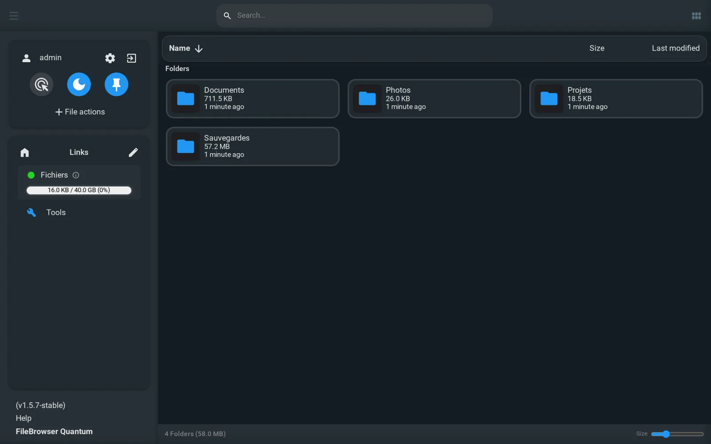
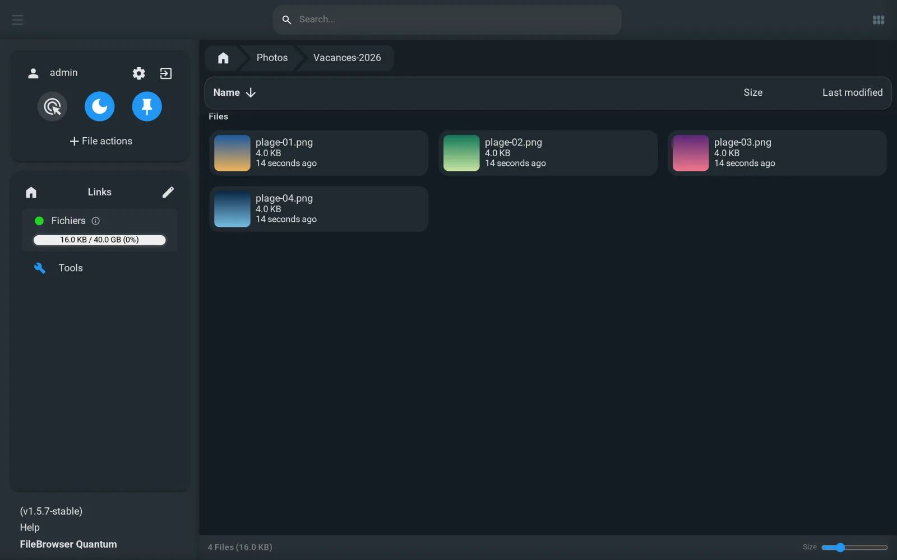
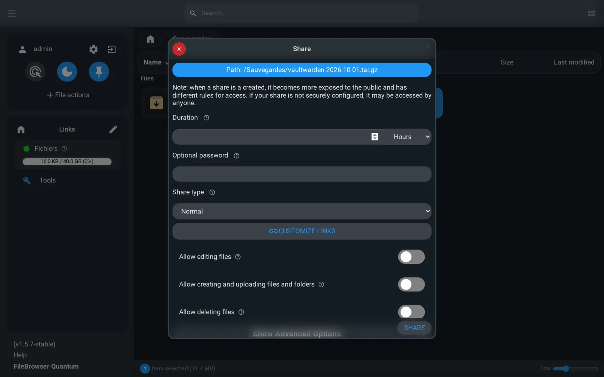

> 💡 **TL;DR**
> - File Browser est archivé depuis le 1er septembre 2026 : plus aucun correctif de sécurité. FileBrowser Quantum, un fork actif, reprend le même usage.
> - L'exécution de commandes, l'un des points faibles de l'original, a été supprimée. En échange : plusieurs sources, une recherche indexée, OIDC, LDAP et la double authentification.
> - Un `docker-compose.yml`, un `config.yaml`, et c'est en ligne en 10 minutes. Seule vraie contrainte : la base de l'ancien File Browser ne se récupère pas.

## Pourquoi changer de gestionnaire de fichiers

J'ai longtemps recommandé [File Browser](/filebrowser-docker-gestionnaire-fichiers/) pour accéder à ses fichiers depuis un navigateur sans sortir l'artillerie Nextcloud. Le 1er septembre 2026, ses mainteneurs ont archivé le projet : dernière version publiée, plus de mises à jour, plus de correctifs de sécurité. Deux faiblesses connues restent ouvertes, dont des sessions impossibles à révoquer.

Un outil qui expose tes fichiers sur le réseau ne peut pas rester figé. Dans ce guide, je déploie FileBrowser Quantum Docker, le remplaçant le plus naturel : c'est un fork de File Browser, lancé avant l'archivage, qui garde la même idée (une interface web au-dessus d'un dossier de ton serveur) mais en a réécrit une bonne partie.

## Table des matières

## FileBrowser Quantum : ce qui change par rapport à l'original

FileBrowser Quantum vit sur GitHub (`gtsteffaniak/filebrowser`), sous licence Apache-2.0, avec environ 8 500 étoiles et des versions publiées toutes les semaines. Son auteur le décrit comme un fork « massif » : l'interface, l'indexation et l'authentification ont été refaites.

Ce qui disparaît :

- **Le terminal et les « runners »** : supprimés pour des raisons de sécurité, et l'auteur précise qu'ils ne reviendront pas. C'était justement l'une des deux faiblesses laissées ouvertes par File Browser.
- **La gestion des utilisateurs en ligne de commande** : elle passe par le fichier de configuration, l'interface ou l'API.

Ce qui arrive :

- **Plusieurs sources** : tu exposes plusieurs dossiers, chacun avec ses règles d'inclusion et d'exclusion.
- **Une recherche indexée** en temps réel sur le contenu des sources.
- **OIDC, LDAP, JWT, mot de passe et double authentification** pour la connexion.
- **Des miniatures** pour les images, les vidéos et les documents bureautiques.
- **WebDAV**, des permissions fines et des partages beaucoup plus configurables (on y revient plus bas).

Deux branches coexistent : la **1.5, stable**, et la **2.x, en bêta**. Pour un service qui touche à tes fichiers, prends la stable.

## Prérequis

- Un serveur Linux avec Docker et Docker Compose. Si tu pars de zéro, mon [guide Docker pour débutants](/docker-debutant-services-auto-heberger/) pose les bases.
- Un dossier à exposer, par exemple `/srv/fichiers`.
- Un reverse proxy si tu veux un accès en HTTPS, comme [Caddy](/caddy-docker-reverse-proxy-guide/).

## Installer FileBrowser Quantum Docker avec Compose

Crée un dossier pour le service, avec un sous-dossier `data` qui contiendra la configuration, la base et le cache :

```bash
mkdir -p ~/filebrowser-quantum/data && cd ~/filebrowser-quantum
```

### Le fichier config.yaml

Dans l'image Docker, FileBrowser Quantum lit sa configuration dans `/home/filebrowser/data/config.yaml`. Crée `data/config.yaml` :

```yaml
server:
  cacheDir: /home/filebrowser/data/tmp
  sources:
    - path: /folder
      name: Fichiers
      config:
        defaultEnabled: true

auth:
  adminUsername: admin
  adminPassword: "un-mot-de-passe-solide"
```

- `sources` : la liste des dossiers exposés. Le `path` est vu **depuis le conteneur**, pas depuis ton serveur. `defaultEnabled: true` donne accès à cette source à tous les utilisateurs.
- `name` : le nom affiché dans l'interface.
- `auth.adminPassword` : sans cette ligne, la version stable crée le compte `admin` avec le mot de passe `admin`. En le définissant avant le premier démarrage, tu ne laisses jamais ces identifiants par défaut en place, même quelques minutes.

Ce fichier contient un mot de passe en clair : restreins ses droits avec `chmod 600 data/config.yaml`.

La documentation déconseille d'exposer la racine `/` du serveur ou un dossier sous `/var` comme source. Expose seulement ce dont tu as besoin.

### Le docker-compose.yml

```yaml
services:
  filebrowser:
    image: gtstef/filebrowser:1.5-stable
    container_name: filebrowser
    restart: unless-stopped
    volumes:
      - /srv/fichiers:/folder
      - ./data:/home/filebrowser/data
    ports:
      - "8080:80"
```

- `1.5-stable` suit les correctifs de la branche 1.5 sans te faire passer en 2.x par surprise. Il existe aussi une variante `-slim` (environ 15 Mo au lieu de 60) sans FFmpeg ni aperçu des documents, donc sans miniatures vidéo.
- `/srv/fichiers:/folder` : ton dossier, monté là où `config.yaml` l'attend.
- `./data` : configuration, base `database.db` et cache, au même endroit.

Le conteneur tourne avec l'utilisateur `filebrowser`, UID et GID 1000. Il doit pouvoir lire, et écrire si tu veux envoyer des fichiers, dans le dossier exposé et dans `data` :

```bash
sudo chown -R 1000:1000 data /srv/fichiers
```

Si tes fichiers appartiennent à un autre utilisateur, adapte plutôt les droits du dossier que de tout passer en 1000.

### Premier démarrage

```bash
docker compose up -d
docker logs filebrowser
```

Dans les logs, vérifie trois lignes : `Using Config file : /home/filebrowser/data/config.yaml` (ta configuration est bien lue), `Sources : [Fichiers: /folder]`, et `Running at : http://0.0.0.0/`. Si tu vois `database file could not be found`, c'est normal au premier lancement : la base est créée dans la foulée.

Ouvre `http://IP_DU_SERVEUR:8080` et connecte-toi avec `admin` et le mot de passe de `config.yaml`. Une fenêtre de bienvenue te signale qu'une nouvelle base vient d'être créée : c'est attendu la première fois.



Un redémarrage du conteneur ne touche pas aux comptes : la base est réutilisée telle quelle.

## Le quotidien : naviguer, prévisualiser, retrouver

L'interface reprend les réflexes de File Browser : dossiers en haut, fichiers en dessous, envoi par glisser-déposer, clic droit pour les actions (télécharger, renommer, copier, déplacer, supprimer, extraire une archive).

Les images, vidéos et documents bureautiques ont droit à une miniature, générée par FFmpeg dans l'image `stable` :



La barre de recherche interroge un index tenu à jour en continu, plutôt que de parcourir le disque à chaque requête.

## Partager un fichier, ou recevoir des fichiers

Clic droit sur un fichier ou un dossier, puis **Share** :



Pour chaque lien, tu choisis :

- **Une durée** en minutes, heures ou jours. Mets-en toujours une : un lien sans expiration finit par traîner dans un vieux message.
- **Un mot de passe optionnel**.
- **Le type de partage** : *Normal* pour donner accès au contenu, ou *Upload only* pour qu'on t'envoie des fichiers sans voir ce qu'il y a déjà dans le dossier. Pratique pour récupérer les photos d'un repas de famille.
- **Les droits** : modification, création et envoi, suppression. Tout est désactivé par défaut, laisse-le ainsi sauf besoin précis.

L'interface le rappelle d'ailleurs en haut de la fenêtre : un partage mal réglé peut être ouvert par n'importe qui qui a le lien.

## Migrer depuis l'ancien File Browser

Tes fichiers ne bougent pas : monte simplement le même dossier comme source dans Quantum. En revanche :

- **La base n'est pas reprise.** La documentation de migration ne porte que sur la configuration : les anciennes options de lancement (`--port`, `--baseurl`, `--root`, etc.) se traduisent en clés de `config.yaml`. Les utilisateurs, leurs mots de passe et les liens de partage sont à recréer.
- **Les commandes personnalisées disparaissent**, terminal compris. Si tu t'en servais pour lancer des scripts, il faut une autre solution, par exemple un [cron](/cron-linux-avance-crontab-guide/) côté serveur.

La procédure la plus simple : arrête l'ancien conteneur, garde son dossier de données de côté au cas où, déploie Quantum sur le même dossier de fichiers, recrée tes comptes, puis supprime l'ancien service une fois que tout le monde a basculé. Les liens de partage envoyés avec l'ancien outil ne fonctionneront plus : préviens leurs destinataires.

## Reverse proxy et accès à distance

Pour une adresse en HTTPS, place FileBrowser Quantum derrière ton reverse proxy. Avec Caddy, sur le même réseau Docker :

```caddy
fichiers.mondomaine.fr {
    reverse_proxy filebrowser:80
}
```

Caddy transmet de lui-même les en-têtes `Host`, `X-Forwarded-For` et `X-Forwarded-Proto` dont FileBrowser Quantum a besoin pour l'authentification. Indique ensuite l'adresse publique dans `config.yaml`, pour que les liens de partage générés pointent au bon endroit :

```yaml
server:
  externalUrl: "https://fichiers.mondomaine.fr"
```

Avec Nginx, la documentation recommande `proxy_buffering off;` et un `client_max_body_size` assez grand pour tes envois (elle donne `10G`).

Et si l'accès ne concerne que toi ou ta famille, ne publie rien : un VPN comme [Tailscale](/tailscale-vpn-mesh-homelab/) ou [WireGuard](/wireguard-docker-vpn-homelab/) suffit, et seuls les liens de partage auront besoin d'une adresse publique.

## Sauvegarde et mises à jour

Tout l'état de FileBrowser Quantum tient dans le dossier `data` : `config.yaml`, la base `database.db` et le cache (qui, lui, se reconstruit). Ajoute `data` à tes sauvegardes, avec [Restic](/restic-docker-sauvegarde-moderne/) par exemple, en plus des fichiers eux-mêmes.

Pour mettre à jour dans la branche stable :

```bash
docker compose pull
docker compose up -d
```

Le passage à la 2.x, le jour où elle sortira de bêta, mérite en revanche de lire le guide de migration du projet avant de changer le tag : ne laisse pas un outil de mise à jour automatique faire le saut à ta place.

## Conclusion

L'archivage de File Browser oblige à bouger, mais FileBrowser Quantum rend la transition peu douloureuse : même usage, même logique de dossier monté, une installation qui tient en deux fichiers. Tu y gagnes une recherche nettement plus rapide, des partages enfin réglables et une authentification moderne. Et tu perds le terminal intégré, ce qui, pour un outil exposé sur le réseau, n'est pas une mauvaise nouvelle.

Le seul vrai coût de la migration, ce sont les comptes et les liens de partage à recréer. Pour un usage personnel ou familial, c'est l'affaire d'un quart d'heure. Si tu as surtout besoin de synchroniser des fichiers entre tes appareils plutôt que de les consulter dans un navigateur, regarde plutôt du côté de [Syncthing](/syncthing-docker-synchronisation-fichiers/).
