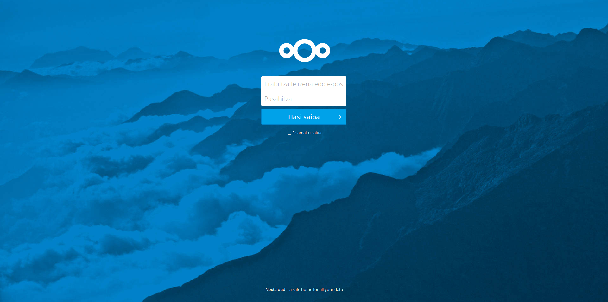
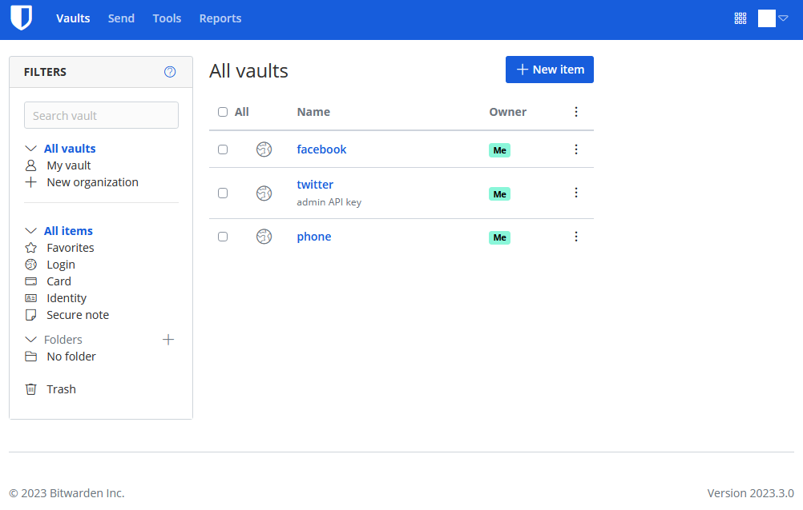

🎯 TL;DR

Tu paies Google Drive (120€/an), Netflix (156€/an), 1Password (36€/an), et tu trouves ça normal ? Spoiler : **tu peux tout héberger toi-même pour 0€/an** (si tu as déjà un serveur) ou 30€/an (avec un VPS).

**Ce guide pilier te montre comment :**

- Remplacer Google Drive par **Nextcloud** (cloud personnel)
- Remplacer Netflix par **Jellyfin** (streaming vidéo gratuit)
- Remplacer 1Password par **Vaultwarden** (gestionnaire de mots de passe)
- **Économiser 534€/an** (5 340€ sur 10 ans)
- Garder le **contrôle total** de tes données
- Installer le tout en **un weekend**

💡 **Bonus** : Télécharge la **checklist gratuite « 30 jours pour l’indépendance numérique »** + script bash de backup automatisé en fin d’article.

- - - - - -

- [Pourquoi l’indépendance numérique, maintenant ?](#pourquoi-lindependance-numerique-maintenant)
  - [La vraie question : Combien tu paies pour tes données ?](#la-vraie-question-combien-tu-paies-pour-tes-donnees)
  - [Les 3 piliers de ton indépendance](#les-3-piliers-de-ton-independance)
- [Le matériel nécessaire : Moins cher que tu penses](#le-materiel-necessaire-moins-cher-que-tu-penses)
  - [Option 1 : Tu as déjà un serveur/NAS ?](#option-1-tu-as-deja-un-serveur-nas)
  - [Option 2 : Partir de zéro avec un Mini PC](#option-2-partir-de-zero-avec-un-mini-pc)
  - [Option 3 : VPS Cloud (si pas de matériel)](#option-3-vps-cloud-si-pas-de-materiel)
- [Les 3 services à installer (dans l’ordre)](#les-3-services-a-installer-dans-lordre)
  - [🗄️ Service 1 : Nextcloud – Ton cloud personnel](#%F0%9F%97%84%EF%B8%8F-service-1-nextcloud-ton-cloud-personnel)
  - [🎬 Service 2 : Jellyfin – Ton Netflix personnel](#%F0%9F%8E%AC-service-2-jellyfin-ton-netflix-personnel)
  - [🔐 Service 3 : Vaultwarden – Ton coffre-fort personnel](#%F0%9F%94%90-service-3-vaultwarden-ton-coffre-fort-personnel)
- [Le plan d’installation : Un weekend suffit](#le-plan-dinstallation-un-weekend-suffit)
  - [Vendredi soir : Préparation (1h)](#vendredi-soir-preparation-1-h)
  - [Samedi matin : Nextcloud (2-3h)](#samedi-matin-nextcloud-2-3-h)
  - [Samedi après-midi : Jellyfin (2h)](#samedi-apres-midi-jellyfin-2-h)
  - [Dimanche matin : Vaultwarden (1h)](#dimanche-matin-vaultwarden-1-h)
  - [Dimanche après-midi : Sécurité &amp; Backups (2h)](#dimanche-apres-midi-securite-backups-2-h)
- [Les coûts réels : Le calcul complet](#les-couts-reels-le-calcul-complet)
  - [Scénario 1 : Mini PC à domicile](#scenario-1-mini-pc-a-domicile)
  - [Scénario 2 : VPS Cloud](#scenario-2-vps-cloud)
  - [Scénario 3 : Stack complète (+ streaming)](#scenario-3-stack-complete-streaming)
- [Les avantages cachés (au-delà de l’argent)](#les-avantages-caches-au-dela-de-largent)
  - [1. Vie privée &amp; RGPD](#1-vie-privee-rgpd)
  - [2. Pérennité &amp; Contrôle](#2-perennite-controle)
  - [3. Performances](#3-performances)
  - [4. Apprentissage](#4-apprentissage)
- [Les inconvénients (soyons honnêtes)](#les-inconvenients-soyons-honnetes)
  - [Ce que tu dois accepter](#ce-que-tu-dois-accepter)
- [FAQ : Questions fréquentes](#faq-questions-frequentes)
  - [C’est légal d’héberger mes propres services ?](#faq-question-1762338738055)
  - [Et si je pars en vacances 2 semaines ?](#faq-question-1762338758596)
  - [Mon FAI bride l’upload, ça marche quand même ?](#faq-question-1762338846419)
  - [Je suis pas dev, c’est trop compliqué pour moi ?](#faq-question-1762338871068)
  - [Mes données sont-elles vraiment en sécurité ?](#faq-question-1762338932762)
- [Aller plus loin : La stack complète](#aller-plus-loin-la-stack-complete)
  - [Services complémentaires recommandés](#services-complementaires-recommandes)
- [🎁 BONUS : Ton pack de démarrage gratuit](#%F0%9F%8E%81-bonus-ton-pack-de-demarrage-gratuit)
  - [Ce que tu reçois gratuitement](#ce-que-tu-recois-gratuitement)
  - [👇 Télécharge maintenant (100% gratuit)](#%F0%9F%91%87-telecharge-maintenant-100-gratuit)
- [Conclusion : Et maintenant ?](#conclusion-et-maintenant)
- [📚 Ressources complémentaires](#%F0%9F%93%9A-ressources-complementaires)
  - [Articles liés sur BrandonVisca.com](#articles-lies-sur-brandon-visca-com)
  - [Communautés francophones](#communautes-francophones)

Pourquoi l’indépendance numérique, maintenant ?

### La vraie question : Combien tu paies pour tes données ?

**Fais le calcul annuel :**

Service | Prix/an | Alternative auto-hébergée | Économie | Google Drive 100GB | 120€ | Nextcloud | 120€/an | iCloud 50GB | 12€ | Nextcloud | 12€/an | Netflix Standard | 156€ | Jellyfin | 156€/an | Disney+ | 120€ | Jellyfin | 120€/an | Prime Video | 70€ | Jellyfin | 70€/an | Spotify Famille | 180€ | Jellyfin | 180€/an | 1Password | 36€ | Vaultwarden | 36€/an | Dashlane | 40€ | Vaultwarden | 40€/an | 

💰 **Total typique : 534-734€/an**  
💰 **Sur 10 ans : 5 340-7 340€**

Et c’est sans compter :

- La **revente de tes données** (publicités ciblées)
- Les **augmentations de prix** régulières (Netflix +30% en 3 ans)
- La **dépendance** aux plateformes américaines
- Le **risque de censure** ou fermeture de compte

### Les 3 piliers de ton indépendance

**Pilier 1 : Stockage &amp; Productivité** → **Nextcloud**

- Alternative Google Drive/iCloud/OneDrive
- Fichiers, calendrier, contacts, notes, photos
- Synchronisation PC/mobile/navigateur
- Partage sécurisé en famille/équipe

**Pilier 2 : Divertissement** → **Jellyfin**

- Alternative Netflix/Disney+/Prime Video
- Films, séries, musique, livres audio
- Streaming 4K avec transcoding
- Apps iOS/Android/TV/navigateur

**Pilier 3 : Sécurité** → **Vaultwarden**

- Alternative 1Password/Dashlane/LastPass
- Gestionnaire de mots de passe chiffré
- 2FA intégré (TOTP)
- Extensions navigateur + apps mobiles

- - - - - -

Le matériel nécessaire : Moins cher que tu penses

### Option 1 : Tu as déjà un serveur/NAS ?

**✅ C’est parfait !** Si tu as :

- Un serveur Linux existant
- Un NAS Synology/QNAP avec Docker
- Un vieux PC sous Ubuntu Server
- Un Raspberry Pi 4/5

**→ Coût supplémentaire : 0€** (juste l’électricité : ~24€/an)

### Option 2 : Partir de zéro avec un Mini PC

**Matériel recommandé :**

- [Beelink Mini S12 Pro](https://amzn.to/4qGqtTI) – **289€**
  - Intel N100 4 cœurs
  - 16GB RAM
  - 500GB SSD
  - Consommation 10W (2€/mois élec)
- [Disque externe 2TB](https://amzn.to/4942V4X) – **85€** (backups)

**💰 Total : 374€ + 24€/an électricité**

**Rentabilité :**

- Coût année 1 : 398€
- Économie année 1 : 534€ – 398€ = **136€ net**
- Années suivantes : **510€/an économisés**

### Option 3 : VPS Cloud (si pas de matériel)

**VPS recommandé :**

- [CONTABO Cloud VPS 10](https://www.anrdoezrs.net/click-101572444-13796470) – **3,60€/mois = **43.20**€/an**
  - 4 vCPU
  - 8GB RAM
  - 75GB SSD

**Économie : 534€ – 44€ = 490€/an**

- - - - - -

Les 3 services à installer (dans l’ordre)

### 🗄️ Service 1 : Nextcloud – Ton cloud personnel

**C’est quoi ?**  
Nextcloud, c’est **Google Drive + Google Photos + Google Calendar + Google Keep** dans un seul logiciel open source que tu héberges.

**Pourquoi commencer par Nextcloud ?**

- C’est le **plus utile au quotidien**
- Facile à installer (30 min)
- Remplace 4-5 services Google d’un coup
- Apps mobiles excellentes

**Ce que tu peux faire avec :**

- ☁️ Stocker et synchroniser tes fichiers (illimité)
- 📸 Sauvegarder tes photos automatiquement (comme Google Photos)
- 📅 Gérer calendriers et contacts
- 📝 Prendre des notes collaboratives
- 🎥 Appels vidéo chiffrés (Talk)
- 📧 Client webmail intégré (Mail)
- 🔒 Partage sécurisé avec expiration et mot de passe

**Installation : 30 minutes**

👉 **[Guide complet : Installer Nextcloud avec Docker en 2025](https://brandonvisca.com/nextcloud-docker-installation-complete-2025/)**

**Ce que tu vas apprendre :**

- Installation Docker Compose optimisée
- Configuration SSL automatique (Let’s Encrypt)
- Réglages performances (Redis, APCu, cron)
- Apps essentielles à activer
- Synchronisation PC/mobile

**Prérequis :**

- Serveur Linux (ou VPS)
- Docker installé
- Nom de domaine (10€/an)

**Économie : 120-180€/an** (Google Drive + iCloud)

- - - - - -

### 🎬 Service 2 : Jellyfin – Ton Netflix personnel

**C’est quoi ?**  
Jellyfin, c’est **Netflix + Disney+ + Prime Video + Spotify** dans un logiciel gratuit, open source, sans pub, sans télémétrie.

**Pourquoi c’est mieux que les plateformes commerciales ?**

- ✅ **Pas d’abonnement** mensuel (0€ à vie)
- ✅ **Ton contenu** = pas de suppression par la plateforme
- ✅ **Pas de censure** ni géoblocage
- ✅ **Qualité maximale** (4K/HDR sans compression)
- ✅ **Hors ligne** sur mobile (téléchargement)
- ✅ **Zéro pub** ou trailers imposés

**Ce que tu peux faire avec :**

- 🎥 Streamer tes films et séries
- 🎵 Écouter ta bibliothèque musicale
- 📚 Lire tes ebooks et livres audio
- 📺 TV en direct (avec extension IPTV)
- 📱 Regarder sur PC/mobile/TV/navigateur
- 👨‍👩‍👧‍👦 Partager avec la famille (comptes séparés)

**Installation : 15 minutes**

👉 **[Guide complet : Jellyfin – Alternative Netflix gratuite avec Docker](https://brandonvisca.com/jellyfin-docker-alternative-netflix-gratuite/)**

**Ce que tu vas apprendre :**

- Installation Docker avec transcoding hardware
- Configuration bibliothèques (films/séries/musique)
- Optimisation streaming 4K
- Apps mobiles iOS/Android/TV
- Partage sécurisé en famille

**Prérequis :**

- Nextcloud installé (pour stocker les médias)
- Espace disque selon ta collection
- GPU recommandé pour transcoding 4K

**Économie : 346-526€/an** (Netflix + Disney+ + Prime + Spotify)

- - - - - -

### 🔐 Service 3 : Vaultwarden – Ton coffre-fort personnel

**C’est quoi ?**  
Vaultwarden, c’est **1Password + Dashlane + LastPass** dans un gestionnaire de mots de passe gratuit, open source, chiffré end-to-end.

**Pourquoi tu DOIS avoir un gestionnaire de mots de passe ?**

- 🚨 **81% des piratages** sont dus à des mots de passe faibles/réutilisés
- 🤦‍♂️ Tu utilises encore `Azerty123!` partout ?
- 🔓 Chrome/Firefox mémorisent sans chiffrement fort
- 💰 Les gestionnaires commerciaux coûtent 36-60€/an

**Ce que tu peux faire avec :**

- 🔐 Stocker tous tes mots de passe chiffrés
- 🎲 Générer mots de passe ultra-sécurisés (30+ caractères)
- 🔄 Synchroniser PC/mobile/navigateur
- 👨‍👩‍👧 Partager identifiants en famille (coffres partagés)
- 🔑 2FA intégré (TOTP comme Google Authenticator)
- 💳 Cartes bancaires, notes sécurisées
- 📋 Remplissage automatique formulaires

**Installation : 15 minutes**

👉 **[Guide complet : Vaultwarden – Gestionnaire de mots de passe gratuit avec Docker](https://brandonvisca.com/vaultwarden-docker-gestionnaire-mots-de-passe/)**

**Ce que tu vas apprendre :**

- Installation Docker ultra-légère (512 Mo RAM)
- Configuration SSL obligatoire (sécurité)
- Extensions navigateur Chrome/Firefox/Safari
- Apps mobiles iOS/Android
- Import depuis Chrome/1Password/LastPass
- Activation 2FA (Yubikey supporté)

**Prérequis :**

- Nom de domaine dédié recommandé
- Certificat SSL valide (Let’s Encrypt)
- Backup chiffré obligatoire

**Économie : 36-60€/an** (1Password/Dashlane)

- - - - - -

Le plan d’installation : Un weekend suffit

### Vendredi soir : Préparation (1h)

**Matériel**

- Serveur Linux prêt (ou VPS loué)
- Nom de domaine acheté (ex: tonnom.fr – 10€/an)
- Sous-domaines configurés dans le DNS : 
  - `cloud.tonnom.fr` → Nextcloud
  - `media.tonnom.fr` → Jellyfin
  - `vault.tonnom.fr` → Vaultwarden

**Logiciels**

- Docker installé
- Docker Compose installé
- Traefik ou Nginx Proxy Manager (reverse proxy)

**Sauvegardes**

- Disque externe branché (ou backup automatique VPS)

- - - - - -

### Samedi matin : Nextcloud (2-3h)

**9h00 – Installation base**

- Créer `docker-compose.yml` Nextcloud
- Lancer les conteneurs
- Accéder à l’interface web
- Créer compte admin

**10h00 – Configuration**

- Configurer Redis (cache)
- Activer APCu (performances)
- Configurer cron
- Tester upload/download

**11h00 – Apps et synchro**

- Installer apps essentielles (Photos, Calendar, Tasks)
- Télécharger app mobile
- Synchroniser premier dossier
- Test photos auto-upload

**Pause déjeuner** 🍕

- - - - - -

### Samedi après-midi : Jellyfin (2h)

**14h00 – Installation**

- Créer `docker-compose.yml` Jellyfin
- Configurer volumes médias
- Activer transcoding hardware (si dispo)

**15h00 – Bibliothèques**

- Ajouter bibliothèque Films
- Ajouter bibliothèque Séries
- Scanner métadonnées automatiques
- Tester lecture 4K

**16h00 – Apps et partage**

- Installer app mobile
- Créer compte famille
- Tester streaming mobile

- - - - - -

### Dimanche matin : Vaultwarden (1h)

**9h00 – Installation**

- Créer `docker-compose.yml` Vaultwarden
- Vérifier SSL (OBLIGATOIRE)
- Créer compte admin

**9h30 – Configuration**

- Installer extension navigateur
- Installer app mobile
- Importer mots de passe existants
- Activer 2FA sur le compte

**10h00 – Migration**

- Générer mots de passe forts pour comptes importants
- Organiser en dossiers
- Tester remplissage automatique

- - - - - -

### Dimanche après-midi : Sécurité &amp; Backups (2h)

**14h00 – Sécurisation**

- Firewall configuré (ufw ou iptables)
- Fail2ban installé
- Certificats SSL vérifiés
- Headers HTTP sécurisés (Nginx/Traefik)

**15h00 – Backups automatisés**

- Script backup Nextcloud (base + data)
- Script backup Vaultwarden (export chiffré)
- Cron quotidien configuré
- Test restauration

**16h00 – Documentation**

- Noter tous les identifiants admin dans Vaultwarden
- Documenter procédure restauration
- Partager accès famille si nécessaire

- - - - - -

Les coûts réels : Le calcul complet

### Scénario 1 : Mini PC à domicile

**Investissement initial :**

- Mini PC Beelink : 289€
- Disque externe 2TB : 85€
- Nom de domaine : 10€/an
- **Total année 1 : 384€**

**Coûts récurrents :**

- Électricité (10W) : 24€/an
- Nom de domaine : 10€/an
- **Total annuel : 34€/an**

**VS Abonnements commerciaux :**

- Google Drive : 120€/an
- Netflix : 156€/an
- 1Password : 36€/an
- **Total : 312€/an minimum**

**💰 Rentabilité : 38€ dès la première année**  
**💰 Années suivantes : 278€/an économisés**  
**💰 Sur 5 ans : 1 376€ économisés**

- - - - - -

### Scénario 2 : VPS Cloud

**Coûts :**

- VPS Contabo Cloud VPS 10 : 44€/an
- Nom de domaine : 10€/an
- **Total : 54€/an**

**VS Abonnements :**

- Total abonnements : 312€/an minimum

**💰 Économie immédiate : 258€/an**  
**💰 Sur 5 ans : 1 290€ économisés**

- - - - - -

### Scénario 3 : Stack complète (+ streaming)

**Si tu ajoutes tous les services de streaming :**

**Abonnements commerciaux :**

- Stockage : 120€/an
- Netflix Standard : 156€/an
- Disney+ : 120€/an
- Prime Video : 70€/an
- Spotify Famille : 180€/an
- 1Password : 36€/an
- **Total : 682€/an**

**Auto-hébergement (Mini PC) :**

- Coûts récurrents : 34€/an

**💰 Économie annuelle : 648€/an**  
**💰 Sur 10 ans : 6 480€ économisés**

- - - - - -

Les avantages cachés (au-delà de l’argent)

### 1. Vie privée &amp; RGPD

**Avec les GAFAM :**

- ❌ Tes données analysées pour ciblage publicitaire
- ❌ Partage avec partenaires tiers
- ❌ Stockage hors UE (Cloud Act américain)
- ❌ Obligation de confiance aveugle

**Avec ton homelab :**

- ✅ **Tes données restent chez toi** (conformité RGPD)
- ✅ Zéro revente ou analyse
- ✅ Chiffrement end-to-end maîtrisé
- ✅ Audit du code open source possible

### 2. Pérennité &amp; Contrôle

**Avec les abonnements :**

- ❌ Augmentations de prix régulières (+30% Netflix en 3 ans)
- ❌ Suppression de contenu sans préavis
- ❌ Fermeture de compte sans recours
- ❌ Dépendance totale à la plateforme

**Avec ton homelab :**

- ✅ **Coût fixe** (électricité uniquement)
- ✅ Contenu jamais supprimé (c’est le tien !)
- ✅ Aucun risque de ban/suspension
- ✅ Indépendance technique complète

### 3. Performances

**Cloud commercial :**

- ❌ Bande passante limitée
- ❌ Compression vidéo agressive
- ❌ Latence selon charge serveurs
- ❌ Quotas de stockage stricts

**Homelab local :**

- ✅ **Débit LAN 1 Gbps** (vs 100 Mbps cloud)
- ✅ Qualité originale préservée (4K/HDR)
- ✅ Latence quasi-nulle
- ✅ Stockage illimité (selon ton disque)

### 4. Apprentissage

**Bonus non négligeable :**

- 🧠 Compétences Docker (recherché sur le marché)
- 🔧 Maîtrise Linux administration
- 🌐 Compréhension réseaux/DNS/SSL
- 💼 Expérience valorisable en CV (DevOps, SysAdmin)

- - - - - -

Les inconvénients (soyons honnêtes)

### Ce que tu dois accepter

**Temps d’installation :**

- ⏱️ **~6-8h sur un weekend** (vs 5 min un abonnement commercial)
- Mais c’est one-shot, après ça tourne tout seul

**Maintenance :**

- 🔧 **~2h/mois** (updates Docker, vérif logs)
- Automatisable avec scripts

**Risques techniques :**

- 💥 **Pannes possibles** (coupure élec, disque défaillant)
- Mitigation : UPS + backups automatiques
- Uptime réaliste : 99.5% (vs 99.95% commercial)

**Bande passante upload :**

- 📡 **Accès distant limité** par ton débit ADSL/Fibre
- Solutions : VPN WireGuard + compression
- Ou VPS avec tunnel reverse proxy

**Légalité du contenu :**

- ⚖️ **Ta responsabilité** (pas de plateforme qui filtre)
- OK : Tes achats DVD/Blu-ray rippés
- OK : Tes vidéos personnelles
- KO : Téléchargements illégaux

- - - - - -

FAQ : Questions fréquentes

### C’est légal d’héberger mes propres services ?

**Oui, 100% légal.**  
Tu as le droit d’héberger :  
✅ Tes propres fichiers (Nextcloud)  
✅ Tes mots de passe (Vaultwarden)  
✅ Tes achats DVD/Blu-ray rippés (Jellyfin)  
✅ Tes vidéos personnelles  
Par contre :  
❌ Partager du contenu piraté = illégal  
❌ Revendre l’accès = illégal  
**En gros : Usage personnel OK, redistribution KO.**

### Et si je pars en vacances 2 semaines ?

**Ton serveur tourne H24, pas de souci.**  
Pour l’accès distant :  
**VPN WireGuard** recommandé (sécurisé)  
Ou reverse proxy avec SSL valide  
Apps mobiles fonctionnent partout  
Monitoring recommandé : **Uptime Kuma** (alerte si panne)

### Mon FAI bride l’upload, ça marche quand même ?

**Ça dépend de ton usage :**  
**ADSL 1 Mbps upload :**  
✅ Nextcloud OK (synchro lente mais fonctionnelle)  
❌ Jellyfin distant compliqué (streaming 720p max)  
✅ Vaultwarden OK (très léger)  
**Fibre 300 Mbps upload :**  
✅ Tout fonctionne parfaitement  
✅ Streaming 4K distant fluide  
**Solutions si upload faible :**  
VPS avec tunnel (contourner limitation)  
Transcoding Jellyfin → qualité réduite automatique  
Nextcloud en local uniquement

### Je suis pas dev, c’est trop compliqué pour moi ?

**Si tu sais :**  
Copier/coller des commandes dans un terminal  
Suivre un tuto étape par étape  
Chercher sur Google en cas d’erreur  
**→ Alors tu peux le faire.**  
Les guides sont conçus pour débutants motivés. Temps d’apprentissage : 1 weekend.

### Mes données sont-elles vraiment en sécurité ?

**Plus qu’avec Google/Microsoft, oui.**  
**Sécurité physique :**  
✅ Chiffrement disque (LUKS)  
✅ Backup chiffré externe (GPG)  
✅ Accès local = pas sur internet = pas de bruteforce  
**Sécurité réseau :**  
✅ Firewall (ufw) activé  
✅ Fail2ban contre attaques  
✅ Certificats SSL valides  
✅ Headers HTTP sécurisés  
**VS Cloud commercial :**  
❓ Confiance aveugle obligatoire  
❓ Backdoors gouvernementales potentielles (Patriot Act)  
❓ Failles de sécurité chez le fournisseur  
**Règle d’or :** Backups 3-2-1 (3 copies, 2 supports, 1 hors site)

- - - - - -

Aller plus loin : La stack complète

### Services complémentaires recommandés

**Monitoring &amp; Santé**

- [📊 **Uptime Kuma** → Surveille tes services H24](https://brandonvisca.com/docker-debutant-services-auto-heberger/)
- 📈 **Grafana + Prometheus** → Dashboard monitoring avancé
- 📧 **Alertes email/Telegram** si service down

**Réseau &amp; Accès**

- 🔐 **WireGuard VPN** → Accès sécurisé depuis l’extérieur
- 🌐 **Nginx Proxy Manager** → Reverse proxy visuel
- 🛡️ **Cloudflare Tunnel** → Protège ton IP publique

**Automatisation &amp; Backups**

- 🔄 **Restic** → Backups incrémentaux chiffrés
- ⏰ **Cron + scripts bash** → Automatisation tâches
- 💾 **Duplicati** → Backup vers cloud externe chiffré

**Communication**

- 💬 **Matrix (Synapse)** → Alternative WhatsApp/Telegram
- 📞 **Jitsi Meet** → Visioconférence auto-hébergée
- 📧 **Mail-in-a-Box** → Serveur email complet

- - - - - -

🎁 BONUS : Ton pack de démarrage gratuit

### Ce que tu reçois gratuitement

En téléchargeant le **Pack Indépendance Numérique 2025**, tu obtiens :

**📋 Checklist PDF « 30 jours pour l’indépendance »**

- Planning jour par jour
- Étapes détaillées installation
- Commandes prêtes à l’emploi
- Troubleshooting fréquent

**💾 Script bash « backup-homelab.sh »**

- Backup automatique Nextcloud + Jellyfin + Vaultwarden
- Chiffrement GPG intégré
- Rotation automatique (7 derniers jours)
- Compatible cron

**📊 Template Excel « Calcul ROI homelab »**

- Compare tes abonnements actuels
- Calcule ton retour sur investissement
- Projections 1/5/10 ans

**🔧 Docker Compose templates**

- Fichiers prêts à l’emploi
- Commentaires détaillés
- Configurations optimisées production

- - - - - -

### 👇 Télécharge maintenant (100% gratuit)

###  🎁 Pack Indépendance Numérique 2025 

 **Reçois gratuitement :**

- ✅ Checklist 30 jours (PDF 15 pages)
- ✅ Script backup automatisé
- ✅ Templates Docker Compose
- ✅ Calculateur ROI Excel
 
  <noscript> Remarque : JavaScript est requis pour ce contenu.</noscript>   🔒 Zéro spam. Tu peux te désinscrire à tout moment.  
 On respecte ta vie privée (forcément, on prêche l’indépendance numérique 😉)

- - - - - -

Conclusion : Et maintenant ?

Tu viens de découvrir comment **reprendre le contrôle de ta vie numérique** tout en économisant **534€/an minimum**.

**Les 3 prochaines étapes :**

1. **Télécharge le Pack gratuit** ci-dessus (checklist + scripts)
2. **Choisis ton matériel** (Mini PC ou VPS)
3. **Bloque un weekend** et suis les guides : 
  - [Nextcloud Docker →](https://brandonvisca.com/nextcloud-docker-installation-complete-2025/)
  - [Jellyfin Docker →](https://brandonvisca.com/jellyfin-docker-alternative-netflix-gratuite/)
  - [Vaultwarden Docker →](https://brandonvisca.com/vaultwarden-docker-gestionnaire-mots-de-passe/)

**Dans 1 mois, tu auras :**

- ☁️ Ton propre cloud privé (Nextcloud)
- 🎬 Ton Netflix personnel (Jellyfin)
- 🔐 Ton coffre-fort sécurisé (Vaultwarden)
- 💰 534€/an économisés
- 🧠 Des compétences valorisables
- 🎯 L’indépendance numérique

**La vraie question n’est plus « Pourquoi faire ça ? »**  
**C’est « Pourquoi continuer à payer ? »**

- - - - - -

📚 Ressources complémentaires

### Articles liés sur BrandonVisca.com

**Guides d’installation :**

- [Nextcloud Docker : Installation complète 2025](https://brandonvisca.com/nextcloud-docker-installation-complete-2025/)
- [Jellyfin : Alternative Netflix gratuite avec Docker](https://brandonvisca.com/jellyfin-docker-alternative-netflix-gratuite/)
- [Vaultwarden : Gestionnaire de mots de passe avec Docker](https://brandonvisca.com/vaultwarden-docker-gestionnaire-mots-de-passe/)

**Sécurité &amp; Infrastructure :**

- [Sécuriser ton serveur Linux : Guide complet](https://brandonvisca.com/securite-de-votre-serveur-linux/)
- [Nginx : Sécuriser avec les headers HTTP](https://brandonvisca.com/securiser-nginx-avec-headers-http/)
- [WireGuard VPN : Accès sécurisé à ton homelab](https://brandonvisca.com/wireguard-vpn-docker/) *(à venir)*

**Matériel &amp; Optimisation :**

- [Mini PC homelab 2025 : Top 7 comparatif](https://brandonvisca.com/mini-pc-homelab-2025/) *(à venir)*
- [NAS DIY vs Synology : Le vrai calcul économique](https://brandonvisca.com/nas-diy-vs-synology/) *(à venir)*

### Communautés francophones

- **Reddit** : r/france, r/selfhosted
- **Forums** : HardwareFR, Homelab France
- **Discord** : Homelab FR, Docker FR
# **Fais le calcul annuel :**
**Fais le calcul annuel :**

| Service | Prix/an | Alternative auto-hébergée | Économie |
|---|---|---|---|
| Google Drive 100GB | 120€ | Nextcloud | 120€/an |
| iCloud 50GB | 12€ | Nextcloud | 12€/an |
| Netflix Standard | 156€ | Jellyfin | 156€/an |
| Disney+ | 120€ | Jellyfin | 120€/an |
| Prime Video | 70€ | Jellyfin | 70€/an |
| Spotify Famille | 180€ | Jellyfin | 180€/an |
| 1Password | 36€ | Vaultwarden | 36€/an |
| Dashlane | 40€ | Vaultwarden | 40€/an |

## Articles connexes

- [Pourquoi j'ai quitté Google (et comment tu peux faire pareil](/quitter-google-auto-hebergement/)
- [Auto-hébergement : Le guide ultime 2025 pour reprendre contr](/auto-hebergement-guide-complet-2025/)
