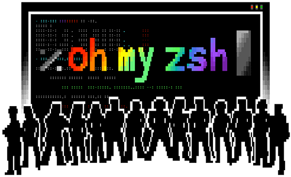

- [Prérequis : Ce qu’il vous faut avant de commencer](#prerequis-ce-quil-vous-faut-avant-de-commencer)
  - [Installation de Zsh](#installation-de-zsh)
  - [Installation de Git](#installation-de-git)
  - [🚨 Erreur fréquente](#%F0%9F%9A%A8-erreur-frequente)
- [Installation de Oh My Zsh : La méthode qui marche](#installation-de-oh-my-zsh-la-methode-qui-marche)
  - [Méthode recommandée (curl)](#methode-recommandee-curl)
  - [Méthode alternative (wget)](#methode-alternative-wget)
  - [✅ À savoir](#%E2%9C%85-a-savoir)
- [Configuration de base : Les incontournables](#configuration-de-base-les-incontournables)
  - [Le fichier de configuration](#le-fichier-de-configuration)
  - [Structure du .zshrc](#structure-du-zshrc)
  - [Premiers réglages sympas](#premiers-reglages-sympas)
- [Powerlevel10k : Le thème qui tue tout](#powerlevel-10-k-le-theme-qui-tue-tout)
  - [Pourquoi Powerlevel10k ?](#pourquoi-powerlevel-10-k)
  - [Installation de Powerlevel10k](#installation-de-powerlevel-10-k)
  - [Activation du thème](#activation-du-theme)
  - [🎯 Configuration wizard](#%F0%9F%8E%AF-configuration-wizard)
  - [Installation des polices Nerd Font (crucial !)](#installation-des-polices-nerd-font-crucial)
  - [🚨 Problèmes fréquents avec Powerlevel10k](#%F0%9F%9A%A8-problemes-frequents-avec-powerlevel-10-k)
- [Plugins essentiels : Votre nouveau superpouvoir](#plugins-essentiels-votre-nouveau-superpouvoir)
  - [Ma config plugins de base](#ma-config-plugins-de-base)
  - [Plugins communautaires indispensables](#plugins-communautaires-indispensables)
  - [⚡ Plugins par cas d’usage](#%E2%9A%A1-plugins-par-cas-dusage)
  - [🎯 Alias magiques](#%F0%9F%8E%AF-alias-magiques)
- [Configuration avancée : Pour les ninjas 🥷](#configuration-avancee-pour-les-ninjas-%F0%9F%A5%B7)
  - [Alias personnalisés](#alias-personnalises)
  - [Fonctions utiles](#fonctions-utiles)
  - [Variables d’environnement](#variables-denvironnement)
  - [🔧 Configuration Powerlevel10k avancée](#%F0%9F%94%A7-configuration-powerlevel-10-k-avancee)
- [Maintenance et troubleshooting](#maintenance-et-troubleshooting)
  - [Mise à jour](#mise-a-jour)
  - [Problèmes courants](#problemes-courants)
  - [Sauvegarde de votre config](#sauvegarde-de-votre-config)
  - [Désinstallation (si vraiment nécessaire)](#desinstallation-si-vraiment-necessaire)
- [La stack productivité complète : Terminal + Interface](#la-stack-productivite-complete-terminal-interface)
  - [L’écosystème parfait](#lecosysteme-parfait)
  - [Pourquoi cette combinaison cartonne ?](#pourquoi-cette-combinaison-cartonne)
- [Conclusion](#conclusion)
  - [Et maintenant ?](#et-maintenant)
  - [Le mot de la fin](#le-mot-de-la-fin)
- [Liens utiles](#liens-utiles)


Introduction : Pourquoi Oh My Zsh va changer votre vie

**Spoiler alert :** Après avoir installé Oh My Zsh, vous ne pourrez plus jamais revenir au bash par défaut. C’est scientifiquement prouvé (bon, pas vraiment, mais presque).

[Oh My Zsh](https://ohmyz.sh/) est **LE** framework open-source qui transforme votre terminal terne en véritable cockpit de développeur. Imaginez Git qui vous dit où vous en êtes d’un coup d’œil, l’autocomplétion qui lit dans vos pensées, et un prompt qui fait baver d’envie vos collègues.

**Ce que vous allez gagner :**

- ⚡ Un terminal **10x plus productif**
- 🎨 Un prompt **magnifique** et informatif
- 🚀 Des **centaines de plugins** prêts à l’emploi
- 🧠 Une **autocomplétion intelligente** qui anticipe vos besoins

**Pour qui ?** Développeurs, sysadmins, étudiants, ou quiconque passe plus de 5 minutes par jour dans un terminal (donc vous, probablement).

- - - - - -

Prérequis : Ce qu’il vous faut avant de commencer

### Installation de Zsh

Avant de plonger dans Oh My Zsh, assurez-vous d’avoir Zsh installé :

**Ubuntu/Debian :**

```bash
sudo apt update && sudo apt install zsh

```

brew install zsh


**CentOS/RHEL/Fedora :**

```bash
# CentOS/RHEL
sudo yum install zsh
# Fedora
sudo dnf install zsh

```

zsh --version
# Devrait afficher quelque chose comme : zsh 5.8.1


### Installation de Git

Git est indispensable pour Oh My Zsh :

```bash
# Ubuntu/Debian
sudo apt install git

# macOS
git --version  # Déjà installé normalement
# Ou avec Homebrew : brew install git

# CentOS/RHEL
sudo yum install git

```

source ~/.bashrc
exec zsh  # Pour basculer vers zsh


- - - - - -

Installation de Oh My Zsh : La méthode qui marche

### Méthode recommandée (curl)

```bash
sh -c "$(curl -fsSL https://raw.githubusercontent.com/ohmyzsh/ohmyzsh/master/tools/install.sh)"

```

sh -c "$(wget -O- https://raw.githubusercontent.com/ohmyzsh/ohmyzsh/master/tools/install.sh)"


**Ce qui se passe :**

1. Le script télécharge Oh My Zsh dans `~/.oh-my-zsh`
2. Sauvegarde votre `.zshrc` existant
3. Crée un nouveau `.zshrc` avec la config par défaut
4. Change votre shell par défaut vers zsh

### ✅ À savoir

L’installation vous demandera si vous voulez faire de zsh votre shell par défaut. **Répondez « Y »** (oui) sauf si vous avez une bonne raison de ne pas le faire.

- - - - - -

Configuration de base : Les incontournables

### Le fichier de configuration

Tout se passe dans `~/.zshrc`. Ouvrez-le avec votre éditeur préféré :

```bash
nano ~/.zshrc
# ou
vim ~/.zshrc
# ou
code ~/.zshrc  # VS Code

```

# Chemin vers Oh My Zsh
export ZSH="$HOME/.oh-my-zsh"

# Thème (on va changer ça bientôt 😉)
ZSH_THEME="robbyrussell"

# Plugins activés
plugins=(git)

# Source Oh My Zsh
source $ZSH/oh-my-zsh.sh

# Vos alias et configurations perso ici


### Premiers réglages sympas

Ajoutez ces lignes à la fin de votre `.zshrc` :

```bash
# Historique plus long et intelligent
HISTSIZE=10000
SAVEHIST=10000
setopt HIST_VERIFY
setopt SHARE_HISTORY
setopt APPEND_HISTORY

# Navigation plus fluide
setopt AUTO_CD
setopt CORRECT
setopt CORRECT_ALL

# Autocomplétion case-insensitive
zstyle ':completion:*' matcher-list 'm:{a-zA-Z}={A-Za-z}'

```

source ~/.zshrc


- - - - - -

Powerlevel10k : Le thème qui tue tout

Oubliez les thèmes basiques. **Powerlevel10k** (P10k pour les intimes) est **LE** thème qui va transformer votre terminal en vaisseau spatial.

### Pourquoi Powerlevel10k ?

- ⚡ **Ultra-rapide** : 10-100x plus rapide que les autres thèmes
- 🎨 **Magnifique** : Icons, couleurs, informations utiles
- 🔧 **Configurable** : Wizard interactif pour tout personnaliser
- 📊 **Informatif** : Git status, temps d’exécution, erreurs…

### Installation de Powerlevel10k

```bash
git clone --depth=1 https://github.com/romkatv/powerlevel10k.git ${ZSH_CUSTOM:-$HOME/.oh-my-zsh/custom}/themes/powerlevel10k

```

# Changez cette ligne :
ZSH_THEME="robbyrussell"

# Par celle-ci :
ZSH_THEME="powerlevel10k/powerlevel10k"


Rechargez :

```bash
source ~/.zshrc

```

p10k configure


**Guide de configuration (mes recommandations) :**

1. **Font icons :** Répondez « Y » si vous voyez les icônes correctement
2. **Prompt style :** « Rainbow » (option 3) – Le plus beau
3. **Character set :** « Unicode » – Plus d’icônes
4. **Show current time :** « 24-hour format » – Pratique pour les logs
5. **Prompt separators :** « Angled » – Look moderne
6. **Prompt heads :** « Sharp » – Style épuré
7. **Prompt tails :** « Flat » – Équilibré
8. **Prompt height :** « Two lines » – Plus d’espace
9. **Prompt spacing :** « Sparse » – Plus lisible
10. **Icons :** « Many icons » – On est là pour ça
11. **Prompt flow :** « Concise » – Optimisé
12. **Transient prompt :** « Yes » – Terminal plus propre

### Installation des polices Nerd Font (crucial !)

Pour que les icônes s’affichent correctement :

**macOS :** Le wizard propose l’installation automatique. Acceptez !

**Linux :**

```bash
# Téléchargement des polices recommandées
mkdir -p ~/.local/share/fonts
cd ~/.local/share/fonts

# MesloLGS NF (recommandée)
wget https://github.com/romkatv/powerlevel10k-media/raw/master/MesloLGS%20NF%20Regular.ttf
wget https://github.com/romkatv/powerlevel10k-media/raw/master/MesloLGS%20NF%20Bold.ttf
wget https://github.com/romkatv/powerlevel10k-media/raw/master/MesloLGS%20NF%20Italic.ttf
wget https://github.com/romkatv/powerlevel10k-media/raw/master/MesloLGS%20NF%20Bold%20Italic.ttf

# Refresh du cache des polices
fc-cache -fv

```

# Relancez la config
p10k configure
# Étape 1 : installez les polices recommandées


**Prompt lent :** Trop de segments activés

```bash
# Éditez la config
nano ~/.p10k.zsh
# Commentez les segments lourds (ex: disk_usage)

```

git config --global --add safe.directory /votre/repo


- - - - - -

Plugins essentiels : Votre nouveau superpouvoir

Oh My Zsh, c’est **300+ plugins** prêts à l’emploi. Voici ma sélection de ceux qui changent vraiment la vie.

### Ma config plugins de base

Dans votre `.zshrc`, remplacez la ligne `plugins=(git)` par :

```bash
plugins=(
  git
  docker
  docker-compose
  node
  npm
  yarn
  python
  pip
  sudo
  history
  colored-man-pages
  command-not-found
  extract
  web-search
)

```

git clone https://github.com/zsh-users/zsh-autosuggestions ${ZSH_CUSTOM:-~/.oh-my-zsh/custom}/plugins/zsh-autosuggestions


**zsh-syntax-highlighting** (Coloration syntaxique)

```bash
git clone https://github.com/zsh-users/zsh-syntax-highlighting.git ${ZSH_CUSTOM:-~/.oh-my-zsh/custom}/plugins/zsh-syntax-highlighting

```

plugins=(
  git
  docker
  # ... autres plugins
  zsh-autosuggestions
  zsh-syntax-highlighting  # TOUJOURS en dernier !
)


### ⚡ Plugins par cas d’usage

**Pour le développement web :**

```bash
plugins=(git node npm yarn react)

```

plugins=(git docker ssh-agent systemd ansible)


**Pour Python :**

```bash
plugins=(git python pip virtualenv)

```

# Navigation rapide
alias ll='ls -alF'
alias la='ls -A'
alias l='ls -CF'
alias ..='cd ..'
alias ...='cd ../..'

# Git shortcuts
alias gs='git status'
alias gd='git diff'
alias gl='git log --oneline --graph'

# Docker shortcuts
alias dps='docker ps --format "table {{.Names}}\t{{.Status}}\t{{.Ports}}"'
alias dlog='docker logs -f'

# Système
alias h='history'
alias c='clear'
alias reload='source ~/.zshrc'

# Recherche rapide
alias grep='grep --color=auto'
alias fgrep='fgrep --color=auto'
alias egrep='egrep --color=auto'


### Fonctions utiles

```bash
# Création rapide de dossier + navigation
mkcd() {
  mkdir -p "$1" && cd "$1"
}

# Backup rapide
backup() {
  cp "$1" "$1.backup.$(date +%Y%m%d-%H%M%S)"
}

# Recherche dans l'historique
hist() {
  history | grep "$1"
}

# IP publique
myip() {
  curl -s https://ipinfo.io/ip
}

```

# Éditeur par défaut
export EDITOR='nano'  # ou vim, code...

# Langues
export LANG=fr_FR.UTF-8
export LC_ALL=fr_FR.UTF-8

# Paths personnalisés
export PATH="$HOME/bin:$PATH"
export PATH="/usr/local/bin:$PATH"


### 🔧 Configuration Powerlevel10k avancée

Le fichier `~/.p10k.zsh` contient toute la config. Quelques tweaks sympas :

```bash
# Éditez le fichier
nano ~/.p10k.zsh

# Trouver cette section et personnaliser :
typeset -g POWERLEVEL9K_LEFT_PROMPT_ELEMENTS=(
  dir                     # Dossier actuel
  vcs                     # Git status
  # newline              # Nouvelle ligne
  prompt_char             # Caractère de prompt
)

typeset -g POWERLEVEL9K_RIGHT_PROMPT_ELEMENTS=(
  status                  # Code de retour
  command_execution_time  # Temps d'exécution
  background_jobs         # Jobs en arrière-plan
  time                    # Heure
)

```

omz update


**Powerlevel10k :**

```bash
git -C ${ZSH_CUSTOM:-$HOME/.oh-my-zsh/custom}/themes/powerlevel10k pull

```

# Exemple pour zsh-autosuggestions
git -C ${ZSH_CUSTOM:-~/.oh-my-zsh/custom}/plugins/zsh-autosuggestions pull


### Problèmes courants

**Prompt qui se charge lentement :**

```bash
# Debug des temps de chargement
time zsh -i -c exit

# Si > 1 seconde, debug Powerlevel10k
p10k configure
# Désactivez les segments lourds

```

rm ~/.zcompdump*
exec zsh


**Plugin qui ne marche pas :**

```bash
# Vérifiez qu'il est dans la liste
echo $plugins

# Rechargez la config
source ~/.zshrc

# Vérifiez les erreurs
zsh -x ~/.zshrc

```

# Backup de votre setup
tar -czf oh-my-zsh-backup.tar.gz ~/.zshrc ~/.p10k.zsh ~/.oh-my-zsh/custom/

# Restauration
tar -xzf oh-my-zsh-backup.tar.gz -C ~/


### Désinstallation (si vraiment nécessaire)

```bash
uninstall_oh_my_zsh

```

brew install --cask jordanbaird-ice

- - - - - -

Conclusion

**Bravo !** Vous venez de transformer votre terminal en véritable **cockpit de développeur**. Avec Oh My Zsh et Powerlevel10k, vous avez maintenant :

✅ Un terminal **magnifique** et informatif  
✅ Une **productivité décuplée** grâce aux plugins  
✅ Une **configuration pro** qui fait envie  
✅ Des **alias magiques** qui vous font gagner du temps

### Et maintenant ?

🚀 **Poussez plus loin :** Explorez [iTerm2 avec ma config ultime](https://brandonvisca.com/iterm2-terminal-macos/) pour une expérience terminale complète  
🐳 **Automatisez :** Intégrez avec Docker pour des environnements de dev isolés  
🔧 **Personnalisez :** Créez vos propres plugins et thèmes

### Le mot de la fin

Un bon terminal, c’est comme un bon café ☕ : ça rend tout le reste possible. Maintenant que vous avez goûté à Oh My Zsh + Powerlevel10k, impossible de revenir en arrière !

**Questions ? Problèmes ?** La communauté Oh My Zsh est ultra-active. Et n’hésitez pas à partager vos configs et découvertes !

- - - - - -

Liens utiles

- [Documentation officielle Oh My Zsh](https://github.com/ohmyzsh/ohmyzsh/wiki)
- [Powerlevel10k GitHub](https://github.com/romkatv/powerlevel10k)
- [Liste complète des plugins](https://github.com/ohmyzsh/ohmyzsh/wiki/Plugins)
- [Awesome Zsh Plugins](https://github.com/unixorn/awesome-zsh-plugins)
