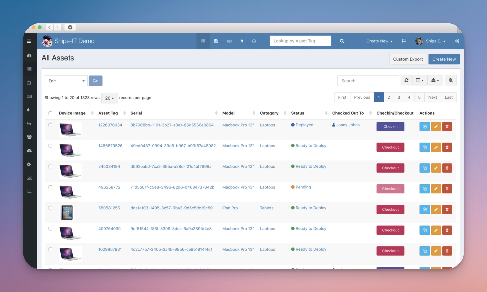
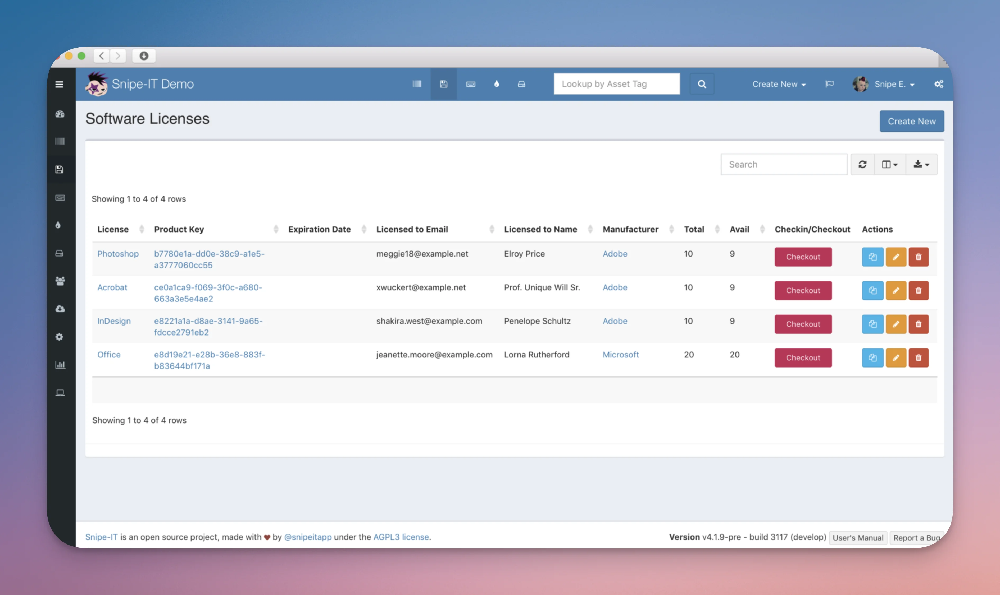

> 💡 **TL;DR**
> - Gérer son inventaire IT dans Excel finit toujours mal (fichier perdu, données périmées)
> - SnipeIT est l'alternative gratuite et open source pour suivre tes actifs IT sans stress
> - Tu sais enfin ce que tu as, où ça se trouve et dans quel état

- - - - - -

## Table des matières

Félicitations, tu viens de découvrir pourquoi l’**ITSM** existe. Et spoiler : c’est pas pour faire joli dans ton CV.

Si tu passes encore tes journées à chercher où est passé ce serveur Dell, ou si tu découvres que votre « inventaire » ressemble à un bazar de brocante mal organisé, cet article va te sauver la vie. On va parler ITSM, de pourquoi Excel c’est l’enfer, et comment SnipeIT peut transformer ton quotidien d’admin.

- - - - - -

## L’ITSM c’est quoi (sans le jargon marketing)

**ITSM** (IT Service Management), c’est l’art de ne plus perdre ses affaires dans le bureau. Sauf qu’au lieu de tes clés de voiture, c’est tes serveurs, tes licences logicielles et tes câbles réseau qui disparaissent dans la nature.

Concrètement, l’**inventaire IT** et la **gestion d’actifs** permettent de :

### Savoir ce que tu as

- Combien de PC sous Windows 10 (qu’il faut migrer avant la fin de support) ?
- Quelles licences Office expirent le mois prochain ?
- Où est passé ce switch Cisco commandé il y a 6 mois ?

### Savoir où ça se trouve

- Dans quel bureau est assigné ce portable ?
- Qui utilise cette licence Adobe Creative Suite à 50€/mois ?
- Quel serveur héberge quoi (et surtout, lequel on peut redémarrer sans faire hurler la compta) ?

### Prévoir les coûts

- Budget renouvellement matériel
- Planification des achats
- Suivi des garanties (avant qu’elles expirent, pas après)

**À savoir :** Dans une PME de 50 personnes, on estime qu’un admin passe **15-20% de son temps** juste à chercher des informations sur le matériel. Avec un bon système ITSM, ça tombe à moins de 5%.

- - - - - -

## Pourquoi Excel va te rendre dingue

### Le problème des versions multiples

Tu connais la chanson : `inventaire_final.xlsx`, `inventaire_final_v2.xlsx`, `inventaire_VRAIMENT_final.xlsx`, `inventaire_final_final_cette_fois.xlsx`.

Résultat ? Personne ne sait quelle version est la bonne. Ton collègue travaille sur une version d’il y a 3 mois pendant que toi tu mets à jour celle de la semaine dernière.

### Pas de workflow ni d’historique

- Qui a modifié quoi et quand ? Mystère.
- Comment suivre le cycle de vie d’un équipement ? Impossible.
- Comment savoir si ce PC a été reformaté ou juste « perdu » ? Bonne question.

### Zéro automatisation

Avec Excel, tu vas saisir à la main :

- Chaque nouvel équipement reçu
- Chaque attribution à un utilisateur
- Chaque changement de statut
- Chaque expiration de garantie (si tu y penses)

### Sécurité et accès catastrophiques

Qui peut modifier ton fichier Excel ? Tout le monde sur le réseau (si tu le partages) ou personne (si tu le gardes jalousement). Il n’y a pas de juste milieu.

**Erreur fréquente :** Mettre l’inventaire Excel sur un partage réseau accessible à tous. Résultat garanti : corruption de fichier sous 6 mois.

- - - - - -

## SnipeIT : ton nouveau meilleur ami

[SnipeIT](https://snipeitapp.com/) est une solution open source de **gestion d’actifs IT** qui fait exactement ce qu’Excel ne sait pas faire : être un vrai outil d’inventaire.

Avant de te lancer, sache qu'il existe un concurrent sérieux : le match est arbitré dans [SnipeIT vs GLPI](/snipeit-vs-glpi-comparatif-itsm-inventaire-it/).

### Pourquoi SnipeIT et pas autre chose ?

- **100% gratuit** (si tu l’héberges toi-même)
- **Interface moderne** qui ne ressemble pas à Windows 95
- **Workflow complet** de gestion des actifs
- **API REST** pour intégrer avec tes autres outils
- **Code QR/Codes-barres** pour scanner tes équipements

### Les fonctionnalités qui changent la vie

#### 1. Gestion complète du cycle de vie

Contrairement à Excel, SnipeIT suit tes équipements de A à Z :

- **Réception** → statut « Prêt à déployer »
- **Attribution** → assigné à Jean-Michel du service compta
- **Maintenance** → en réparation chez le prestataire
- **Fin de vie** → recyclage ou revente

#### 2. Notifications automatiques

Fini les « Oups, la garantie était expirée depuis 6 mois » :

- Alertes d’expiration de garantie
- Rappels de maintenance préventive
- Notifications de licences qui arrivent à échéance

#### 3. Génération de rapports

Pas besoin de jongler avec les tableaux croisés dynamiques d’Excel :

- Rapport par département, par site, par type d’équipement
- Suivi des coûts et amortissements
- Export en PDF pour les réunions

#### 4. Intégration LDAP/Active Directory

Si tu as suivi mon guide sur [comment connecter Ubuntu à Active Directory avec SSSD](https://brandonvisca.com/connecter-les-systemes-ubuntu-a-active-directory-en-utilisant-sssd/), tu vas apprécier : SnipeIT se synchronise directement avec ton annuaire.

Plus besoin de saisir manuellement la liste des utilisateurs !

- - - - - -

## Les avantages concrets pour l’admin débutant

### Interface intuitive

Tu sais utiliser un smartphone ? Tu sais utiliser SnipeIT. L’interface est claire, les boutons font ce qu’on attend d’eux, et pas besoin d’un master en ergonomie pour s’y retrouver.

### Déploiement pas-à-pas

Pas besoin de révolutionner ton infrastructure du jour au lendemain :

1. Tu installes SnipeIT sur un serveur (ou VPS)
2. Tu importes ton Excel existant en CSV
3. Tu commences à utiliser les nouvelles fonctionnalités petit à petit

**Bonnes pratiques :** Commence par inventorier un type d’équipement (par exemple : les PC) avant de tout faire d’un coup. Ça évite l’indigestion.

- - - - - -

## Où héberger tout ça (sans se ruiner)

Le déploiement complet, de la base de données au vhost, est détaillé dans [l'installation de SnipeIT sur Ubuntu](/installation-snipeit-ubuntu-guide-complet/).

### Option 1 : Auto-hébergement sur VPS

Si tu veux garder le contrôle total (et que tu n’as pas peur de mettre les mains dans le cambouis), un VPS est parfait.

**Recommandation VPS français :**

- **Hostinger VPS** : À partir de 8,99€/mois, avec support français et datacenter en Europe. Largement suffisant pour débuter avec SnipeIT.
- **Webdock** : Plus orienté développeur, à partir de 4€/mois avec des SSD NVMe. Parfait si tu es à l’aise avec Linux.

L’avantage ? Tu maîtrises tes données, pas de limite d’utilisateurs, et tu peux coupler ça avec d’autres services (comme ton serveur de supervision que tu vas installer après avoir lu mes guides sur [la sécurisation Linux](https://brandonvisca.com/securite-de-votre-serveur-linux/)).

### Option 2 : Version hébergée officielle

Si tu veux juste que ça marche sans te préoccuper de l’installation :

- SnipeIT Cloud : à partir de 39,99$/mois
- Maintenance, sauvegardes et mises à jour incluses
- Support technique direct de l’éditeur

Une fois l'annuaire branché, le point qui fait perdre le plus de temps est le filtrage des comptes remontés : c'est l'objet du guide [filtrer les utilisateurs LDAP dans Snipe-IT](/ldap-filtrage-utilisateurs-snipeit/).

- - - - - -

## Cas d’usage concrets

### PME de 30 personnes

- **Avant SnipeIT :** 2h par semaine à chercher qui a quel laptop, quelles licences expirent quand
- **Après SnipeIT :** 15 minutes par semaine de maintenance, alertes automatiques, inventaire à jour en temps réel

### Startup tech de 15 développeurs

- Suivi des MacBook Pro et configurations spécifiques
- Gestion des licences de dev (IntelliJ, Adobe, etc.)
- Attribution temporaire de matériel pour les projets

### Association de 100 bénévoles

- Matériel partagé entre plusieurs sites
- Traçabilité des prêts d’équipement
- Gestion des dons de matériel informatique

- - - - - -

## Conclusion : Excel c’est fini

Si tu en as marre de jongler avec des fichiers Excel qui ressemblent à un inventaire de brocante, **SnipeIT** est LA solution pour débuter sereinement dans l’ITSM.

L’outil est gratuit, les concepts sont simples, et tu peux commencer petit avant d’étendre ton usage.

Dans le prochain guide, on verra comment SnipeIT se positionne face à GLPI (spoiler : chacun a ses avantages selon ton contexte). En attendant, si tu veux préparer le terrain côté infrastructure, jette un œil à mon guide sur l’[installation d’Oh My Zsh avec Powerlevel10k](https://brandonvisca.com/installation-oh-my-zsh-powerlevel10k-guide-complet/), parce qu’un bon admin, ça commence par un terminal qui claque.

**💡 Une question sur la gestion d’actifs IT ?** N’hésite pas à me contacter ou à laisser un commentaire. J’ai probablement déjà galéré avec le même problème que toi !
