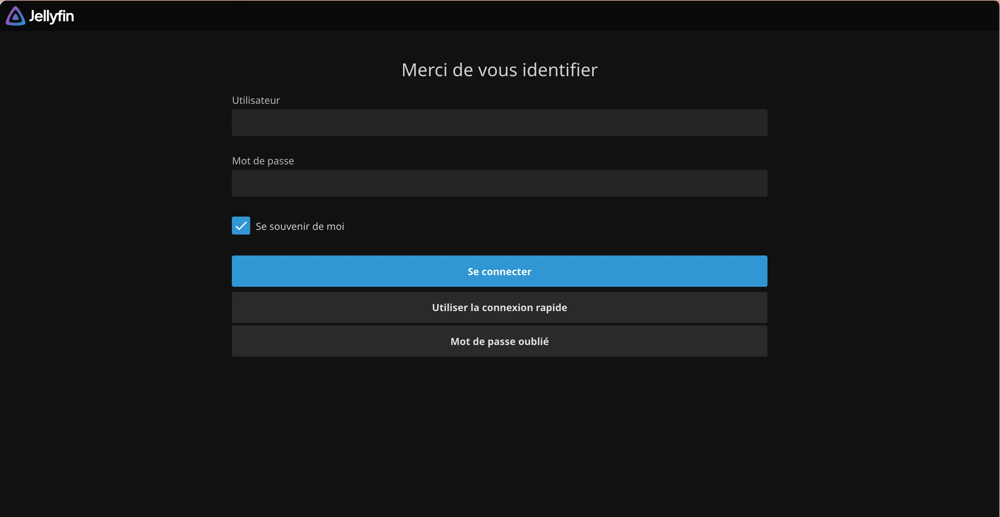
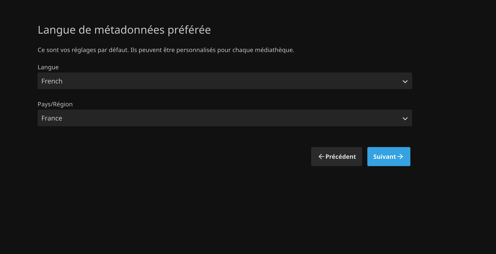
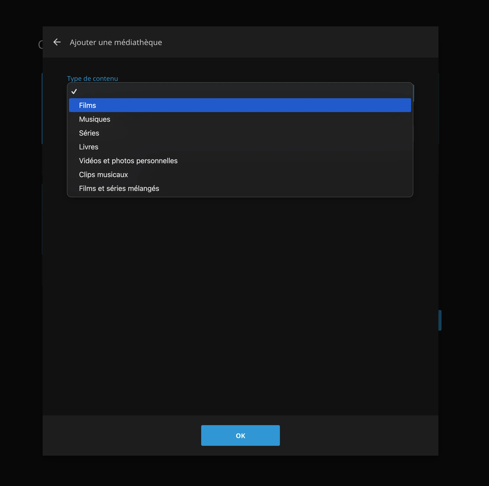
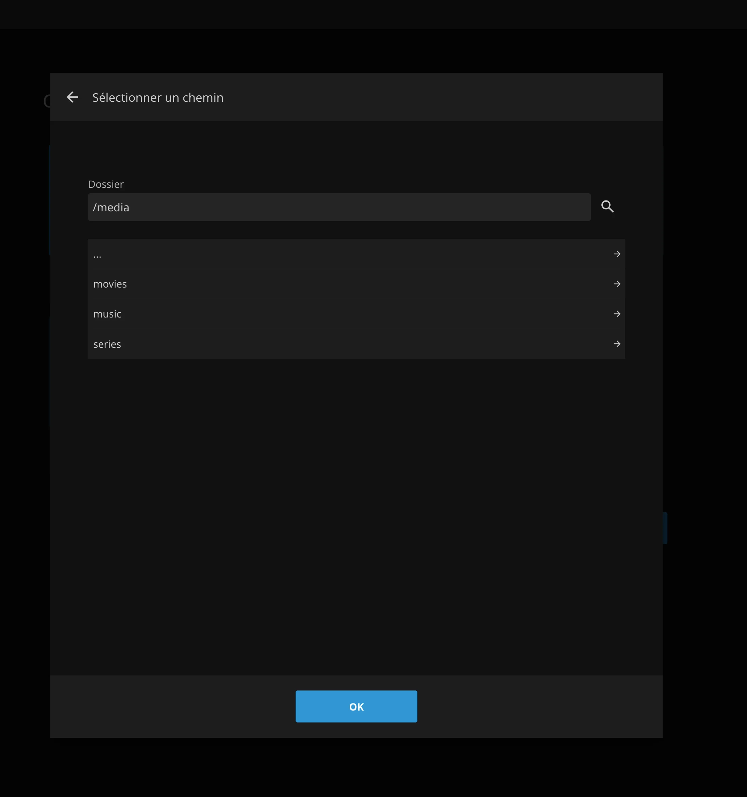
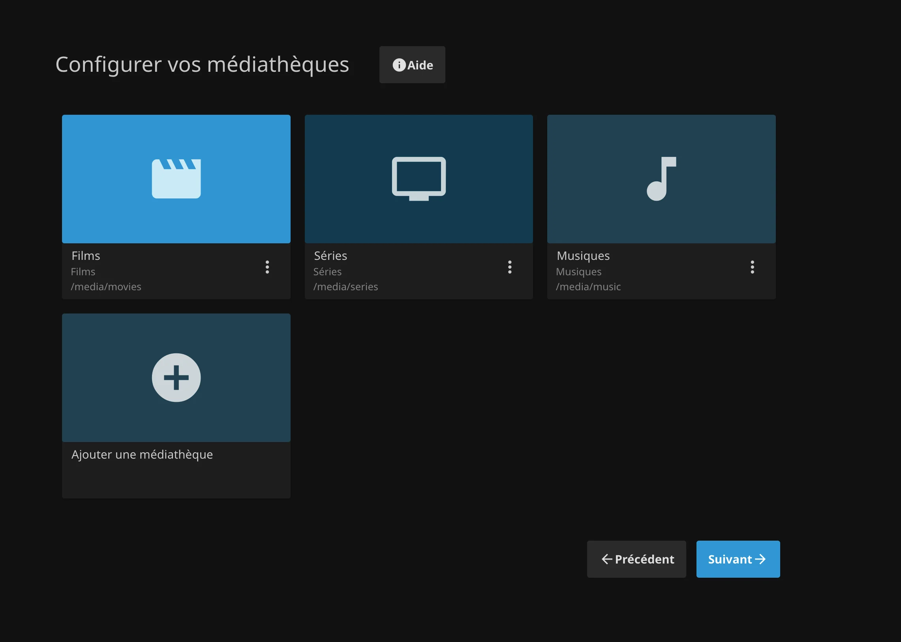
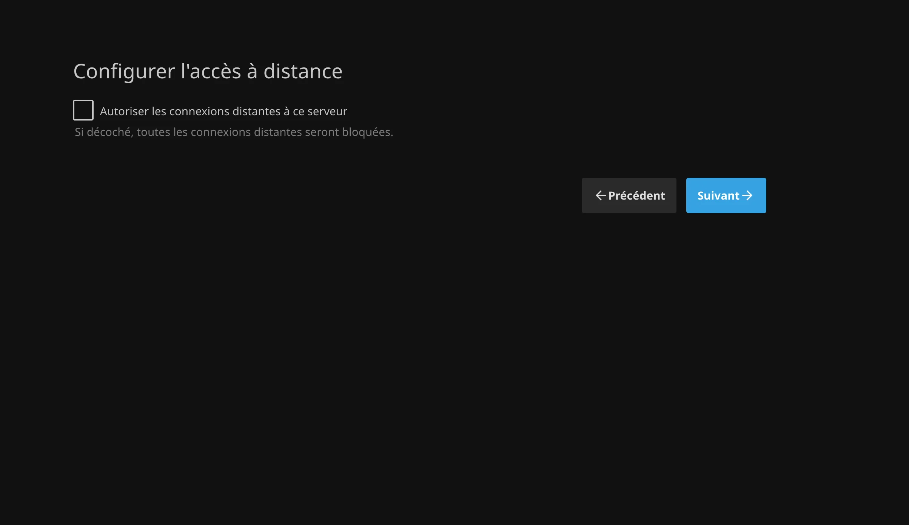

> 💡 **TL;DR**
> - Netflix + Disney+ + Prime = 396€/an en 2026, que tu remplaces par ton propre Jellyfin (0€ si tu as déjà un serveur)
> - Installation Docker en 30 minutes, bibliothèque films/séries organisée automatiquement (metadata, posters, sous-titres)
> - Streaming sur TV, mobile, tablette et navigateur, transcoding 4K en temps réel si ton serveur suit

**Prérequis :**

- Un serveur Linux (VPS, Raspberry Pi 4/5, vieux PC, NAS)
- 2 Go RAM minimum, 4 Go recommandé (8 Go pour transcoding 4K)
- [Docker installé](/docker-debutant-services-auto-heberger/)
- Espace disque selon ta collection (500 Go = ~200 films HD)
- 30 minutes de ton temps

Testé sur **Jellyfin 10.11.11** (sortie le 6 juin 2026), sur un mini PC Intel avec Ubuntu 24.04 LTS.

- - - - - -

## Table des matières

## Pourquoi Jellyfin > Netflix (et Plex, et Emby)

### Le calcul économique qui fait mal

**Abonnements streaming en 2026 :**

- Netflix Standard : 14,99€/mois = **180€/an**
- Disney+ Standard : 10,99€/mois = **132€/an**
- Prime Video : 6,99€/mois = **84€/an**
- Canal+ sans engagement : 24,99€/mois = **300€/an** (si fan de sport/séries)

💰 **Total famille moyenne : 396-696€/an**

Et ça monte tous les ans. Netflix Standard était à 13,49€ fin 2025, il est à 14,99€ aujourd'hui. Tu paies plus cher chaque année un catalogue qui rétrécit.

**Jellyfin auto-hébergé :**

- Serveur (si VPS) : 4-8€/mois = **48-96€/an**
- Électricité (Raspberry Pi) : **~10€/an**
- Contenu : **variable** (achats VOD, Blu-ray d'occasion, bibliothèque municipale…)

💰 **Économie réaliste sur 5 ans : 1 800-3 200€**

Et encore, si tu réutilises ton serveur [Nextcloud](/nextcloud-docker-installation-complete-2025/) ou un vieux PC, c'est **quasi gratuit**.

- - - - - -

### Jellyfin vs Plex vs Emby : le match


| Critère | Jellyfin | Plex | Emby |
| --- | --- | --- | --- |
| **Prix** | 🟢 Gratuit à vie | 🟡 Gratuit (limité) ou payant | 🟡 Gratuit (limité) ou payant |
| **Open source** | 🟢 100% | 🔴 Propriétaire | 🟡 Partiellement |
| **Vie privée** | 🟢 Aucune télémétrie | 🔴 Compte Plex obligatoire | 🟡 Compte optionnel |
| **Transcoding matériel** | 🟢 Illimité | 🟡 Réservé au Plex Pass | 🟡 Réservé au Premiere |
| **Apps mobiles** | 🟢 Gratuites | 🔴 Déblocage payant | 🟡 Freemium |
| **Interface** | 🟡 Correcte | 🟢 Excellente | 🟢 Très bonne |
| **Plugins** | 🟢 Large choix | 🟡 Restreints | 🟡 Moyens |
| **Communauté FR** | 🟢 Active | 🟢 Très active | 🟡 Moyenne |

**Verdict :**

- **Tu veux gratuit + privé + sans limites** → **Jellyfin** ✅
- **Tu veux la meilleure interface** → Plex (mais tu paies)
- **Tu veux un mix** → Emby

💡 **Mon avis perso** : Jellyfin fait 95% du job de Plex gratuitement. L'interface est moins léchée par défaut, mais un thème CSS règle ça en deux minutes (voir plus bas). Et surtout, **tes données restent chez toi**.

- - - - - -

## Jellyfin c'est quoi exactement ?



**En une phrase :** un serveur multimédia qui transforme ta collection de films/séries en **Netflix personnel**.

**Ce que ça fait :**
✅ Récupère automatiquement les **posters, synopsis, notes** (via TMDB/TVDB)
✅ Organise ta bibliothèque par **films, séries, musique, photos**
✅ **Transcode à la volée** (ton film 4K devient 720p si ton mobile est en 4G)
✅ **Sous-titres automatiques** (recherche et téléchargement intégrés)
✅ **Comptes utilisateurs** séparés (papa voit pas les dessins animés des enfants)
✅ **Reprise lecture** multi-appareils (tu commences sur TV, tu finis sur tablette)
✅ **Apps dédiées** Android TV, Fire TV, Roku, iOS, Android, Web…

**Ce que ça fait PAS :**
❌ Télécharger du contenu à ta place (c'est pas son job)
❌ Gérer les DRM (pas de Netflix/Prime rippé)
❌ Remplacer ta box TV (c'est complémentaire)

Si tu cherches justement à télécharger du contenu YouTube pour l'intégrer proprement dans ta bibliothèque, [HomeTube Docker](/hometube-docker-telechargeur-youtube/) est l'outil complémentaire qu'il te faut.

- - - - - -

## Avant de commencer : choisir ton matériel

### Option 1 : VPS cloud (le plus simple)

**Pour qui ?** Tu veux streamer depuis l'extérieur, pas de serveur à la maison.

**⚠️ ATTENTION : légalité du streaming depuis VPS**

Juridiquement en France :

- ✅ Streamer **tes propres Blu-ray/DVD** = légal (copie privée)
- ✅ Héberger sur VPS français = légal
- ❌ Partager avec 50 personnes = zone grise (contrefaçon)

**Conseil légal :** utilise Jellyfin pour **ton usage personnel/familial** uniquement.

**VPS adaptés à Jellyfin :**

| VPS | Prix/mois | Specs | Transcoding |
| --- | --- | --- | --- |
| Hetzner CPX21 | ~8€ HT | 3 vCPU, 4 Go RAM | 1080p OK, 4K difficile |
| Scaleway DEV1-M | ~0,02€/h | 3 vCPU, 4 Go RAM | 1080p OK |
| OVH VPS Value | ~6€ HT | 2 vCPU, 4 Go RAM | 720p-1080p OK |

💡 **Astuce transcoding :** le transcoding 4K demande un CPU costaud OU un GPU (pas dispo sur VPS classiques). Solution : **active Direct Play**, le client lit directement sans transcoder.

- - - - - -

### Option 2 : homelab (le plus économique)

**Pour qui ?** Tu as un serveur chez toi (Raspberry Pi, vieux PC, mini PC, NAS).

**Matériel testé et approuvé :**

**🔴 Raspberry Pi 4/5 (8 Go RAM)**, ~80€

- ✅ Consommation : 5W (10€/an électricité)
- ✅ Silencieux, compact
- ⚠️ Transcoding limité (720p max, 1080p possible sur Pi 5)
- 💡 **Idéal pour Direct Play** (pas de transcoding)

**🟢 Mini PC x86 (Intel N100 ou N150)**, 150-200€

- ✅ Transcoding matériel Intel Quick Sync (4K OK, décodage AV1 sur N150)
- ✅ Consommation : 10-15W (20€/an)
- ✅ 16 Go RAM possible
- 💡 **Le meilleur rapport qualité/prix 2026**

**🟡 Vieux PC reconverti**, 0€

- ✅ Gratuit (tu l'as déjà)
- ❌ Consommation élevée (50-150W = 100-300€/an)
- ✅ Transcoding OK si CPU récent (i5 8ème gen et plus)
- 💡 **Solution transitoire avant mini PC**

**🔵 NAS Synology/QNAP**, 300-800€

- ✅ Tout-en-un (stockage + apps)
- ✅ Transcoding matériel (selon modèle)
- ❌ Cher à l'achat
- 💡 **Si tu as déjà un NAS, c'est parfait**

**Ma recommandation 2026 :** **mini PC Intel N150** (Beelink, GMKtec, Acemagic), le sweet spot performance/prix/conso. Le N100 reste excellent et se trouve d'occasion à 120€.

- - - - - -

### Option 3 : combo VPS + stockage externe (hybride)

**Pour qui ?** Tu veux l'accessibilité du VPS mais le stockage pas cher.

**Setup :**

- **VPS léger** (2 Go RAM) pour Jellyfin : 4€/mois
- **Stockage objet** (Backblaze B2, Wasabi, Hetzner Storage Box) : 5€/To/mois
- **Total : 9€/mois** pour du To accessible partout

💡 **Astuce avancée :** monte le stockage distant avec `rclone` en cache local (`--vfs-cache-mode full`). Tu gagnes en vitesse de seek sans exploser le disque du VPS.

- - - - - -

## Installation Jellyfin avec Docker : la méthode qui marche

### Étape 1 : préparer le serveur

On repart sur **Ubuntu 24.04 LTS** (ou 22.04, Debian 12/13, Raspberry Pi OS…).

```bash
# Mise à jour système
sudo apt update && sudo apt upgrade -y

# Installer Docker si pas déjà fait
curl -fsSL https://get.docker.com -o get-docker.sh
sudo sh get-docker.sh
sudo usermod -aG docker $USER
newgrp docker

# Vérifier
docker --version
```

- - - - - -

### Étape 2 : créer la structure

```bash
# Créer les dossiers
mkdir -p ~/jellyfin/{config,cache,media/{movies,series,music}}
cd ~/jellyfin

# Vérifier la structure
tree -L 2
```

Tu devrais voir :

```text
jellyfin/
├── config/     # Configuration Jellyfin
├── cache/      # Cache transcoding
└── media/
    ├── movies/ # Tes films ici
    ├── series/ # Tes séries ici
    └── music/  # Ta musique ici
```

- - - - - -

### Étape 3 : le docker-compose.yml

```bash
nano docker-compose.yml
```

Colle ce fichier **testé en amont** :

```yaml
services:
  jellyfin:
    image: jellyfin/jellyfin:10.11.11
    container_name: jellyfin
    restart: unless-stopped

    # Ports
    ports:
      - "8096:8096"   # Interface web
      - "8920:8920"   # HTTPS (optionnel)
      - "7359:7359/udp" # Auto-discovery
      - "1900:1900/udp" # DLNA

    # Volumes
    volumes:
      - ./config:/config
      - ./cache:/cache
      - ./media:/media:ro  # :ro = read-only (sécurité)
      # Si tu as un disque externe monté ailleurs :
      # - /mnt/films:/media/movies:ro
      # - /mnt/series:/media/series:ro

    # Variables d'environnement
    environment:
      - PUID=1000  # ID utilisateur (vérifie avec 'id -u')
      - PGID=1000  # ID groupe (vérifie avec 'id -g')
      - TZ=Europe/Paris
      - JELLYFIN_PublishedServerUrl=https://jellyfin.ton-domaine.fr  # Change si domaine

    # Transcoding matériel (optionnel)
    # Décommente selon ton matériel :

    # Intel Quick Sync (mini PC Intel)
    # devices:
    #   - /dev/dri:/dev/dri

    # NVIDIA GPU (si GPU NVIDIA)
    # runtime: nvidia
    # environment:
    #   - NVIDIA_VISIBLE_DEVICES=all

    # AMD GPU (si GPU AMD)
    # devices:
    #   - /dev/dri:/dev/dri

    networks:
      - jellyfin-network

networks:
  jellyfin-network:
    driver: bridge
```

**Récupère tes PUID/PGID avant de lancer :**

```bash
id
# uid=1000(brandon) gid=1000(brandon) groups=...
```

**Les trois lignes qui comptent vraiment :**

- `/media:ro` : read-only, Jellyfin peut **lire** mais pas **modifier/supprimer** tes films (sécurité)
- `TZ=Europe/Paris` : fuseau horaire français (sinon les heures de visionnage sont fausses)
- **Transcoding matériel** : décommente la section selon ton matériel pour accélérer le transcoding x10

💡 J'épingle volontairement la version (`10.11.11`) plutôt que `latest`. Une mise à jour majeure de Jellyfin casse régulièrement les thèmes CSS et certains plugins, autant décider toi-même du moment.

- - - - - -

### Étape 4 : activer le transcoding Intel Quick Sync (si mini PC Intel)

Si tu as un mini PC Intel N100/N150/i3/i5/i7, tu peux utiliser **Quick Sync**, du transcoding 4K quasi gratuit en CPU.

```bash
# Vérifier que /dev/dri existe
ls -la /dev/dri
# Tu dois voir renderD128 et card0

# Donner accès à Jellyfin
sudo usermod -aG render $USER
sudo usermod -aG video $USER
```

Puis décommente dans `docker-compose.yml` :

```yaml
    devices:
      - /dev/dri:/dev/dri
```

- - - - - -

### Étape 5 : lancer Jellyfin

```bash
# Démarrer
docker compose up -d

# Vérifier que ça tourne
docker ps

# Voir les logs
docker compose logs -f jellyfin
```

Ouvre `http://IP-DE-TON-SERVEUR:8096`. L'assistant de première configuration t'accueille.

- - - - - -

### Étape 6 : configuration initiale Jellyfin

L'assistant se déroule en cinq écrans. Les deux qui comptent :

**1. Langue des métadonnées**

Choisis `French` et `France`, sinon tous tes synopsis arrivent en anglais et tu devras rescanner toute la bibliothèque plus tard.



**2. Ajouter tes médiathèques**

Clique sur **Ajouter une médiathèque**, choisis le **type de contenu** (Films, Séries, Musiques…), puis le chemin **à l'intérieur du conteneur**.



⚠️ **Le piège classique :** le chemin à saisir est `/media/movies`, pas `~/jellyfin/media/movies`. Jellyfin vit dans un conteneur, il ne voit que ce que tu lui as monté.



Répète pour Films, Séries et Musiques :



**3. Accès distant**

Décoche **Autoriser les connexions distantes** si tu comptes passer par un reverse proxy ou un VPN. Tu pourras le réactiver proprement plus tard.



Crée ton compte admin, valide, c'est fini. Jellyfin tourne.

- - - - - -

## Organiser ta bibliothèque : le naming qui change tout

C'est **la** étape que tout le monde bâcle. Jellyfin identifie tes fichiers par leur nom. Un mauvais nommage = pas de poster, pas de synopsis, et le mauvais film dans la fiche.

### Structure de dossiers recommandée

**🎬 Films :**

```text
/media/movies/
├── Inception (2010)/
│   └── Inception (2010).mkv
├── The Matrix (1999)/
│   └── The Matrix (1999).mkv
├── Interstellar (2014)/
│   └── Interstellar (2014) - 1080p.mkv
└── Le Fabuleux Destin d'Amélie Poulain (2001)/
    └── Le Fabuleux Destin d'Amélie Poulain (2001).mkv
```

**Règles :**

- ✅ **Dossier par film** : `Nom du Film (Année)/`
- ✅ **Nom de fichier** : `Nom du Film (Année).extension`
- ✅ **Année obligatoire** : sinon Jellyfin confond les remakes
- ⚠️ Évite les caractères spéciaux : `é` OK, mais `? : * < >` → remplace par `-`

- - - - - -

**📺 Séries (structure optimale) :**

```text
/media/series/
├── Breaking Bad/
│   ├── Season 01/
│   │   ├── Breaking Bad - S01E01 - Pilot.mkv
│   │   ├── Breaking Bad - S01E02.mkv
│   │   └── Breaking Bad - S01E03.mkv
│   ├── Season 02/
│   │   ├── Breaking Bad - S02E01.mkv
│   │   └── ...
│   └── Season 05/
│       └── ...
└── Stranger Things/
    ├── Season 01/
    │   ├── Stranger Things - S01E01.mkv
    │   └── ...
    └── Season 04/
        └── ...
```

Le format `SxxExx` est non négociable. `Episode 1.mkv` ne sera jamais reconnu.

💡 **Le raccourci qui sauve** : si ta collection est déjà un capharnaüm, [FileBot](https://www.filebot.net/) renomme tout automatiquement en interrogeant TMDB. Une heure de boulot économisée par centaine de fichiers.

### Scanner la bibliothèque

Après avoir renommé, force un scan :

**Dashboard** → **Médiathèques** → **Analyser toutes les médiathèques**

```bash
# Suivre le scan en direct
docker compose logs -f jellyfin | grep -i "library scan"
```

Compte environ **1 à 2 minutes pour 100 films** (le temps de récupérer posters et synopsis sur TMDB). Sur Raspberry Pi, multiplie par trois.

Si un film reste sans poster : clique dessus → **⚙️ Modifier les métadonnées** → **Identifier** → saisis le titre exact. Jellyfin réinterroge TMDB.

- - - - - -

## Accès HTTPS avec Nginx Proxy Manager

Jellyfin en `http://192.168.1.x:8096`, ça marche sur ton réseau local. Depuis l'extérieur, il te faut du HTTPS, sinon tes identifiants circulent en clair.

Le plus simple : [Nginx Proxy Manager](/nginx-proxy-manager-docker-guide/), qui gère les certificats Let's Encrypt tout seul.

**Configuration côté NPM :**

1. **Hosts** → **Proxy Hosts** → **Add Proxy Host**
2. **Domain Names** : `jellyfin.ton-domaine.fr`
3. **Forward Hostname/IP** : l'IP de ton serveur Jellyfin, **Port** : `8096`
4. **Websockets Support** : ✅ **obligatoire** (sinon la lecture se bloque au bout de 30 secondes)
5. Onglet **SSL** → **Request a new SSL Certificate** + **Force SSL**
6. Onglet **Advanced**, colle cette configuration :

```nginx
# Augmenter les timeouts pour le streaming
proxy_connect_timeout 600;
proxy_send_timeout 600;
proxy_read_timeout 600;
send_timeout 600;

# Pas de buffer pour le streaming en temps réel
proxy_buffering off;

# Headers
proxy_set_header X-Real-IP $remote_addr;
proxy_set_header X-Forwarded-For $proxy_add_x_forwarded_for;
proxy_set_header X-Forwarded-Proto $scheme;
proxy_set_header X-Forwarded-Host $host;
```

7. **Save** → attends 30s → teste `https://jellyfin.ton-domaine.fr`

Pense aussi à renseigner l'URL publique dans **Dashboard** → **Réseau** → **URL du serveur publiée**, sinon les apps mobiles génèrent des liens en IP locale.

🎉 **Ton Jellyfin est accessible en HTTPS.**

- - - - - -

## Donner à Jellyfin le look Netflix

L'interface par défaut de Jellyfin est fonctionnelle mais austère. Bonne nouvelle : tout est modifiable en CSS, sans plugin, sans toucher au conteneur.

**Où coller le CSS :** **Dashboard** → **Général** → **Custom CSS Code** (pour tout le serveur) ou **Paramètres utilisateur** → **Affichage** → **Custom CSS Code** (juste pour ton compte).

**Jellyfish** (le plus maintenu) propose dix palettes dont une baptisée JellyFlix :

```css
@import url("https://cdn.jsdelivr.net/gh/n00bcodr/jellyfish@main/theme.css");
@import url("https://cdn.jsdelivr.net/gh/n00bcodr/jellyfish@main/indicators.css");
@import url("https://cdn.jsdelivr.net/gh/n00bcodr/jellyfish@main/10.11_fixes.css");
```

⚠️ La ligne `10.11_fixes.css` est **indispensable** depuis Jellyfin 10.11. Sans elle, la barre de navigation part en vrac.

**NetFin**, plus radicalement Netflix (vignettes larges, fond noir profond) :

```css
@import url("https://cdn.jsdelivr.net/gh/ya0903/NetFin@main/netfin.css");
```

Rafraîchis la page (Ctrl+F5) et c'est appliqué. Aucun redémarrage du conteneur nécessaire.

💡 **Le piège :** un thème CSS tiers casse à chaque montée de version majeure de Jellyfin. JellyFlix, longtemps la référence, n'a pas survécu au passage en 10.11. Vérifie la date du dernier commit du dépôt avant d'adopter un thème, et garde le CSS dans un fichier texte pour pouvoir le retirer en un copier-coller.

- - - - - -

## Apps mobiles et clients

### 📱 Mobile (Android et iOS)

**Jellyfin officiel** (recommandé) :

- Android : [Play Store](https://play.google.com/store/apps/details?id=org.jellyfin.mobile)
- iOS : [App Store](https://apps.apple.com/fr/app/jellyfin-mobile/id1480192618)

**Alternatives tierces (parfois meilleures) :**

- **Findroid** (Android) : interface moderne, plus agréable que l'officielle
- **Swiftfin** (iOS) : plus fluide que l'app officielle, développée par l'équipe Jellyfin
- **Infuse** (iOS, payante) : la Rolls du streaming, gère tous les formats

**Configuration :**

1. Lance l'app → **Connexion manuelle**
2. URL : `https://jellyfin.ton-domaine.fr`
3. Identifiants : ton compte Jellyfin
4. ✅ **Active le téléchargement hors ligne** si tu veux regarder dans le train

- - - - - -

### 📺 TV (Android TV, Fire TV, Apple TV)

**Android TV / Google TV / Fire TV :**

- Jellyfin officiel dispo sur le Play Store TV
- Installe depuis le store de ta box

**Apple TV :**

- Swiftfin (gratuite, excellente)

**Roku :**

- Jellyfin officiel dispo sur le Roku Store

**Smart TV Samsung/LG :**

- Pas d'app native 😢
- Solution : **Chromecast** ou **mini PC Android TV** (30€)

- - - - - -

### 💻 Desktop (Windows, Mac, Linux)

**Option 1 : navigateur** (recommandé)

- Ouvre `https://jellyfin.ton-domaine.fr`
- Ça marche parfaitement en web, pas besoin d'app

**Option 2 : Jellyfin Media Player** (si tu veux une vraie app)

- Télécharge : [github.com/jellyfin/jellyfin-media-player/releases](https://github.com/jellyfin/jellyfin-media-player/releases)
- Interface type Netflix, mode plein écran, lecteur mpv intégré

- - - - - -

## Optimisations avancées

### Activer le transcoding matériel

Si tu as un mini PC Intel avec Quick Sync :

1. **Dashboard** → **Lecture** → **Transcodage**
2. Chemin FFmpeg : `/usr/lib/jellyfin-ffmpeg/ffmpeg` (auto)
3. ✅ **Accélération matérielle** : `Intel QuickSync (QSV)`
4. ✅ Décodage matériel pour : **H264, HEVC, VP9, AV1**
5. ✅ Encodage matériel pour : **H264, HEVC**
6. **Threads de transcodage** : `0` (auto)
7. **Sauvegarder**

✅ **Test :** lance un film 4K sur mobile en 4G. Il doit transcoder en 720p instantanément, avec le CPU sous les 15% au lieu de 100%.

- - - - - -

### Sous-titres automatiques

**Plugin OpenSubtitles :**

1. **Dashboard** → **Plugins** → **Catalogue**
2. Installe : **Open Subtitles**
3. **Redémarre Jellyfin** (obligatoire)
4. **Plugins** → **Open Subtitles** → configure :
   - Crée un compte gratuit sur [opensubtitles.com](https://www.opensubtitles.com/)
   - Entre tes identifiants et ta clé API
   - Langue préférée : `Français`
5. **Utilisation :** clique sur un film → **⚙️ Sous-titres** → **Rechercher** → Jellyfin télécharge les `.srt` automatiquement

- - - - - -

### Intro Skip (sauter les génériques)

**Plugin Intro Skipper :**

1. **Plugins** → **Catalogue** → installe **Intro Skipper**
2. **Redémarre**
3. **Plugins** → **Intro Skipper** :
   - ✅ Détection automatique des génériques
   - ✅ Bouton « Skip Intro » dans le player

🎉 **Comme Netflix : tu sautes les génériques en un clic.**

⚠️ Intro Skipper suit les versions de Jellyfin d'assez près. Si tu épingles ta version comme conseillé plus haut, vérifie que le plugin existe pour cette version avant de mettre à jour.

- - - - - -

## Cas d'usage réels

### Scénario 1 : famille (4 personnes)

**Setup :**

- Mini PC Intel N150 (180€) + disque dur 4 To (90€)
- Total investissement : **270€**
- Électricité : **20€/an**

**Collection :**

- 150 films HD (1,5 To)
- 30 séries (1 To)
- Musique (200 Go)

**Économie :**

- Avant : Netflix + Disney+ + Prime = **396€/an**
- Après : 20€/an d'électricité
- 💰 **Gain : 376€/an, amorti en 9 mois**
- 💰 **Gain sur 5 ans : 1 610€**

**Usage :**

- Papa : films d'action (compte séparé)
- Maman : séries françaises
- Enfants : dessins animés (contrôle parental activé)
- Mamie : regarde depuis son iPad à distance

- - - - - -

### Scénario 2 : cinéphile hardcore

**Setup :**

- Vieux PC reconverti (i5-8400, gratuit)
- 2 disques durs 8 To (360€)
- Total : **360€**
- Électricité : **~100€/an**

**Collection :**

- 800 films HD/4K (10 To)
- Documentaires, classiques, films cultes
- Archives personnelles

**Économie :**

- Avant : achats VOD ~30€/mois = **360€/an**
- Après : 100€/an d'électricité + Blu-ray d'occasion à 3€
- 💰 **Gain : 260€/an**

**Usage :**

- Bibliothèque personnelle accessible à vie
- Qualité Blu-ray préservée (pas de compression streaming)
- Pas de censure ni de disparition de contenu (coucou Netflix qui vire des films)

- - - - - -

### Scénario 3 : colocation / famille élargie

**Setup :**

- VPS 8 Go RAM (15€/mois) + Hetzner Storage Box 5 To (15€/mois)
- Total : **30€/mois = 360€/an**

**Utilisateurs :**

- 8 comptes (4 colocataires + 4 membres de la famille à distance)

**Économie :**

- Avant : 8 × Netflix Standard = **8 × 180€ = 1 440€/an**
- Après : 360€/an partagés entre 8 = **45€/personne/an**
- 💰 **Économie collective : 1 080€/an**
- 💰 **Par personne : 135€/an économisés**

Pour éviter que les huit te réclament un film par SMS, [Jellyseerr avec Docker](/jellyseerr-docker-gestion-demandes/) leur donne une interface de demandes en libre-service.

- - - - - -

## Problèmes courants et solutions

### ❌ « Playback Error » / erreur de lecture

**Causes possibles :**

1. **Format non supporté par le client**
   → Solution : active le transcoding dans les paramètres Jellyfin
2. **Bande passante insuffisante**
   → Solution : réduis la qualité (Dashboard → Lecture → Bitrate max : 8 Mbps)
3. **Transcoding qui plante (CPU trop faible)**
   → Solution : active Direct Play, dans Paramètres utilisateur → Lecture → Qualité : Maximum

- - - - - -

### ❌ Transcoding ultra-lent (buffering constant)

**Symptôme :** le film lag toutes les 10 secondes.

**Solution :**

```bash
# Vérifier la charge CPU pendant le transcoding
docker stats jellyfin

# Si CPU à 100% constamment :
# → Ton serveur est trop faible pour transcoder en logiciel
```

Deux issues : activer le transcoding matériel (voir plus haut), ou forcer le Direct Play côté client pour que le serveur se contente d'envoyer le fichier tel quel.

- - - - - -

### ❌ Metadata en anglais au lieu de français

Tu as zappé l'écran « Langue de métadonnées » à l'installation. Ça se rattrape :

1. **Dashboard** → **Médiathèques** → clique sur la bibliothèque concernée
2. **Langue préférée** : `Français`, **Pays** : `France`
3. Enregistre, puis **⋮** → **Actualiser les métadonnées**
4. Coche **Remplacer toutes les métadonnées**, sinon Jellyfin garde l'existant

⚠️ Un rafraîchissement complet sur 500 films prend un bon moment et tape sur l'API TMDB. Lance-le le soir.

- - - - - -

### ❌ Jellyfin inaccessible depuis l'extérieur

Dans l'ordre, vérifie :

1. **Le conteneur tourne** :

```bash
docker compose ps
curl -I http://localhost:8096
```

2. **Le pare-feu laisse passer** le reverse proxy :

```bash
sudo ufw allow 80
sudo ufw allow 443
```

3. **Le DNS** : `jellyfin.ton-domaine.fr` pointe bien vers ton IP publique ?
4. **Les websockets** sont activés dans Nginx Proxy Manager (cause n°1 des lectures qui se coupent)
5. **Dashboard** → **Réseau** → **Autoriser les connexions distantes** est bien coché

- - - - - -

## 🧩 Jellyfin : la pièce maîtresse de ton indépendance numérique

Bravo, tu as maintenant ton propre Netflix. Mais imagine un instant :

- **Jellyfin** pour tes films/séries (✅ fait)
- **[Nextcloud](/nextcloud-docker-installation-complete-2025/)** pour tes fichiers/photos/documents
- **[Vaultwarden](/vaultwarden-docker-gestionnaire-mots-de-passe/)** pour tes mots de passe

Tu te retrouves avec **une stack d'indépendance numérique complète** qui te coûte 0€/mois en abonnements. Le seul coût ? L'électricité de ton serveur, environ 5€/mois pour un mini PC.

**Calcul rapide :**

- Netflix Standard : 14,99€/mois
- Un cloud 200 Go type Google One : ~3€/mois
- Un gestionnaire de mots de passe commercial : ~5€/mois

= environ **276€/an** que tu peux économiser, sur ces trois services uniquement.

👉 **[Consulte le guide complet d'indépendance numérique](/independance-numerique-2025-guide-complet/)** pour voir comment tout interconnecter proprement.

*Bonus : le guide inclut une roadmap progressive pour ne pas te noyer dans la technique.*

- - - - - -

## Légalité et éthique : ce qu'il faut savoir

### ✅ Usages légaux en France

**Tu as le DROIT de :**

- Ripper tes propres DVD/Blu-ray pour copie privée (article L122-5 CPI)
- Héberger ta collection personnelle sur Jellyfin
- Partager avec ta famille proche (même foyer)
- Regarder depuis l'extérieur (en vacances, au travail)

**Tu n'as PAS le droit de :**

- ❌ Télécharger des films piratés (torrent sans droit = contrefaçon)
- ❌ Partager avec 50 personnes (= diffusion publique, article L335-2 CPI)
- ❌ Contourner les DRM (Netflix/Prime/Disney+ rippé = illégal)

### 💡 Sources de contenu légales

**Où trouver du contenu pour Jellyfin :**

1. **Médiathèque municipale** : emprunte des DVD/Blu-ray gratuitement, rippe-les
2. **Blu-ray d'occasion** : Leboncoin, Vinted, Cash Converters (3-5€/film)
3. **VOD sans DRM** : Arte Boutique, Vimeo On Demand (téléchargement MP4)
4. **Archives personnelles** : vidéos de vacances, films de famille
5. **Creative Commons** : Archive.org, films tombés dans le domaine public

**Outil de rip légal : MakeMKV**

- Gratuit pour DVD (Windows/Mac/Linux)
- Licence payante à vie pour le Blu-ray
- Télécharge : [makemkv.com](https://www.makemkv.com/)

- - - - - -

## Conclusion : ton Netflix à toi, pour toujours

Tu viens de monter **ton propre service de streaming** en 30 minutes. Jellyfin avec Docker, c'est :

✅ **Économique** : 376€/an économisés minimum
✅ **Indépendant** : plus d'abonnements qui augmentent tous les ans
✅ **Privé** : tes habitudes de visionnage ne partent pas chez Netflix
✅ **Complet** : films, séries, musique, photos, tout en un
✅ **Durable** : ta collection t'appartient à vie

**Prochaines étapes suggérées :**

1. **Organise ta bibliothèque** : renomme tes fichiers proprement, FileBot fait ça très bien
2. **Invite ta famille** : crée des comptes utilisateurs (Dashboard → Utilisateurs)
3. **Automatise les backups** : sauvegarde `/config` et ta liste de films
4. **Explore les plugins** : Intro Skipper, OpenSubtitles, Trakt…
5. **Complète ta stack média** : si tu lis aussi des ebooks ou des mangas, [Kavita avec Docker](/kavita-docker-lecteur-ebooks/) gère les ebooks et [Komga avec Docker](/komga-docker-bd-manga-auto-heberge/) les BD et mangas. Et pour streamer tes jeux PC vers la TV du salon, il y a [Sunshine Docker avec Moonlight](/sunshine-docker-streaming-jeux/).

Et surtout, profite de ces **396€/an** dans ta poche au lieu de les filer à Netflix. 🎉

💬 Si tu bloques quelque part ou si ton setup tourne, raconte-le en commentaire, ça sert au suivant qui lit ce guide.
