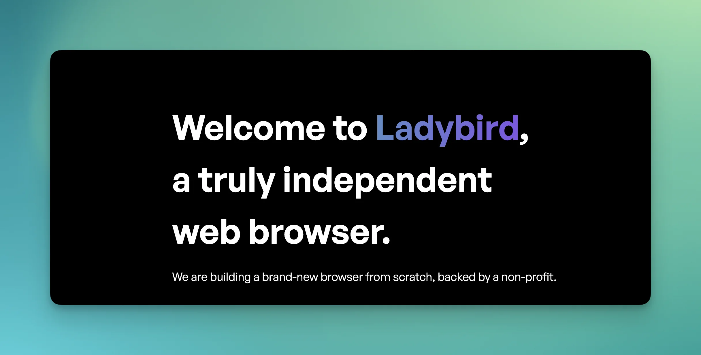

> 💡 **TL;DR**
> - Ladybird est un navigateur open source construit from scratch, pas un énième fork de Chromium
> - Ses propres moteurs maison (LibWeb, LibJS), indépendants de Google
> - Architecture, financement et timeline d'un projet qui veut rebattre les cartes du web

- - - - - -

## Table des matières



Dans un monde où Chrome domine à 65% et où Firefox peine à maintenir ses 3% de parts de marché, plusieurs projets osent défier les géants avec des approches radicalement différentes. D’un côté, **[Arc Search révolutionne l’expérience utilisateur](https://brandonvisca.com/arc-search-redefinir-la-navigation-internet-avec-lia)** en intégrant l’IA directement dans la navigation. De l’autre, **Ladybird Browser** prend le chemin inverse : plutôt que d’améliorer l’existant, il repart de zéro.

Non, ce n’est pas encore un autre fork de Chromium avec une interface redessinée et trois fonctionnalités « révolutionnaires ». C’est carrément plus ambitieux que ça.

Andreas Kling et son équipe ont eu une idée assez folle : repartir de zéro. Complètement. Même pas de code recyclé de WebKit, Blink ou Gecko. Du pur travail artisanal, comme on sait encore le faire dans l’open source quand on a du temps, de la passion et, accessoirement, des financements sérieux.

## Un navigateur né d’un hobby qui a mal tourné

L’histoire commence en 2018 avec SerenityOS, le projet « thérapie » d’Andreas Kling après sa sortie de cure de désintoxication. Ce qui devait être un simple OS personnel s’est transformé en écosystème complet avec son propre navigateur web. Sauf qu’à un moment, Andreas s’est dit : « Et si on sortait ce navigateur de SerenityOS pour en faire quelque chose de vraiment cross-platform ? »

Le 4 juillet 2022, première démo publique de Ladybird avec une interface Qt basique. Deux ans plus tard, en juillet 2024, le projet annonce son indépendance totale avec la création de la **Ladybird Browser Initiative**, une 501(c)(3) non-profit financée par Chris Wanstrath (co-fondateur de GitHub) et d’autres sponsors comme Shopify et Proton VPN.

**Message reçu** : quand vous avez assez d’argent et pas d’objectifs commerciaux douteux, vous pouvez vous permettre de dire non aux « default search deals » et autres joyeusetés du business model publicitaire.

## Architecture technique : du multi-processus qui assume

Contrairement au Safari de base ou à Chrome dans ses mauvais jours, Ladybird mise tout sur une **architecture multi-processus robuste** :

- **Processus UI principal** : interface utilisateur
- **Processus WebContent** : rendu des pages (un par onglet)
- **Processus ImageDecoder** : décodage d’images isolé
- **Processus RequestServer** : gestion réseau séparée

Chaque onglet est sandboxé du reste du système. Si une page malveillante plante, elle n’emmène pas tout le navigateur avec elle. Du bon sens technique, enfin.

### LibWeb et LibJS : les moteurs faits maison

Le cœur de Ladybird, c’est **LibWeb** (moteur de rendu) et **LibJS** (moteur JavaScript), tous deux développés from scratch. Pas de récupération de code existant, pas de raccourcis. L’équipe veut créer une implémentation des standards web qui leur appartient totalement.

**Côté performance** : on n’est pas encore au niveau de Chrome ou Safari, mais selon les Web Platform Tests (mars 2025), Ladybird se classe déjà **4ème** derrière Chrome, Safari et Firefox. Pas mal pour un projet de quelques années.

## Compilation et installation : pour les courageux

Attention, Ladybird n’est pas encore prêt pour votre grand-mère. Le projet vise une alpha en **été 2026**, une beta en **2027** et une release stable pour le grand public en **2028**.

Compiler Ladybird se fait intégralement en ligne de commande. Si ton terminal est resté dans sa configuration d’usine, [Oh My Zsh et Powerlevel10k](/installation-oh-my-zsh-powerlevel10k-guide-complet/) rendent ce genre de session nettement plus supportable.

Pour les développeurs qui veulent jouer avec :

# Clone le repo
git clone https://github.com/LadybirdBrowser/ladybird.git
cd ladybird
# Installation des dépendances (Ubuntu/Debian)
sudo apt update
sudo apt install build-essential cmake ninja-build qt6-base-dev
# Compilation (comptez 1-2h la première fois)
./Meta/build.sh
# Lancement
./Build/ladybird

```bash
# Clone le repo
git clone https://github.com/LadybirdBrowser/ladybird.git
cd ladybird

# Installation des dépendances (Ubuntu/Debian)
sudo apt update
sudo apt install build-essential cmake ninja-build qt6-base-dev

# Compilation (comptez 1-2h la première fois)
./Meta/build.sh

# Lancement
./Build/ladybird

```

**Support plateforme** : Linux, macOS, autres Unix-like. Windows ? « On verra plus tard », dit l’équipe. Priorités.

## Financement : l’argent sans les contraintes

Point crucial : Ladybird est financé uniquement par des **donations et sponsorships**, sans aucun deal commercial. Pas de moteur de recherche par défaut négocié à prix d’or, pas de tracking publicitaire, pas de tokens crypto. Just build a browser, point.

L’équipe actuelle compte **7 ingénieurs** à temps pleins. C’est peu comparé aux centaines de développeurs chez Google ou Mozilla, mais suffisant pour avancer sérieusement sur les fondations.

> **Erreur fréquente** : Croire qu’un navigateur indépendant ne peut pas rivaliser techniquement. Ladybird prouve qu’avec du financement stable et une vision claire, on peut créer une alternative crédible aux mastodontes.

## Pourquoi ça compte pour l’écosystème web

Avoir un quatrième moteur de rendu majeur, ce n’est pas juste de la diversité pour faire joli. C’est crucial pour :

- **Éviter la mono-culture Chromium** qui dicte les standards de facto
- **Donner une voix indépendante** dans les discussions sur les standards web
- **Proposer des implémentations alternatives** des spécifications W3C
- **Maintenir la concurrence** technologique

Quand Google décide unilatéralement de tuer les Manifest V2 ou d’imposer WEI (Web Environment Integrity), avoir des alternatives devient vital.

## Timeline et réalisme

**2026** : Alpha pour développeurs et early adopters
**2027** : Beta publique
**2028** : Release stable grand public

Oui, c’est long. Mais construire un navigateur web moderne, c’est plus complexe que Linux à ses débuts. On parle de millions de lignes de code, de centaines de standards web à implémenter avec l’existant…

> **À savoir** : Actuellement, beaucoup de sites majeurs (Gmail, Google Calendar, Figma) se chargent déjà dans Ladybird, même si l’expérience utilisateur n’est pas encore fluide à 100%.

## Pour qui et pourquoi tester

Si vous êtes développeur web, administrateur système ou simplement curieux des alternatives technologiques, Ladybird mérite votre attention. Le sujet rejoint celui des [alternatives à Arc Browser](/arc-browser-alternatives-navigateur-epure-2025/) : sortir du duopole Chromium/WebKit, mais avec un horizon bien plus lointain. Pas pour remplacer votre navigateur principal (pas encore), mais pour :

- **Comprendre** comment un moteur web moderne se construit
- **Contribuer** à un projet open source ambitieux
- **Tester** la compatibilité de vos sites avec un moteur non-Chromium
- **Soutenir** financièrement une initiative indépendante

En attendant, si le but est simplement de sortir de l’écosystème Google au quotidien, la voie praticable dès aujourd’hui passe plutôt par [l’auto-hébergement de ses services](/quitter-google-auto-hebergement/).

- - - - - -

## Ce qui manque encore (et c’est normal)

- Extensions et add-ons
- Synchronisation de données
- Performance optimisée pour l’usage quotidien
- Support mobile
- Fonctionnalités avancées de dev tools

Mais rappelons-nous qu’on parle d’un projet qui existe depuis 4 ans face à des navigateurs développés depuis plus de 20 ans avec des budgets annuels en milliards.

## Conclusion

Ladybird Browser n’est pas (encore) le navigateur que vous utiliserez demain matin. Mais c’est peut-être celui que vous utiliserez dans 5 ans quand Chrome aura encore durci sa politique de contrôle et que Firefox aura encore perdu quelques points de market share.

Le pari d’Andreas Kling et de son équipe tient en une phrase : prouver qu’on peut encore créer de la technologie indépendante, financée proprement, sans compromis commerciaux. Dans un monde tech de plus en plus centralisé, c’est exactement le genre d’initiative qu’il faut soutenir.
- - - - - -
## Soutenir le projet

**Site officiel** : [ladybird.org](https://ladybird.org/)
**Code source** : [GitHub - LadybirdBrowser](https://github.com/LadybirdBrowser/ladybird)
**Donations** : Via Donorbox sur le site officiel
**Discord** : Communauté de développeurs active

Pour les entreprises qui utilisent beaucoup de technologies web, sponsoriser Ladybird peut être un investissement stratégique dans la diversité de l’écosystème browser. Plus de concurrence = moins de dépendance à un seul acteur.
