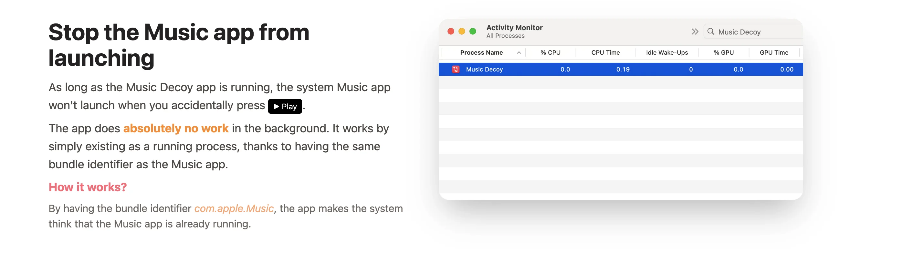

> 💡 **TL;DR**
> - La touche Play du clavier Mac lance Apple Music par défaut, même si tu utilises Spotify
> - Music Decoy intercepte la touche Play et empêche Apple Music de se lancer, sans configuration
> - Micro-app installée en 3 secondes, peut démarrer automatiquement au login

- - - - - -

## Table des matières

## Le problème : macOS force Apple Music comme lecteur par défaut

Apple a codé en dur dans macOS : **touche Play = ouvrir Apple Music**.

Peu importe que tu utilises Spotify, YouTube Music, VLC, ou IINA. La touche Play du clavier (ou des AirPods, ou d’un clavier externe) lance **toujours** Apple Music en premier.
- - - - - -- - - - - -
### Pourquoi c’est chiant ?

1. **Apple Music se lance** alors que tu veux juste lire sur Spotify
2. **Ça ralentit le Mac** (Apple Music démarre, charge, puis tu dois le quitter)
3. **Tu perds 3-5 secondes** à chaque fois à fermer Apple Music
4. **C’est frustrant** : t’as payé Spotify, pourquoi macOS force Apple Music ?

C’est pas un bug, c’est un « feature » voulu par Apple pour pousser Apple Music. Sauf que si t’utilises pas leur service, c’est juste relou. C’est le même genre d’irritant que [la barre de menu encombrée que règle Ice](/ice-macos-gestionnaire-barre-menu-gratuit-2025/) : minuscule pris isolément, insupportable répété cinquante fois par jour.
- - - - - -
## Music Decoy macOS : la solution minimaliste


Music Decoy est une app ultra-simple qui fait **une seule chose** : elle se place entre la touche Play et Apple Music, et dit « non ».

### Comment ça marche ?

1. Music Decoy tourne en arrière-plan (invisible)
2. Quand tu appuies sur Play, Music Decoy intercepte le signal
3. Au lieu de lancer Apple Music, il ne fait **rien**
4. Ton lecteur actif (Spotify, YouTube Music, VLC…) reçoit le signal et démarre la lecture

C’est transparent. T’appuies sur Play, ta musique démarre. Pas d’Apple Music qui popup.

### Ce que Music Decoy fait PAS

- ❌ Music Decoy ne contrôle pas Spotify (pas de play/pause/skip)
- ❌ Music Decoy ne change pas le lecteur par défaut (c’est impossible sur macOS)
- ❌ Music Decoy n’a pas d’interface (pas de fenêtre, pas de menu)

C’est juste un **bloqueur Apple Music**. Pour contrôler Spotify avec les touches média, utilise [Raycast](/raycast-macos-outil-productivite-ultime/) (extension Spotify intégrée).
- - - - - -
## Installation de Music Decoy macOS

### Méthode 1 : Téléchargement direct

1. Va sur le [repo GitHub de Music Decoy](https://github.com/simonbs/MusicDecoy)
2. Télécharge le fichier `.app` depuis les Releases
3. Glisse **Music Decoy.app** dans `/Applications`
4. Lance l’app (clic droit > Ouvrir si macOS bloque)

**Boom, c’est terminé.** Pas de configuration, pas de menu, rien. Music Decoy tourne en arrière-plan.

### Méthode 2 : Via Homebrew (recommandé)

Si t’utilises [Homebrew](https://brandonvisca.com/installation-homebrew-macos/), c’est encore plus rapide :

```bash
brew install --cask music-decoy

```

Homebrew installe automatiquement et gère les mises à jour.

### Vérifier que ça fonctionne

1. Ouvre **Moniteur d’activité** (⌘+Space > « Moniteur d’activité »)
2. Recherche « MusicDecoy »
3. Si tu le vois dans la liste des processus, c’est actif

Maintenant, appuie sur Play : Apple Music ne devrait plus s’ouvrir.
- - - - - -
Si tu as installé Music Decoy avec Homebrew et que tu préfères piloter tes paquets sans passer par le terminal, [WailBrew donne une interface graphique à Homebrew](/wailbrew-interface-graphique-homebrew/).

- - - - - -

## Configuration : lancement automatique au démarrage

Music Decoy doit tourner en permanence pour bloquer Apple Music. Pour pas avoir à le relancer manuellement à chaque boot :

### Ajouter aux Login Items

1. **Paramètres Système > Général > Login Items**
2. Clique sur le **« + »**
3. Navigue vers `/Applications/Music Decoy.app`
4. Ajoute

macOS lance automatiquement Music Decoy à chaque démarrage.

**Astuce** : Music Decoy consomme 0% CPU et &lt;10 Mo de RAM. Aucun impact sur les performances.
- - - - - -
## Cas d’usage : qui a besoin de Music Decoy ?

### 1. Tu utilises Spotify

Tu payes 10€/mois pour Spotify, t’as toutes tes playlists dedans. La touche Play devrait lancer Spotify, pas Apple Music.

**Solution** : Music Decoy + [Raycast extension Spotify](/raycast-macos-outil-productivite-ultime/) pour contrôler play/pause/skip avec des raccourcis clavier.

### 2. Tu utilises YouTube Music

Même combat : YouTube Music c’est dans le navigateur. La touche Play lance Apple Music au lieu de lancer l’onglet YouTube Music.

**Solution** : Music Decoy bloque Apple Music. Pour contrôler YouTube Music, installe **BeardedSpice** (voir alternatives ci-dessous).

### 3. Tu écoutes des podcasts via Overcast/Pocket Casts

Pareil : tu veux que Play/Pause contrôle ton app de podcasts, pas Apple Music.

**Solution** : Music Decoy empêche Apple Music d’interférer.

### 4. Tu utilises VLC ou IINA pour lire des vidéos

T’es en train de matter une série sur VLC. Tu mets pause avec la touche Play. Résultat : Apple Music se lance au lieu de contrôler VLC.

**Solution** : Music Decoy bloque Apple Music. VLC/IINA reçoit directement le signal.
- - - - - -
Dans le même registre d’utilitaires macOS qui corrigent un défaut d’ergonomie en arrière-plan, [Magnet pour la gestion des fenêtres](/magnet-macos-gestionnaire-fenetres-guide-complet/) tient la même promesse : on l’installe une fois, on l’oublie.

- - - - - -

## Alternatives à Music Decoy macOS



Music Decoy fait **une chose** : bloquer Apple Music. Si tu veux **plus de contrôle** sur tes apps média, voici des alternatives.

### 1. BeardedSpice (contrôle navigateur)

**BeardedSpice** permet de contrôler les lecteurs **dans le navigateur** (YouTube Music, Spotify Web, SoundCloud…) avec les touches média.

| Fonctionnalité | Music Decoy | BeardedSpice |
| --- | --- | --- |
| **Bloquer Apple Music** | ✅ | ✅ |
| **Contrôler lecteur navigateur** | ❌ | ✅ (YouTube Music, Spotify Web…) |
| **Contrôler apps natives** | ❌ | ⚠️ Limité |
| **Complexité** | Ultra simple | Plus complexe |

**Mon avis** : Si tu écoutes de la musique dans le navigateur, BeardedSpice est mieux. Si tu utilises des apps natives (Spotify desktop, Apple Music, VLC…), Music Decoy suffit.

### 2. NoTunes (alternative similaire)

**NoTunes** fait la même chose que Music Decoy : bloquer Apple Music au lancement.

| Fonctionnalité | Music Decoy | NoTunes |
| --- | --- | --- |
| **Bloquer Apple Music** | ✅ | ✅ |
| **Maintenance** | ✅ Actif | ⚠️ Moins maintenu |
| **Performance** | Ultra léger | Léger |

Les deux marchent bien. Music Decoy est plus récent et mieux maintenu.

### 3. Raccourcis clavier personnalisés (solution manuelle)

Si t’es un power user, tu peux créer des raccourcis clavier custom pour contrôler Spotify/YouTube Music sans passer par les touches média.

**Avec Raycast** :

1. Installe l’extension **Spotify Controls**
2. Assigne des raccourcis perso (ex : ⌥+Space = Play/Pause)
3. Tu bypasses complètement les touches média du clavier

Check mon guide [Raycast](/raycast-macos-outil-productivite-ultime/) pour configurer ça.
- - - - - -
## Combiner Music Decoy avec d’autres outils

### Music Decoy + Raycast = Contrôle total Spotify

**Setup recommandé** :

- **Music Decoy** : Bloque Apple Music
- **Raycast extension Spotify** : Contrôle Spotify (play, pause, skip, volume, recherche…)

Workflow :

1. Music Decoy empêche Apple Music de s’ouvrir
2. Raycast te laisse contrôler Spotify avec ⌘+Space + commandes

Résultat : contrôle Spotify sans jamais voir Apple Music.

### Music Decoy + IINA = Lecture vidéo sans interruption

Si tu utilises **IINA** (le meilleur player vidéo macOS), Music Decoy empêche Apple Music d’interférer quand tu mets pause.

IINA reçoit directement les signaux Play/Pause des touches média. Ça marche nickel.
- - - - - -
## Erreurs fréquentes avec Music Decoy macOS

### « Apple Music se lance toujours »

Si Music Decoy est installé mais Apple Music se lance quand même :

**Solutions** :

1. **Vérifie que Music Decoy tourne** : Moniteur d’activité > Recherche « MusicDecoy »
2. **Relance Music Decoy** : Quitte l’app (si tu la trouves), relance depuis `/Applications`
3. **Réinitialise les préférences macOS** : `defaults delete com.apple.Musickillall Music`
4. **Redémarre ton Mac** (parfois macOS cache les préférences)

### « Music Decoy consomme trop de CPU »

Normalement, Music Decoy consomme 0% CPU. Si tu vois 10%+ :

**Solutions** :

1. **Redémarre Music Decoy** (quitte + relance)
2. **Vérifie qu’il n’y a pas de conflit** avec d’autres apps (ex : 2 blockers Apple Music en parallèle)
3. **Réinstalle** : Supprime `/Applications/Music Decoy.app` et réinstalle

### « Les touches média ne fonctionnent plus du tout »

Si Play/Pause/Skip ne font plus rien après avoir installé Music Decoy :

**Cause** : Conflit avec une autre app qui gère les touches média (ex : BeardedSpice, Muse, etc.)

**Solution** : Désinstalle les autres apps de contrôle média, garde juste Music Decoy.
- - - - - -
## Music Decoy sur différents devices

### AirPods / AirPods Pro

Les contrôles des AirPods (double-tap, pression longue) passent par le même système que les touches clavier.

Avec Music Decoy :

- ✅ Double-tap sur AirPods ne lance plus Apple Music
- ✅ Pression longue fonctionne avec Spotify si actif

Ça marche nickel.

### Clavier externe Bluetooth

Si t’utilises un clavier externe (Logitech, Keychron, etc.) avec touches média, Music Decoy fonctionne aussi.

Les touches Play/Pause sont interceptées avant d’atteindre Apple Music.

### Touch Bar (MacBook Pro 2016-2020)

Sur les MacBook Pro avec Touch Bar, le bouton Play/Pause est dans la Touch Bar.

Music Decoy fonctionne aussi : cliquer Play dans la Touch Bar n’ouvre plus Apple Music.
- - - - - -
## Désinstaller Music Decoy macOS

Si tu veux revenir au comportement par défaut (Apple Music au clic Play) :

1. **Supprime l’app** : Glisse `/Applications/Music Decoy.app` dans la Corbeille
2. **Retire des Login Items** : Paramètres Système > Général > Login Items > Supprime Music Decoy
3. **Redémarre** (optionnel)

Apple Music redevient le lecteur par défaut.

**Note** : Music Decoy ne modifie aucun fichier système. La désinstallation est propre. Si tu veux vraiment être sûr, utilise [AppCleaner](https://brandonvisca.com/appcleaner-mac-alternative-gratuite-cleanmymac/) pour virer tous les fichiers associés.
- - - - - -
## Conclusion : Music Decoy, l’utilitaire qui règle un problème stupide

Si je devais résumer Music Decoy en une phrase : **c’est l’app la plus simple et la plus efficace que j’ai installée cette année**.

Elle fait **une chose**, elle le fait **parfaitement**, et elle disparaît complètement en arrière-plan. Pas de menu, pas de configuration, pas de bullshit. Juste une solution qui marche.

Si t’utilises Spotify, YouTube Music, ou n’importe quel lecteur autre qu’Apple Music, **installe Music Decoy maintenant**. Ça va te sauver 5 secondes de frustration par jour, soit ~30 minutes par an. Pas mal pour une app gratuite qui pèse 500 Ko.

Prochaine étape : si tu veux aller plus loin dans le contrôle de Spotify, mon guide [Raycast](/raycast-macos-outil-productivite-ultime/) montre comment installer l’extension Spotify et piloter ta musique au clavier.
- - - - - -
## FAQ Music Decoy macOS

**Music Decoy est-il gratuit ?** Oui, 100% gratuit et open-source (disponible sur GitHub). Pas de version premium, pas de pubs, rien.

**Music Decoy fonctionne-t-il sur macOS Sequoia ?** Oui, testé et fonctionnel sur macOS Sequoia (15.x). Compatible depuis macOS 10.13 (High Sierra).

**Music Decoy contrôle-t-il Spotify ?** Non, Music Decoy **bloque** juste Apple Music. Pour contrôler Spotify, utilise Raycast (extension Spotify) ou BeardedSpice.

**Puis-je utiliser Music Decoy ET Apple Music ?** Oui, mais ça a pas de sens. Si tu veux utiliser Apple Music, désinstalle Music Decoy. Si tu veux bloquer Apple Music, installe Music Decoy.

**Music Decoy consomme-t-il des ressources ?** Non, &lt;10 Mo RAM et 0% CPU. Aucun impact sur les performances.

**Les touches média fonctionnent-elles toujours avec Music Decoy ?** Oui. Music Decoy bloque juste Apple Music. Les touches Play/Pause/Skip fonctionnent avec ton lecteur actif (Spotify, VLC, YouTube Music…).
- - - - - -
## Liens utiles

- [GitHub Music Decoy](https://github.com/simonbs/MusicDecoy) (source officielle)
- [Guide d’installation Homebrew](/installation-homebrew-macos/) (pour installer via CLI)
- [Raycast pour contrôler Spotify](/raycast-macos-outil-productivite-ultime/) (extension Spotify)
