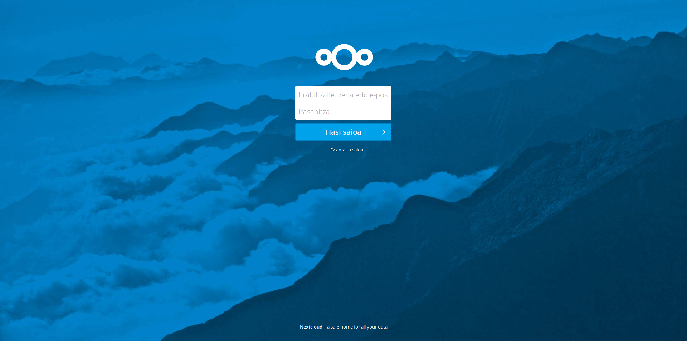

> 💡 **TL;DR**
> - Google Drive / Dropbox / OneDrive à 10-20€/mois remplacés par ton Nextcloud 34 à 3-5€/mois sur un petit VPS
> - Installation Docker en moins d'1h, HTTPS automatique (Let's Encrypt), synchro multi-appareils
> - Contrôle total de tes données, 120 à 240€/an économisés
> - **Mise à jour août 2026** : guide compatible Nextcloud 34 (Hub 26), migration 28 → 34 incluse

T'en as marre de payer Google ou Dropbox pour stocker tes propres fichiers ? Nextcloud, c'est ton Google Drive à toi : tes photos, tes documents, ton agenda, tes contacts, hébergés chez toi ou sur un petit VPS. En moins d'une heure avec Docker, tu reprends le contrôle.

**Prérequis :**

- Un serveur Linux (VPS ou machine chez toi)
- 2 Go de RAM minimum, 4 Go recommandé
- 20 Go d'espace disque (plus ce que tu veux stocker)
- Un nom de domaine (10€/an suffit)
- 1h de ton temps

## Table des matières

## Pourquoi Nextcloud > Google Drive (et les autres)

### Le calcul économique qui fâche

**Google Drive :**

- 100 Go : 2€/mois = **24€/an**
- 200 Go : 3€/mois = **36€/an**
- 2 To : 10€/mois = **120€/an**

**Nextcloud auto-hébergé :**

- VPS 2 Go RAM : 4€/mois = **48€/an**
- Domaine : **10€/an**
- **Total : 58€/an pour un stockage limité seulement par ton VPS**

**Économie sur 5 ans avec 2 To :** 600€ chez Google contre 290€ en auto-hébergé, soit **310€ dans ta poche**.

Et encore, si tu as déjà un serveur chez toi (Raspberry Pi, vieux PC), c'est **gratuit** à part l'électricité.

### Ce que tu gagnes en plus

**Vie privée** : tes fichiers ne partent pas aux USA
**Pas de limite** : tu choisis ta capacité
**Apps intégrées** : calendrier, contacts, notes, galerie photos, visio
**Partage de fichiers** : comme WeTransfer, mais à toi
**Conforme RGPD** : hébergé en France, tes données restent en France

## Avant de commencer : choisir ton setup

### Option 1 : VPS Cloud (recommandé pour débuter)

**Pour qui ?** Tu débutes, tu veux que ça marche vite, et tu n'as pas de serveur à la maison.

**Recommandation VPS :**

- **Hetzner Cloud CPX11** : 4,51€/mois HT, 2 vCPU, 2 Go RAM, 40 Go SSD, Allemagne
- **Scaleway DEV1-S** : ~6€/mois, 2 vCPU, 2 Go RAM, 20 Go SSD, Paris
- **OVHcloud VPS Starter** : 3,50€/mois HT, 1 vCPU, 2 Go RAM, 20 Go SSD, France

**Pourquoi un VPS ?**

- Accès depuis n'importe où (pas besoin d'ouvrir ton routeur)
- IP fixe incluse
- Bande passante confortable
- Backups automatiques disponibles

### Option 2 : Homelab (gratuit mais plus technique)

**Pour qui ?** Tu as déjà un Raspberry Pi 4/5, un vieux PC ou un mini PC chez toi.

**Avantages :**

- Coût quasi nul (électricité ~10€/an pour un Raspberry Pi)
- Stockage vraiment illimité (tu branches un disque externe)
- Contrôle total physique

**Inconvénients :**

- Configuration réseau plus complexe (DynDNS, port forwarding)
- Dépendant de ta connexion internet maison
- Pas d'accès si ton électricité saute

**Mon conseil :** commence sur VPS, migre sur homelab quand tu seras à l'aise.

## Installation de Nextcloud avec Docker : la méthode propre



### Étape 1 : préparer le serveur

On part sur **Ubuntu 24.04 LTS** (ou 22.04, ça marche aussi).

```bash
# Mise à jour du système
sudo apt update && sudo apt upgrade -y

# Installation des dépendances
sudo apt install -y curl git nano

# Installation Docker (méthode officielle)
curl -fsSL https://get.docker.com -o get-docker.sh
sudo sh get-docker.sh

# Ajouter ton utilisateur au groupe docker
sudo usermod -aG docker $USER
newgrp docker

# Vérification
docker --version
docker compose version
```

**Erreur fréquente** : « Permission denied » signifie que tu as oublié `newgrp docker` ou que tu n'as pas relancé ta session SSH.

### Étape 2 : créer la structure Docker Compose

On va monter un setup **Nextcloud + MariaDB + Redis + Nginx Proxy Manager** pour gérer facilement le HTTPS.

```bash
# Créer le dossier projet
mkdir -p ~/nextcloud && cd ~/nextcloud

# Créer le docker-compose.yml
nano docker-compose.yml
```

Colle ce contenu dans `docker-compose.yml` :

```yaml
services:
  # Base de données MariaDB
  db:
    image: mariadb:11.2
    container_name: nextcloud-db
    restart: unless-stopped
    command: --transaction-isolation=READ-COMMITTED --log-bin=binlog --binlog-format=ROW
    volumes:
      - ./db:/var/lib/mysql
    environment:
      - MYSQL_ROOT_PASSWORD=ChangeMotDePasseSuperSecure123!
      - MYSQL_DATABASE=nextcloud
      - MYSQL_USER=nextcloud
      - MYSQL_PASSWORD=NextcloudPassword456!
    networks:
      - nextcloud-network

  # Redis pour améliorer les performances
  redis:
    image: redis:7.2-alpine
    container_name: nextcloud-redis
    restart: unless-stopped
    command: redis-server --requirepass RedisPassword789!
    networks:
      - nextcloud-network

  # Nextcloud
  nextcloud:
    image: nextcloud:34-apache
    container_name: nextcloud-app
    restart: unless-stopped
    ports:
      - "8080:80"
    volumes:
      - ./nextcloud:/var/www/html
      - ./data:/var/www/html/data
    environment:
      - MYSQL_HOST=db
      - MYSQL_DATABASE=nextcloud
      - MYSQL_USER=nextcloud
      - MYSQL_PASSWORD=NextcloudPassword456!
      - REDIS_HOST=redis
      - REDIS_HOST_PASSWORD=RedisPassword789!
      - NEXTCLOUD_TRUSTED_DOMAINS=ton-domaine.fr
      - OVERWRITEPROTOCOL=https
      - OVERWRITECLIURL=https://ton-domaine.fr
    depends_on:
      - db
      - redis
    networks:
      - nextcloud-network

  # Cron pour les tâches de maintenance
  cron:
    image: nextcloud:34-apache
    container_name: nextcloud-cron
    restart: unless-stopped
    volumes:
      - ./nextcloud:/var/www/html
      - ./data:/var/www/html/data
    entrypoint: /cron.sh
    depends_on:
      - db
      - redis
      - nextcloud
    networks:
      - nextcloud-network

networks:
  nextcloud-network:
    driver: bridge

volumes:
  db:
  nextcloud:
  data:
```

**Explications ligne par ligne :**

- `mariadb:11.2` : base de données performante (plus rapide que PostgreSQL pour Nextcloud)
- `redis` : cache qui accélère drastiquement l'interface
- `nextcloud:34-apache` : version 34 (Hub 26) avec Apache intégré
- `OVERWRITEPROTOCOL=https` : force le HTTPS même derrière un reverse proxy
- `cron` : container dédié qui exécute les tâches de maintenance toutes les 5 min

**CHANGE LES MOTS DE PASSE !** Remplace tous les `ChangeMotDePasseSuperSecure`, `NextcloudPassword`, `RedisPassword` par les tiens.

### Étape 3 : lancer Nextcloud

```bash
# Lancer tous les containers
docker compose up -d

# Vérifier que tout tourne
docker ps
```

Quelques commandes utiles si ça coince au démarrage :

```bash
# Voir les logs en direct
docker compose logs -f nextcloud

# "Connection refused" = la DB n'est pas encore prête.
# Attends 30 secondes et recharge la page.

# "Permission denied" dans les logs : corrige les droits
sudo chown -R www-data:www-data ./nextcloud ./data
```

### Étape 4 : configuration HTTPS avec Nginx Proxy Manager

Pour exposer Nextcloud en HTTPS proprement, on utilise **Nginx Proxy Manager** (interface graphique hyper simple).

```bash
# Revenir dans le home
cd ~

# Créer le dossier NPM
mkdir nginx-proxy-manager && cd nginx-proxy-manager

# Créer le docker-compose.yml
nano docker-compose.yml
```

```yaml
version: '3.8'

services:
  npm:
    image: 'jc21/nginx-proxy-manager:latest'
    container_name: nginx-proxy-manager
    restart: unless-stopped
    ports:
      - '80:80'    # HTTP
      - '443:443'  # HTTPS
      - '81:81'    # Interface admin
    volumes:
      - ./data:/data
      - ./letsencrypt:/etc/letsencrypt
    networks:
      - proxy-network

networks:
  proxy-network:
    external: true
    name: nextcloud_nextcloud-network
```

```bash
# Lancer NPM
docker compose up -d

# Créer le network partagé si erreur
docker network create nextcloud_nextcloud-network
docker compose up -d
```

Dans l'interface NPM (port 81), crée un **Proxy Host** qui pointe vers `nextcloud-app:80`, puis demande un certificat Let's Encrypt dans l'onglet SSL. Dans l'onglet **Advanced**, colle cette config nginx :

```nginx
# Headers de sécurité
add_header X-Content-Type-Options "nosniff" always;
add_header X-XSS-Protection "1; mode=block" always;
add_header X-Frame-Options "SAMEORIGIN" always;
add_header X-Robots-Tag "noindex, nofollow" always;
add_header Referrer-Policy "no-referrer" always;

# Headers pour Nextcloud
proxy_set_header X-Forwarded-Proto $scheme;
proxy_set_header X-Forwarded-Host $host;

# Configuration .well-known pour CalDAV/CardDAV
location = /.well-known/carddav {
    return 301 $scheme://$host/remote.php/dav;
}

location = /.well-known/caldav {
    return 301 $scheme://$host/remote.php/dav;
}

location = /.well-known/webfinger {
    return 301 $scheme://$host/index.php/.well-known/webfinger;
}

location = /.well-known/nodeinfo {
    return 301 $scheme://$host/index.php/.well-known/nodeinfo;
}

# Augmenter les timeouts pour les gros fichiers
client_max_body_size 10G;
client_body_timeout 300s;
fastcgi_buffers 64 4K;
```

Clique **Save** et Let's Encrypt génère automatiquement ton certificat HTTPS.

**Tu peux maintenant accéder à** `https://cloud.ton-domaine.fr`

### Étape 5 : configuration initiale Nextcloud

Ouvre `https://cloud.ton-domaine.fr`, tu arrives sur l'assistant d'installation.

**Configuration recommandée :**

1. **Compte administrateur :** utilisateur `admin` (ou ton prénom), mot de passe **FORT** (générateur aléatoire recommandé)
2. **Stockage et base de données :**
   - Dossier des données : `/var/www/html/data` (déjà configuré)
   - Base de données : MySQL/MariaDB
   - Utilisateur BDD : `nextcloud`, mot de passe : celui du docker-compose
   - Nom BDD : `nextcloud`, hôte : `db:3306`
3. **Applications recommandées :** Calendrier, Contacts, Notes, Photos. Laisse Talk de côté pour l'instant (visio gourmande en ressources).

Clique **Terminer l'installation**, ça prend 1 à 2 minutes.

## Optimisations post-installation (important !)

### Activer le cache Redis

Par défaut, Nextcloud ne sait pas qu'on a Redis. Il faut l'activer manuellement.

```bash
# Se connecter au container Nextcloud
docker exec -it nextcloud-app bash

# Éditer config.php
nano /var/www/html/config/config.php
```

Ajoute ces lignes dans le tableau de config :

```php
  'memcache.local' => '\OC\Memcache\APCu',
  'memcache.distributed' => '\OC\Memcache\Redis',
  'memcache.locking' => '\OC\Memcache\Redis',
  'redis' => array(
    'host' => 'redis',
    'port' => 6379,
    'password' => 'RedisPassword789!',
  ),
```

Sauvegarde (Ctrl+O, Entrée, Ctrl+X), quitte le container (`exit`), puis redémarre :

```bash
docker restart nextcloud-app
```

### Augmenter la limite d'upload

Crée un fichier de config PHP custom :

```bash
nano ~/nextcloud/nextcloud/uploads.ini
```

```ini
upload_max_filesize = 10G
post_max_size = 10G
max_execution_time = 3600
max_input_time = 3600
memory_limit = 512M
```

Monte ce fichier dans le container. Dans la section `nextcloud` du `docker-compose.yml`, ajoute la ligne au volume :

```yaml
    volumes:
      - ./nextcloud:/var/www/html
      - ./data:/var/www/html/data
      - ./nextcloud/uploads.ini:/usr/local/etc/php/conf.d/uploads.ini
```

Puis relance :

```bash
cd ~/nextcloud
docker compose down
docker compose up -d
```

**Tu peux maintenant envoyer des fichiers jusqu'à 10 Go !**

### Sécuriser avec fail2ban (optionnel mais recommandé)

Si ton Nextcloud est accessible publiquement, protège-le contre le bruteforce.

```bash
# Installation fail2ban
sudo apt install fail2ban -y

# Créer un filtre Nextcloud
sudo nano /etc/fail2ban/filter.d/nextcloud.conf
```

```ini
[Definition]
failregex = ^{"reqId":".*","level":2,"time":".*","remoteAddr":"<HOST>","user":".*","app":"core","method":".*","url":".*","message":"Login failed:
            ^{"reqId":".*","level":2,"time":".*","remoteAddr":"<HOST>","user":".*","app":"no app in context","method":".*","url":".*","message":"Login failed:
ignoreregex =
```

```bash
# Créer la jail
sudo nano /etc/fail2ban/jail.d/nextcloud.local
```

```ini
[nextcloud]
enabled = true
port = http,https
protocol = tcp
filter = nextcloud
maxretry = 5
bantime = 3600
findtime = 600
logpath = /home/ton-user/nextcloud/data/nextcloud.log
```

> Remplace `/home/ton-user/nextcloud/data/nextcloud.log` par le chemin réel.

```bash
# Redémarrer fail2ban
sudo systemctl restart fail2ban

# Vérifier le statut
sudo fail2ban-client status nextcloud
```

Pour aller plus loin sur le durcissement, j'ai un guide dédié pour [sécuriser ton serveur Linux](https://brandonvisca.com/securite-de-votre-serveur-linux/).

## Synchronisation multi-appareils

Un cloud perso sans synchro automatique, ça ne sert à rien. Bonne nouvelle : Nextcloud a des clients officiels pour tout.

### Desktop (Windows / Mac / Linux)

Télécharge le client desktop sur [nextcloud.com/install](https://nextcloud.com/install/) (ou `brew install --cask nextcloud` sur Mac).

1. Lance le client, entre l'adresse `https://cloud.ton-domaine.fr`
2. Connecte-toi avec ton compte (le client crée un mot de passe d'application dédié)
3. Choisis le dossier local à synchroniser et active la **synchro sélective** : tu décides quels dossiers descendent sur quelle machine

Tu obtiens un dossier `Nextcloud` qui se comporte exactement comme Dropbox : tout ce que tu glisses dedans est synchronisé partout. La fonction **Virtual Files** (Windows) garde les fichiers dans le cloud et ne les télécharge qu'au moment où tu les ouvres, parfait pour un laptop avec peu de SSD.

### Mobile (Android / iOS)

Installe l'app **Nextcloud** (Play Store / App Store). Deux réglages qui changent la vie :

- **Auto-upload des photos** : active-le et tu remplaces Google Photos. Chaque photo prise part automatiquement vers ton serveur, en Wi-Fi uniquement si tu veux préserver ton forfait
- **Fichiers hors ligne** : marque tes documents importants comme disponibles offline pour y accéder sans connexion

Ajoute les apps **Calendrier** et **Contacts** de Nextcloud (ou la synchro CalDAV/CardDAV native) et ton téléphone est entièrement dégooglisé côté données.

## Cas d'usage réels : qui utilise Nextcloud ?

Pour t'aider à dimensionner ton instance, voici trois setups concrets.

### Scénario 1 : famille (4 personnes)

Un compte par membre, un **dossier partagé famille** pour les photos de vacances et les documents administratifs, un **calendrier partagé** pour les rendez-vous. L'auto-upload photo de chaque téléphone remplace Google Photos pour toute la maison.

- **VPS conseillé** : 4 Go de RAM, 200 Go à 500 Go de disque
- **Apps utiles** : Photos, Calendrier, Contacts, Notes

### Scénario 2 : freelance / entrepreneur solo

Tes documents clients au même endroit, des **liens de partage** avec mot de passe et date d'expiration (fini WeTransfer), un calendrier de rendez-vous, et la signature de PDF directement dans l'interface. Tu remplaces Dropbox Pro et tu gardes tes données confidentielles chez toi.

- **VPS conseillé** : 2 à 4 Go de RAM, 100 Go de disque
- **Apps utiles** : partage avancé, Deck (gestion de tâches), OnlyOffice pour éditer les documents

### Scénario 3 : petite asso (15 membres)

Des **groupes** par pôle (bureau, bénévoles), un partage de documents avec droits fins, un **tableau Deck** en mode kanban pour suivre les actions, et un calendrier d'événements visible par tous.

- **VPS conseillé** : 4 à 8 Go de RAM, 500 Go de disque
- **Apps utiles** : Deck, Calendrier, Formulaires (Forms), Groupes

## Backup et restauration

Ton cloud perso ne vaut rien sans sauvegarde. Règle d'or : **3-2-1** (3 copies, 2 supports, 1 hors site).

### Stratégie de backup recommandée

Ce script met Nextcloud en maintenance, dump la base et compresse les fichiers :

```bash
#!/bin/bash
# Script de backup Nextcloud, à placer dans ~/backup-nextcloud.sh

BACKUP_DIR="/home/backups/nextcloud"
DATE=$(date +%Y-%m-%d_%H-%M)

# Créer le dossier de backup
mkdir -p $BACKUP_DIR

# Mettre Nextcloud en mode maintenance
docker exec nextcloud-app php occ maintenance:mode --on

# Backup de la base de données
docker exec nextcloud-db mysqldump -u nextcloud -pNextcloudPassword456! nextcloud > $BACKUP_DIR/nextcloud-db-$DATE.sql

# Backup des fichiers (compression)
tar -czf $BACKUP_DIR/nextcloud-data-$DATE.tar.gz ~/nextcloud/data
tar -czf $BACKUP_DIR/nextcloud-config-$DATE.tar.gz ~/nextcloud/nextcloud/config

# Désactiver le mode maintenance
docker exec nextcloud-app php occ maintenance:mode --off

# Garder seulement les 7 derniers backups
find $BACKUP_DIR -type f -mtime +7 -delete

echo "Backup terminé : $DATE"
```

Rends-le exécutable et automatise-le avec cron :

```bash
# Rendre exécutable
chmod +x ~/backup-nextcloud.sh

# Tester
./backup-nextcloud.sh

# Automatiser (tous les jours à 2h du matin)
crontab -e
```

Ajoute cette ligne dans le crontab :

```bash
0 2 * * * /home/ton-user/backup-nextcloud.sh >> /home/ton-user/backup.log 2>&1
```

### Backup vers un cloud externe (le hors-site du 3-2-1)

Pour la copie hors site, rclone synchronise tes backups vers Backblaze B2, S3 ou autre :

```bash
# Installer rclone
curl https://rclone.org/install.sh | sudo bash

# Configurer une destination (exemple : Backblaze B2)
rclone config
# Suis l'assistant interactif

# Envoyer les backups hors site
rclone sync /home/backups/nextcloud remote-b2:nextcloud-backups
```

### Restauration depuis un backup

Le jour où ton serveur meurt, voici la procédure complète :

```bash
# 1. Réinstaller Docker + Docker Compose
curl -fsSL https://get.docker.com -o get-docker.sh
sudo sh get-docker.sh

# 2. Recréer la structure
mkdir -p ~/nextcloud && cd ~/nextcloud

# 3. Récupérer ton docker-compose.yml (tu l'as sauvegardé à part, hein ?)

# 4. Extraire les backups
tar -xzf nextcloud-data-XXXX.tar.gz -C ~/
tar -xzf nextcloud-config-XXXX.tar.gz -C ~/nextcloud/nextcloud/

# 5. Restaurer la base de données
docker compose up -d db   # Lancer juste la DB d'abord
sleep 10
docker exec -i nextcloud-db mysql -u nextcloud -pNextcloudPassword456! nextcloud < nextcloud-db-XXXX.sql

# 6. Lancer Nextcloud
docker compose up -d

# 7. Réparer les permissions si nécessaire
docker exec nextcloud-app chown -R www-data:www-data /var/www/html
```

**Tu as récupéré toutes tes données !**

## Problèmes courants et solutions

### « Trusted domain error »

**Symptôme :** « Vous accédez au serveur depuis un domaine non approuvé ».

**Solution :** ajoute ton domaine dans la config.

```bash
docker exec -it nextcloud-app bash
nano /var/www/html/config/config.php
```

```php
'trusted_domains' =>
array (
  0 => 'localhost',
  1 => 'ton-ip-serveur',
  2 => 'cloud.ton-domaine.fr',
),
```

### Nextcloud lent ou timeouts

**Symptôme :** l'interface rame, les uploads échouent après 30 secondes.

**Causes possibles :** Redis pas activé (voir section Optimisations), VPS sous-dimensionné (moins de 2 Go de RAM) ou PHP mal configuré.

```bash
# Augmenter les limites PHP
nano ~/nextcloud/nextcloud/uploads.ini
```

```ini
max_execution_time = 7200
max_input_time = 7200
memory_limit = 1G
```

```bash
docker compose restart nextcloud
```

Souvent, c'est juste que la DB n'était pas prête (MariaDB met 30 à 60 secondes à démarrer). Attends et relance.

### Commandes de maintenance utiles

```bash
# Voir les logs
docker compose logs -f nextcloud
docker compose logs -f db

# Vérifier l'espace disque
df -h

# Nettoyer les anciennes images Docker
docker system prune -a

# Nettoyer les versions de fichiers (garde l'historique récent)
docker exec nextcloud-app php occ versions:cleanup

# Vider la corbeille de tous les utilisateurs
docker exec nextcloud-app php occ trashbin:cleanup --all-users
```

## Quoi de neuf dans Nextcloud 34 (Hub 26) - 2026

Ton guide utilise **Nextcloud 34** (`nextcloud:34-apache`), sorti en juin 2026 avec Hub 26. Voici les changements concrets par rapport à la version 28 :

**UI revue et menu waffle**

La navigation a été retravaillée. Le menu applications (waffle) est plus clair, la barre latérale utilise des teintes plus douces, et l'onglet actif dans le panneau de droite est surligné visuellement. Ça paraît mineur, mais sur un usage quotidien, c'est moins fatiguant.

**Euro-Office en alternative à Collabora**

Nextcloud Office intègre désormais **Euro-Office** comme suite bureautique native, en parallèle de Collabora. Si tu préfères une intégration plus légère ou que tu as des contraintes de souveraineté européenne, c'est une option supplémentaire directement dans les paramètres.

**Performance : getUserGroupIds remplace getUserGroups**

La version 34 optimise les appels de permissions sur les groupes d'utilisateurs. Sur une instance avec 50+ comptes, l'interface Files est nettement plus réactive. Pas de changement de config - c'est automatique.

**Pour mettre à jour depuis la version 28**

```bash
# Backup avant toute chose
docker exec nextcloud-app php occ maintenance:mode --on
cd ~/nextcloud && tar czvf backup-nextcloud-$(date +%F).tar.gz nextcloud data

# Mettre à jour l'image
sed -i 's/nextcloud:28-apache/nextcloud:34-apache/' docker-compose.yml
docker compose pull nextcloud cron
docker compose up -d nextcloud cron

# Exécuter le migrateur
docker exec nextcloud-app php occ upgrade
docker exec nextcloud-app php occ maintenance:mode --off
```

La migration 28 → 34 est automatique mais compte 5-10 min de downtime selon la taille de ta base.

---

## Nextcloud dans l'écosystème d'indépendance numérique

Félicitations, tu viens de franchir un cap : **remplacer Google Drive, Google Photos et Google Docs** d'un seul coup. Mais l'indépendance numérique ne s'arrête pas au stockage.

Nextcloud est **le premier pilier d'une stack complète** qui peut te faire économiser jusqu'à 534€/an :

- **Nextcloud** : remplace Google Drive/Photos/Docs (que tu viens d'installer)
- **PhotoPrism** : si tu préfères une galerie photo dédiée avec reconnaissance faciale IA, j'ai un guide pour [installer PhotoPrism avec Docker](https://brandonvisca.com/photoprism-docker-galerie-photo/)
- **Jellyfin** : remplace Netflix/Prime Video, voir mon [guide Jellyfin avec Docker](https://brandonvisca.com/jellyfin-docker-alternative-netflix-gratuite/) (économie ~240€/an)
- **Vaultwarden** : remplace LastPass/1Password avec [Vaultwarden en Docker](https://brandonvisca.com/vaultwarden-docker-gestionnaire-mots-de-passe/) (économie ~60€/an)

**Résultat ?** Une infrastructure 100% sous ton contrôle, sans abonnement, qui tient sur un simple Raspberry Pi 4.

**[Découvre la stack complète d'indépendance numérique](https://brandonvisca.com/independance-numerique-2025-guide-complet/)**

## Pour aller plus loin

- [Sécuriser ton serveur Linux](https://brandonvisca.com/securite-de-votre-serveur-linux/) : firewall, SSH, fail2ban, mises à jour automatiques
- [Docker pour débutants](https://brandonvisca.com/docker-debutant-services-auto-heberger/) : comprendre Docker et créer d'autres services
- [Nginx : optimiser les headers HTTP](https://brandonvisca.com/securiser-nginx-avec-headers-http/) : renforcer la sécurité de ton reverse proxy
- [Documentation officielle Nextcloud](https://docs.nextcloud.com/) : la référence complète

## Conclusion : reprends le contrôle de tes données

Tu viens de monter **ton propre cloud perso** en moins d'1h. Nextcloud avec Docker, c'est économique (58€/an contre 120€+ pour les clouds commerciaux), privé (tes données chez toi), puissant (calendrier, contacts, notes, galerie, visio) et évolutif (tu ajoutes de l'espace quand tu veux).

Tes prochaines étapes : active la double authentification dans **Paramètres, Sécurité**, installe OnlyOffice pour éditer tes documents, crée des comptes pour tes proches, et laisse le script de backup tourner en cron. Le reste, c'est du bonus. Tu as déjà dit adieu aux 10 à 20€/mois de Google Drive.
