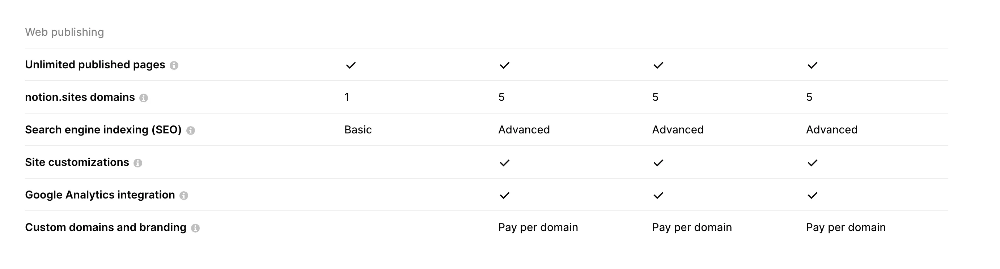

  - [Création et Personnalisation des Pages avec Notion](#creation-et-personnalisation-des-pages-avec-notion)
  - [Publication et Gestion des Domaines Personnalisés](#publication-et-gestion-des-domaines-personnalises)
- [Avantages de Notion Sites](#avantages-de-notion-sites)
  - [Facilité d’utilisation et Rapidité de Publication](#facilite-dutilisation-et-rapidite-de-publication)
  - [Fonctionnalités CMS Avancées](#fonctionnalites-cms-avancees)
  - [Transformation de Contenu Statique en CMS Dynamique](#transformation-de-contenu-statique-en-cms-dynamique)
- [F.A.Q](#f-a-q)
  - [Quelle est la différence principale entre Notion Sites et d’autres plateformes comme WordPress?](#faq-question-1719342516475)
  - [Comment puis-je intégrer un domaine personnalisé à mon site Notion?](#faq-question-1719342521590)
  - [Est-ce que Notion Sites est adapté pour la création de blogs professionnels?](#faq-question-1719342532579)

[Notion](http://notion.so), célèbre pour ses capacités de gestion de tâches et de notes, étend ses fonctionnalités avec [Notion Sites](https://www.notion.so/fr-fr/help/guides/build-a-website-with-notion-in-seconds-no-coding-required), permettant aux utilisateurs de transformer facilement leurs pages en sites web complets. Cette nouvelle fonctionnalité vise à simplifier le processus de création et de gestion de sites web pour une variété d’applications, allant des portfolios personnels aux sites d’entreprise complexes.

### Création et Personnalisation des Pages avec Notion

Notion Sites offre une approche intuitive pour [créer des sites web à partir de zéro](https://blog.imaginotion.fr/creer-site-web-notion). Les utilisateurs peuvent tirer parti de mises en page multi-colonnes, intégrer des boutons interactifs, et organiser leur contenu avec des vues de base de données. La personnalisation avancée inclut la possibilité de choisir des thèmes, d’ajouter des favicons distinctifs, et d’intégrer des outils d’analyse comme Google Analytics pour un suivi détaillé des performances.

### Publication et Gestion des Domaines Personnalisés

Un guide détaillé accompagne les utilisateurs dans la [publication instantanée de leurs pages Notion en ligne](https://la-webeuse.com/creer-un-site-web-avec-notion/). Notion permet l’intégration facile de domaines personnalisés et la gestion efficace des sous-domaines notion.site. Les options tarifaires offertes sont comparées à celles d’autres plateformes de création de sites web, mettant en lumière la flexibilité et l’accessibilité des fonctionnalités proposées.

Avantages de Notion Sites

### Facilité d’utilisation et Rapidité de Publication

Notion Sites se distingue par sa facilité d’utilisation. Idéal pour ceux qui cherchent à publier rapidement du contenu en ligne, il permet des modifications instantanées et une mise à jour immédiate des pages web. Cette fonctionnalité est particulièrement avantageuse pour les utilisateurs cherchant à maximiser leur productivité sans compromettre la qualité du résultat final.

### Fonctionnalités CMS Avancées

La plateforme offre des fonctionnalités CMS robustes, permettant la création aisée de blogs et la gestion efficace de collections de contenu structuré. Comparée à d’autres solutions du marché telles que [WordPress](http://wordpress.com) et [Webflow](http://webflow.com), Notion se distingue par sa simplicité d’intégration et sa gestion intuitive des bases de données, facilitant ainsi la création et la maintenance de sites web dynamiques.

### Transformation de Contenu Statique en CMS Dynamique

Notion facilite la [transformation de pages web statiques en collections CMS dynamiques](https://www.impli.fr/post/creer-son-site-avec-notion). Cette capacité permet aux utilisateurs de créer des vues de galerie attrayantes, personnalisables selon les besoins spécifiques du contenu. La flexibilité offerte dans la gestion des propriétés des modèles permet d’afficher des descriptions détaillées et des liens pertinents, offrant ainsi une expérience utilisateur enrichie.

F.A.Q

### Quelle est la différence principale entre Notion Sites et d’autres plateformes comme WordPress?

Notion Sites se distingue par sa simplicité d’utilisation et sa capacité à permettre des modifications en temps réel sans nécessiter de compétences techniques avancées, contrairement à WordPress qui demande souvent une courbe d’apprentissage plus longue.

### Comment puis-je intégrer un domaine personnalisé à mon site Notion?

La [gestion des domaines personnalisés avec Notion](https://www.notion.so/fr-fr/templates/category/website-building) est facile. Vous pouvez suivre un guide étape par étape pour associer votre domaine existant à votre site Notion, assurant ainsi une présence web professionnelle et personnalisée.

### Est-ce que Notion Sites est adapté pour la création de blogs professionnels?

Oui, Notion Sites offre des fonctionnalités CMS robustes qui permettent la création et la gestion de [blogs professionnels avec facilité](https://apprendre-notion.com/6-outils-gratuits-pour-creer-son-site-avec-notion/). Les utilisateurs peuvent publier du contenu, gérer des commentaires et personnaliser l’apparence de leur blog selon leurs besoins spécifiques.
