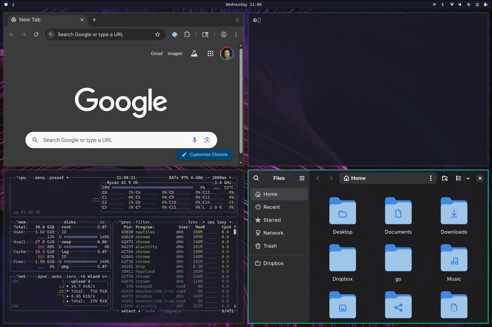
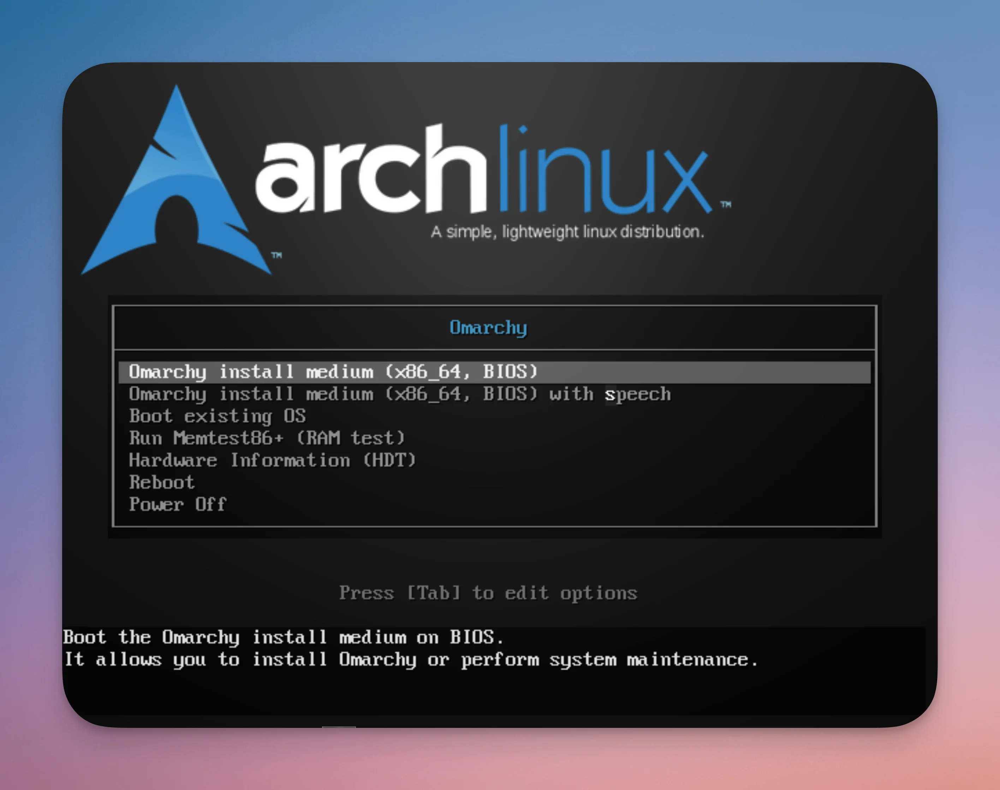
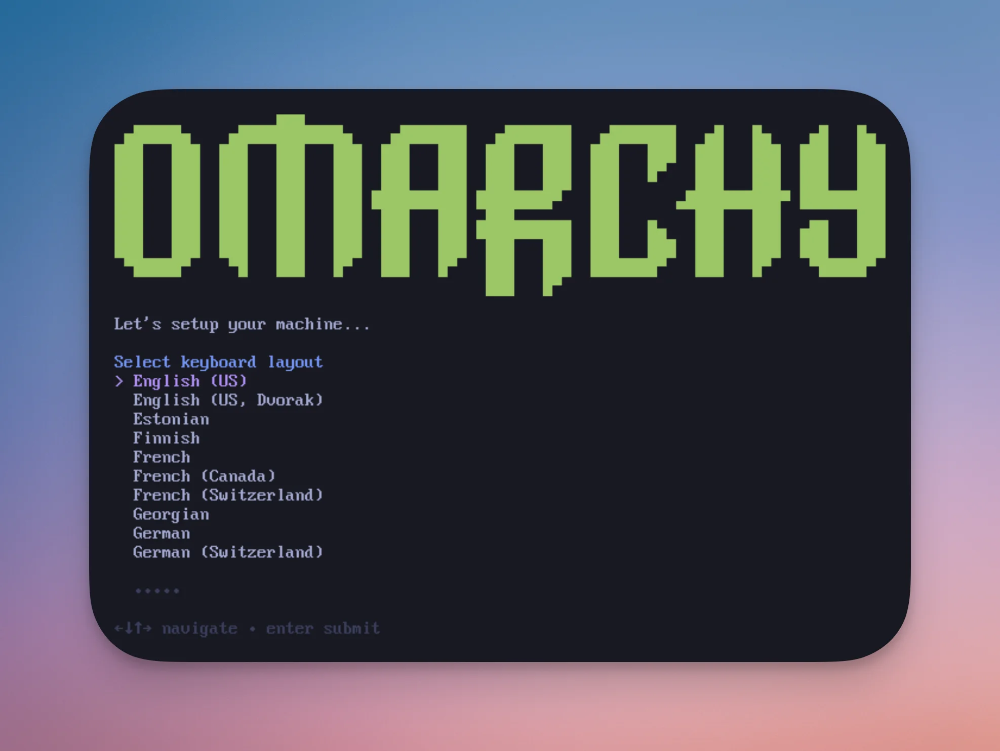
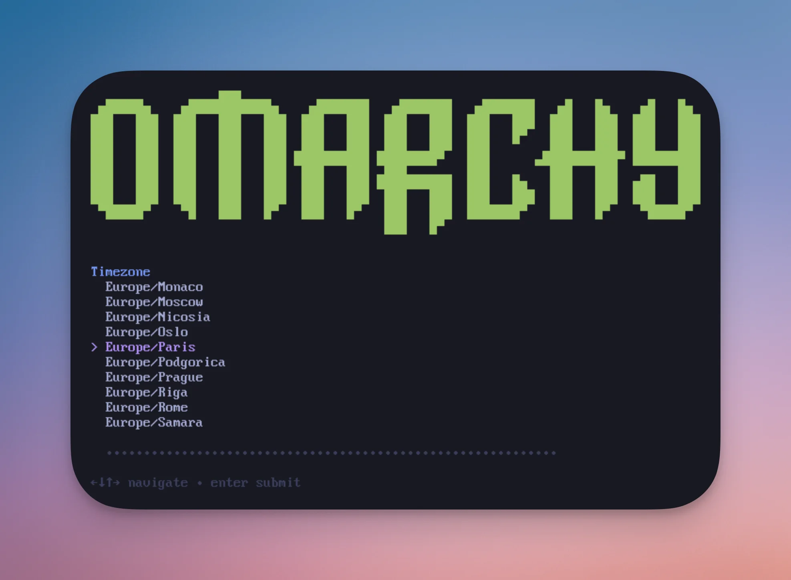
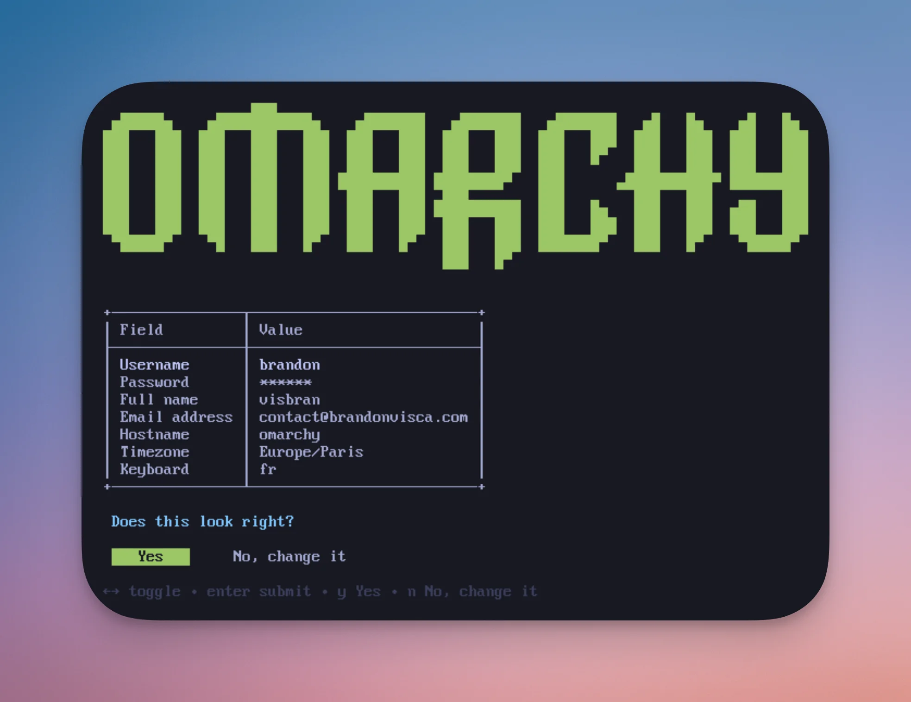
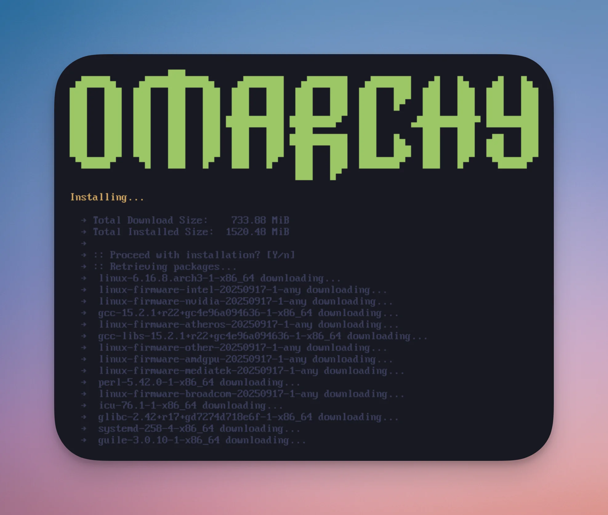
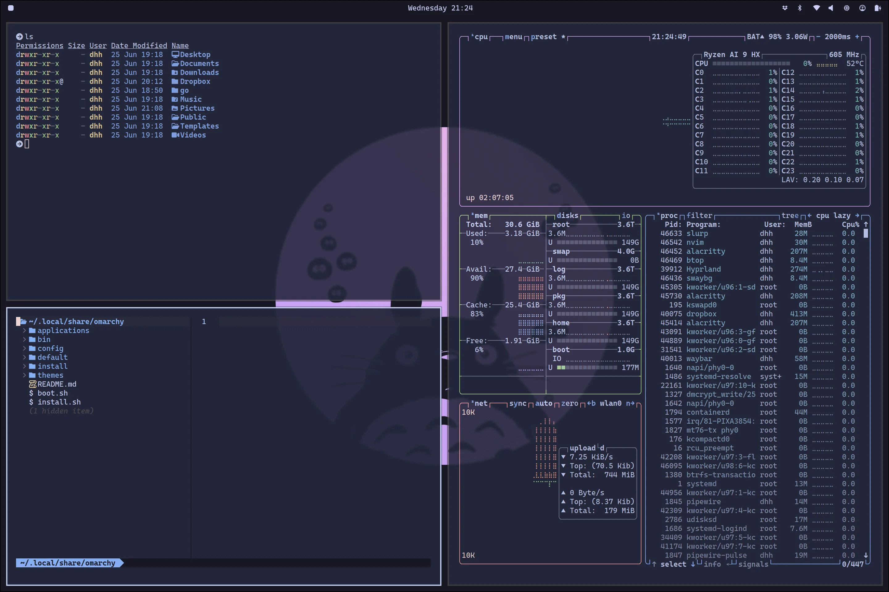
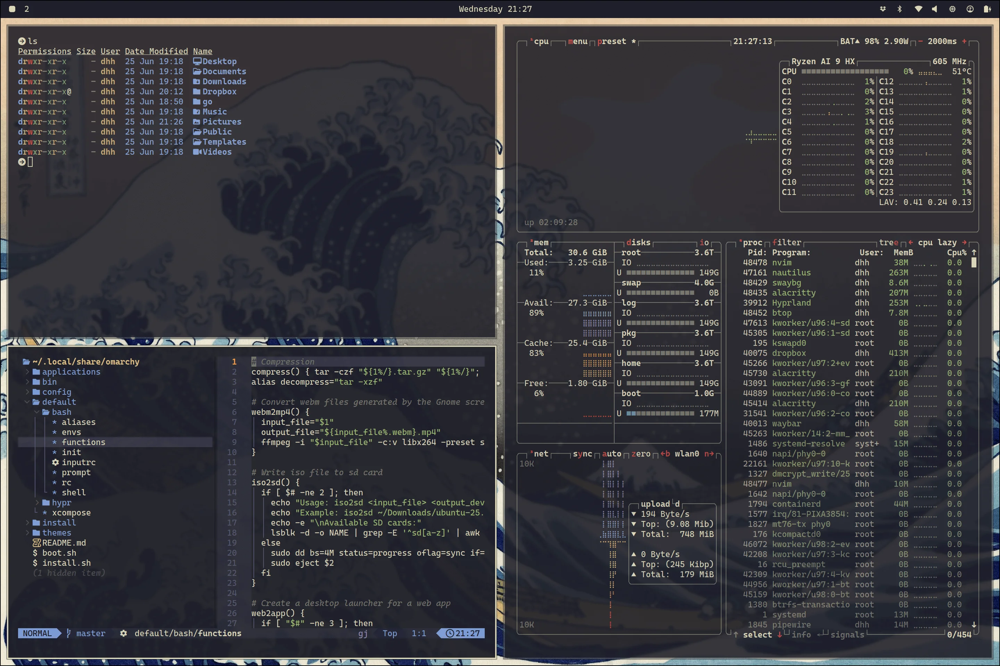

Sommaire : 

- [Omarchy en résumé : Arch sans les larmes](#omarchy-en-resume-arch-sans-les-larmes)
- [Installation : plus simple qu’un YAML bien indenté](#installation-plus-simple-quun-yaml-bien-indente)
- [Premier démarrage : bienvenue dans le futur](#premier-demarrage-bienvenue-dans-le-futur)
- [Les thèmes : 11 façons de rendre tes collègues jaloux](#les-themes-11-facons-de-rendre-tes-collegues-jaloux)
- [Développement : l’environnement qui anticipe tes besoins](#developpement-lenvironnement-qui-anticipe-tes-besoins)
- [Sécurité : Omarchy prend ça au sérieux](#securite-omarchy-prend-ca-au-serieux)
- [Performance et monitoring](#performance-et-monitoring)
- [Cas d’usage : pour qui et pourquoi ?](#cas-dusage-pour-qui-et-pourquoi)
- [Comparaison avec d’autres distributions](#comparaison-avec-dautres-distributions)
- [Installation et premier paramétrage](#installation-et-premier-parametrage)
- [Troubleshooting courant](#troubleshooting-courant)
- [Ressources complémentaires](#ressources-complementaires)
- [Verdict : révolution ou simple évolution ?](#verdict-revolution-ou-simple-evolution)


*Tu cherches une distribution Linux qui allie la puissance d’Arch à l’esthétique d’un bureau moderne ? Spoiler : Omarchy pourrait bien révolutionner ta façon de bosser.*

Omarchy, c’est cette nouvelle distribution qui fait parler d’elle dans les cercles d’administrateurs systèmes éclairés. Basée sur Arch Linux mais avec un twist « omakase » (laissez au chef, en japonais), elle propose une expérience prête à l’emploi avec le gestionnaire de fenêtres tiling Hyprland.

Autrement dit : fini de passer trois semaines à configurer ton environnement de travail. Ici, tout fonctionne out-of-the-box, et en beauté.

- - - - - -

**Omarchy en résumé : Arch sans les larmes**

Imagine Arch Linux, mais sans la galère de configuration habituelle. Omarchy embarque :

**🎨 11 thèmes magnifiques** préconçus (Tokyo Night, Catppuccin, Gruvbox…)  
**⌨️ Navigation 100% clavier** avec des raccourcis logiques  
**🔒 Sécurité renforcée** (chiffrement disque obligatoire, firewall activé)  
**🛠️ Outils de développement** prêts à l’emploi (Neovim, Docker, Node.js…)  
**📦 Arch User Repository** intégré via `yay`

Le principe ? Tu installes, tu choisis ton thème, et tu bosses. Point.

- - - - - -

**Installation : plus simple qu’un YAML bien indenté**

Contrairement à une installation Arch classique qui peut transformer même un sysadmin aguerri en zombie, Omarchy mise sur la simplicité.

**Prérequis :**

- Une machine compatible UEFI
- Au moins 8GB de RAM (16GB recommandé)
- 50GB d’espace disque minimum
- Secure Boot désactivé

**Étapes d’installation :**

1. [**Télécharge l’ISO** d’Omarchy ](https://iso.omarchy.org/omarchy-3.0.2.iso)depuis le site officiel
2. **Grave sur USB** avec [balenaEtcher](https://etcher.balena.io/#download-etcher)
3. **Boot** sur ta clé usb

4. **Lance l’installateur** Arch :

Pour effectuer l’installation rien de bien compliquer :

- Tu choisis ton langage de clavier
- Tu saisis ton nom d’utilisateur pour pouvoir te connecter
- Un bon mot de passe, évidemment !
- Il te propose de connecter Git, tu peux le faire ou tu peux passer si tu n’as pas envie maintenant
- Tu choisis ton fuseau horaire
- Un résumé de la configuration s’affiche, tu peux procéder à l’installation si tout est correct.

- - - - - -

**Premier démarrage : bienvenue dans le futur**

Au premier lancement, tu tombes sur un bureau… vide. Normal ! Omarchy privilégie la navigation clavier.

**Raccourcis essentiels à retenir :**

Raccourci | Action | `Super + Space` | Lanceur d’applications | `Super + Alt + Space` | Menu Omarchy | `Super + Return` | Terminal | `Super + B` | Navigateur | `Super + K` | Aide raccourcis | 

Le menu Omarchy (`Super + Alt + Space`) est ton nouveau meilleur ami. Il permet d’installer des packages, configurer le système, changer de thème…

- - - - - -

**Les thèmes : 11 façons de rendre tes collègues jaloux**

L’un des atouts majeurs d’Omarchy, ce sont ses thèmes intégrés qui changent **tout** : fond d’écran, couleurs du terminal, Neovim, notifications, barre de tâches…

**Mes favoris :**

- **Tokyo Night** : sombre et moderne, parfait pour les longues sessions de code
- **Catppuccin** : pastel et doux pour les yeux
- **Gruvbox** : le classique qui ne vieillit pas
- **Nord** : minimaliste et classe

Pour changer de thème : `Super + Ctrl + Shift + Space`

Tu peux même créer tes propres thèmes en copiant un thème existant dans `~/.config/omarchy/themes/` et en bidouillant les couleurs.

- - - - - -

**Développement : l’environnement qui anticipe tes besoins**

Omarchy embarque un stack complet pour le développement :

**Éditeurs :**

- Neovim avec LazyVim (éditeur principal)
- Installation facile de VSCode, Cursor, Zed via le menu

**Environnements de développement :**

- Node.js, Bun, Deno pour JavaScript
- Ruby on Rails
- PHP avec frameworks populaires
- Docker et docker-compose

**Outils en ligne de commande :**

- `fzf` pour la recherche floue de fichiers
- `zoxide` pour la navigation intelligente
- `ripgrep` pour chercher dans les fichiers
- `lazygit` et `lazydocker` pour Git et Docker

L’intégration est remarquable. Par exemple, dans Neovim, `Space Space` utilise fzf pour ouvrir rapidement n’importe quel fichier.

- - - - - -

**Sécurité : Omarchy prend ça au sérieux**

Contrairement à certaines distributions qui considèrent la sécurité comme optionnelle, Omarchy l’impose :

**✅ Chiffrement disque obligatoire** avec LUKS  
**✅ Firewall activé par défaut** (sauf ports SSH et LocalSend)  
**✅ Rolling release** = correctifs de sécurité en temps réel  
**✅ Isolation Docker** sécurisée via ufw-docker

Cette approche rappelle celle que j’ai détaillée dans mon [guide de sécurisation des serveurs Linux](https://brandonvisca.com/securite-de-votre-serveur-linux/) : la sécurité doit être native, pas ajoutée après coup.

- - - - - -

**Performance et monitoring**

Omarchy inclut des outils de monitoring intégrés :

**btop** remplace htop avec style :

```bash
btop

```

```ini
# Éditer ~/.config/hypr/input.conf
kb_layout = us,fr  
kb_options = compose:caps,grp:alts_toggle
```

**2. Ajuster l’échelle d’affichage** Pour les écrans non-4K, modifier `~/.config/hypr/hyprland.conf` :

```bash
env = GDK_SCALE,1  # Au lieu de 2 par défaut

```

yay -S firefox spotify-launcher discord


- - - - - -

**Troubleshooting courant**

**Applications trop grandes ?**  
→ Modifie `GDK_SCALE` dans `hyprland.conf`

**Pas de son ?**  
→ Vérifie la sortie audio : `Super + Alt + Space` &gt; Setup &gt; Audio

**Clavier français non reconnu ?**  
→ Configure `kb_layout` dans les paramètres Hypr

Pour des problèmes plus complexes, la communauté sur GitHub est réactive et les développeurs accessibles.

- - - - - -

**Ressources complémentaires**

Pour approfondir tes connaissances système Linux, consulte aussi :

- [Connecter Ubuntu à Active Directory avec SSSD](https://brandonvisca.com/connecter-les-systemes-ubuntu-a-active-directory-en-utilisant-sssd/) pour intégrer tes machines à un domaine
- [Résolution des problèmes de montage RAID](https://brandonvisca.com/depannage-montage-partition-raid-linux-mode-secours/) si tu gères du stockage avancé

- - - - - -

**Verdict : révolution ou simple évolution ?**

Omarchy représente exactement ce que beaucoup d’entre nous attendaient : la puissance d’Arch sans les nuits blanches de configuration.

**Les plus :**

✅ Installation simplifiée  
✅ Esthétique soignée et cohérente  
✅ Sécurité native  
✅ Productivité immédiate  
✅ Écosystème Arch intact

**Les moins :**

❌ Courbe d’apprentissage Hyprland  
❌ Jeune projet (stabilité à confirmer)  
❌ Documentation encore limitée

Si tu cherches une distribution Linux qui combine productivité, sécurité et esthétique sans sacrifier la puissance d’Arch, Omarchy mérite clairement ton attention.

Le concept « omakase » (laissez au chef) prend ici tout son sens : les développeurs ont fait les choix techniques à ta place, et franchement, ils ont plutôt bon goût.

- - - - - -

**Et toi, ça te tente de tester Omarchy ? Partage ton expérience dans les commentaires !**

## Articles connexes

- [Oh My Zsh + Powerlevel10k : Transformez votre terminal en ma](/installation-oh-my-zsh-powerlevel10k-guide-complet/)
- [Nebula-Sync : synchroniser plusieurs Pi-hole v6 gratuitement](/nebula-sync-pihole-v6-installation-docker-guide/)
