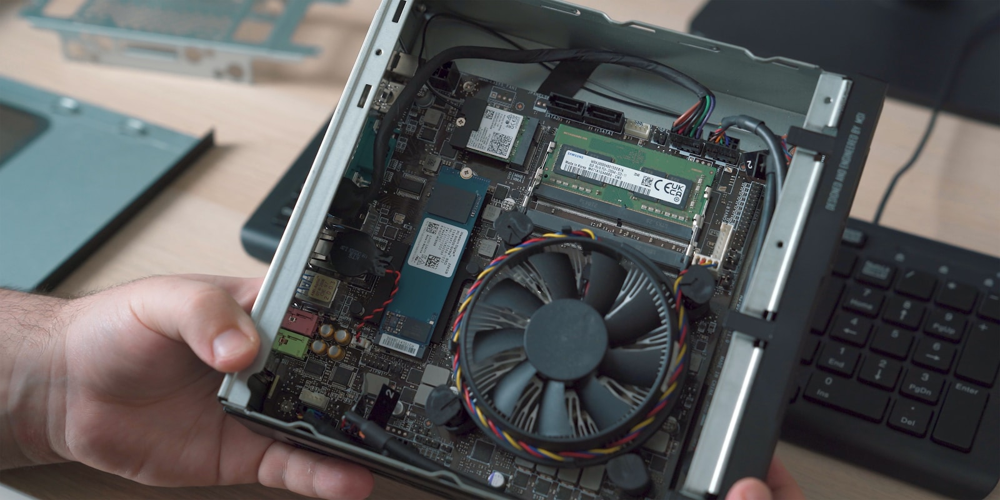
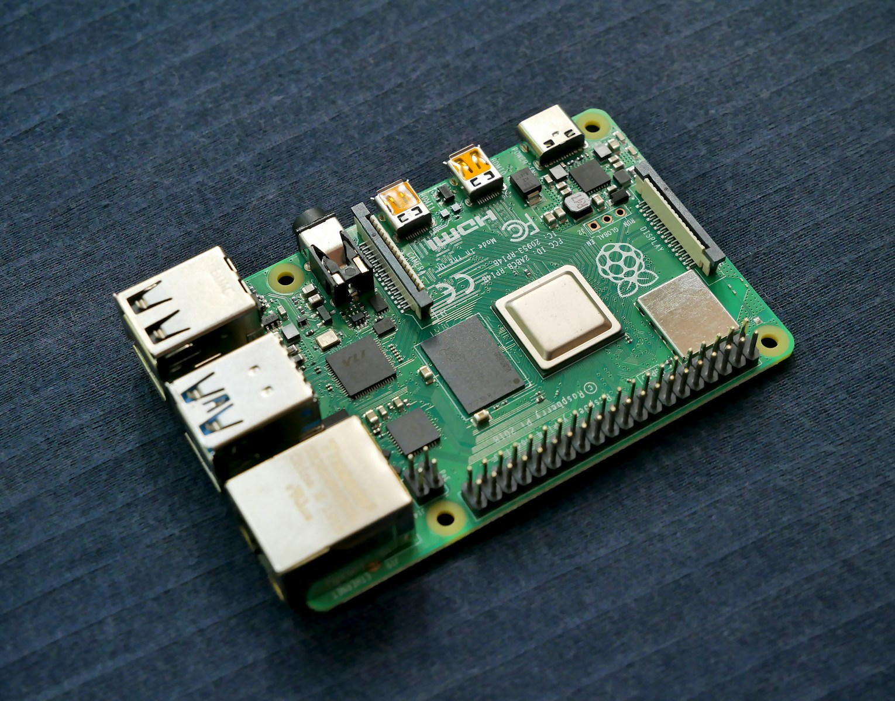
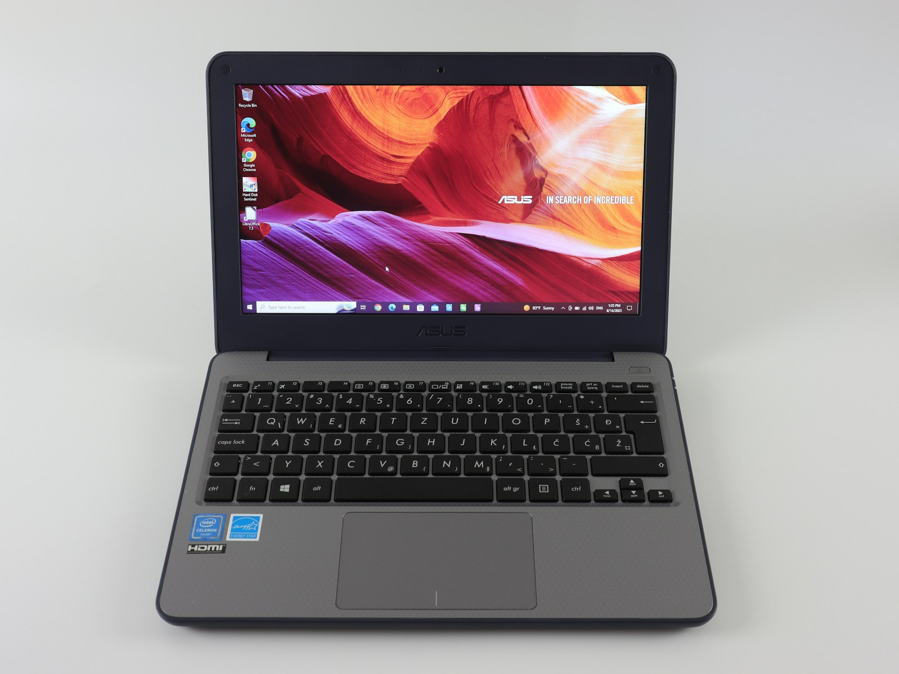

TL;DR
-----

- ✅ J’ai viré Google Drive, Photos, Gmail et Calendar
- ✅ Économie : 240€/an (après investissement 200€)
- ✅ Alternatives : Nextcloud, Immich, Mailcow, Jellyfin
- ✅ Temps d’installation : Un weekend
- ✅ Résultat : 100% fonctionnel, contrôle total de mes données

- - - - - -

Introduction : Le jour où j’en ai eu marre
------------------------------------------

Février 2024. Je reçois mon énième notification « Google One : stockage bientôt plein, passez à 200 Go ».

20€/mois pour du stockage.  
240€/an.  
1200€ sur 5 ans.

Et là, le déclic : **je paie pour que Google garde MES données**.

Données qu’ils scannent.  
Qu’ils analysent pour me profiler.  
Que je ne peux pas récupérer facilement si je veux partir.

Spoiler : j’ai viré Google. Ça m’a pris un weekend. Et depuis 18 mois, je n’ai payé que 30€/an pour mon nom de domaine.

Voici comment.

Pourquoi quitter Google ? (Les vraies raisons)
----------------------------------------------

### 1. L’argent (évidemment)

Faisons le compte de ce que Google me ponctionnait :

Service | Prix mensuel | Prix annuel | Google One 200 GB | 20€ | 240€ | YouTube Premium | 12€ | 144€ | **Total** | **32€/mois** | **384€/an** | 

**Sur 5 ans : 1920€.**

Sachant qu’un mini PC qui héberge tout ça coûte ~200€… le calcul est vite fait.

### 2. La vie privée (vraiment)

Je sais, ça fait complotiste. Mais quand tu réalises que Google scanne :

- Tes emails (pour te profiler)
- Tes photos (reconnaissance faciale)
- Tes documents (analyse de contenu)
- Ton agenda (pour vendre des pubs ciblées)

…tu te dis que peut-être, **tes données devraient rester CHEZ TOI**.

### 3. La dépendance (le pire)

Le jour où Google décide de :

- Fermer ton compte (ça arrive, Google ça sans justification)
- Doubler les prix (ils l’ont déjà fait)
- Limiter les fonctionnalités (YouTube sans Premium, c’est l’enfer)

Tu fais quoi ? Tu râles et tu paies.

**Moi je voulais reprendre le contrôle.**

- - - - - -

Ma stack auto-hébergée (ce qui remplace Google)
-----------------------------------------------

Voici mon setup actuel, 100% fonctionnel depuis 18 mois :

### Google Drive → Nextcloud

**Ce que ça fait :**

- Stockage illimité (si tu as un disque assez gros)
- Synchro desktop/mobile
- Partage de fichiers avec liens sécurisés
- Édition de documents en ligne (Collabora)

**Temps d’installation :** 1h  
**Coût :** 0€/mois (après setup)

👉 [Guide complet : Installe Nextcloud en 1h](https://brandonvisca.com/nextcloud-docker-installation-complete-2025/)

### Google Photos → Immich

**Ce que ça fait :**

- Upload automatique depuis smartphone
- Reconnaissance faciale (en local !)
- Albums, recherche par date/lieu
- Timeline comme Google Photos
- Partage d’albums

**Temps d’installation :** 30 minutes  
**Coût :** 0€/mois

C’est **exactement** Google Photos, mais gratuit et privé.

👉 [Immich : Alternative Google Photos auto-hébergée](#)

### Gmail → Mailcow

Bon, je vais être honnête : héberger ses emails, c’est chaud.

Pas impossible, mais il faut :

- Un nom de domaine
- Un VPS avec IP dédiée
- Configurer SPF, DKIM, DMARC (sinon spam)

**Mon choix actuel :** J’utilise [ProtonMail](https://proton.me) (9€/mois) en attendant.

Mais si tu veux auto-héberger, Mailcow est la référence.

### YouTube Premium → Jellyfin

**Ce que ça fait :**

- Streaming vidéos perso (films, séries légales)
- Interface Netflix-like
- Apps mobile/TV
- Pas de pub (évidemment)

Je ne parle pas de piratage ici. Mais pour streamer mes achats DVD/Blu-ray et mes vidéos persos, Jellyfin est parfait.

**Temps d’installation :** 20 minutes  
**Coût :** 0€/mois

👉 [Jellyfin : Netflix gratuit chez toi](https://brandonvisca.com/jellyfin-docker-alternative-netflix-gratuite/)

### Bonus : Bitwarden (Passwords)

Google gérait mes mots de passe. Maintenant j’utilise **[Vaultwarden](https://brandonvisca.com/vaultwarden-docker-gestionnaire-mots-de-passe/)** (version auto-hébergée de Bitwarden).

Gratuit, open source, chiffré. Parfait.

- - - - - -

Le matériel : Ce dont tu as VRAIMENT besoin
-------------------------------------------

Pas besoin d’un serveur à 2000€. Voici mon setup actuel :

### Option #1 : Le mini PC (mon choix)

**Matériel :**

- [Beelink Mini S12 Pro](https://amzn.to/4rlW7qa) – 289€
- Intel N100, 16GB RAM, 500GB SSD
- Consommation : 10W (2€/mois élec)
- [Disque externe 2TB](https://amzn.to/43yGnpt) – 81€ (backups)
- **Total : 370€**

**Avantages :**

- Assez puissant pour tout
- Silencieux
- Consomme rien

### Option #2 : Le Raspberry Pi (budget serré)

**Matériel :**

- [Starter Pack Raspberry Pi 5 8GB](https://amzn.to/49rWcCe) – 140€
- ✔ Alimentation officielle 27W : Alimentation stable et fiable pour votre Raspberry Pi 5.
- ✔ Boîtier officiel avec ventilateur : Protège votre Raspberry Pi et assure un refroidissement optimal lors d’une utilisation intensive.
- ✔ Carte mémoire de 128 Go : offre un stockage généreux pour votre système d’exploitation, vos applications et vos fichiers.
- ✔ Lecteur de cartes USB pour cartes mémoire : configuration simple et rapide de votre système d’exploitation sur votre PC ou ordinateur portable.
- ✔ Dissipateur thermique en aluminium : refroidissement supplémentaire pour des performances et une durabilité fiables.
- ✔ Câble Micro HDMI 4K 1 mètre : parfait pour une sortie vidéo ultra-nette sur des moniteurs ou téléviseurs 4K compatibles.
- **Total : 140€**

**Avantages :**

- Moins cher
- Encore plus économe (5W)

**Inconvénients :**

- Moins de puissance (limite Docker)
- Pas de virtualisation

### Option #3 : Le vieux PC (0€)

Tu as un vieux PC qui traîne ? Installe Ubuntu Server dessus. Gratuit, fonctionnel.

👉 [Guide : Ton premier serveur avec un vieux PC](#)

- - - - - -

L’installation : Un weekend suffit
----------------------------------

Voici comment j’ai procédé (et toi aussi tu peux) :

### Samedi matin : Setup de base (2h)

1. **Installer Ubuntu Server** sur le mini PC
2. **Installer Docker** et Docker Compose
3. **Configurer un nom de domaine** (10€/an chez Cloudflare)
4. **Installer Traefik** (reverse proxy)

C’est la fondation. Après ça, installer des services = copier-coller des Docker Compose.

### Samedi après-midi : Nextcloud (2h)

- Install Nextcloud via Docker
- Config SSL avec Let’s Encrypt (automatique)
- Synchro premier dossier

**Résultat :** Mon propre Google Drive fonctionnel.

### Dimanche matin : Immich (1h)

- Docker Compose Immich
- Upload premières photos
- Reconnaissance faciale activée

**Résultat :** Mon Google Photos privé.

### Dimanche après-midi : Jellyfin + Bitwarden (1h)

- Jellyfin pour streaming vidéos
- Vaultwarden pour passwords

**Résultat :** Stack complète fonctionnelle.

**Total : 6h de taf sur un weekend.**

- - - - - -

Les résultats après 18 mois
---------------------------

### Côté finances

**Avant (Google) :**

- 384€/an (Drive + YouTube Premium)

**Maintenant (auto-hébergé) :**

- Investissement initial : 254€ (mini PC + disque)
- Nom de domaine : 10€/an
- Électricité : ~24€/an (2€/mois)
- **Total année 1 : 288€**
- **Années suivantes : 34€/an**

**Économie sur 5 ans : 1632€**

### Côté technique

**Uptime :** 99.7% (3 redémarrages en 18 mois)  
**Bugs :** 2-3 fois où j’ai dû fouiller les logs (fixés en 30 min)  
**Maintenance :** ~2h/mois (updates Docker)

C’est largement gérable, même en bossant à temps plein.

### Côté confort

**Spoiler : C’est AUSSI pratique que Google.**

- Synchro automatique smartphone → Nextcloud
- Upload photos automatique → Immich
- Jellyfin sur TV via app Android
- Bitwarden fonctionne partout (extension navigateur)

La seule différence ? **C’est chez moi. Sous mon contrôle.**

- - - - - -

Les galères (soyons honnêtes)
-----------------------------

Pas tout est rose. Voici les vrais problèmes que j’ai rencontrés :

### 1. Le premier setup est intimidant

Si tu n’as jamais touché à Linux, ça peut faire peur.

**Solution :** Suis un tuto pas à pas. Moi j’ai mis 4h. Toi tu mettras peut-être 8h. Mais après, c’est roulé.

### 2. Les mises à jour

Faut penser à mettre à jour Docker, les containers, Ubuntu.

**Solution :** Script automatique toutes les semaines. Prend 5 minutes à configurer.

### 3. Si ça tombe en panne

Pas de support Google pour te dépanner.

**Solution :**

- Backups automatiques quotidiens
- Communauté r/selfhosted ultra-active
- Documentation top (Nextcloud, Immich, etc.)

En 18 mois, j’ai eu 2-3 bugs. À chaque fois, solution trouvée en 20 minutes sur Google (ironique, je sais).

- - - - - -

Pourquoi ça vaut le coup (vraiment)
-----------------------------------

Au-delà des économies et de la vie privée, voici ce qui change vraiment :

### 1. Tu apprends des trucs

Docker, Linux, réseaux, sécurité… En montant ton homelab, tu gagnes des compétences.

Si tu bosses dans l’IT (ou veux y bosser), c’est un ÉNORME plus sur un CV.

### 2. Tu contrôles tout

- Google décide de monter ses prix ? Pas ton problème.
- Ils ferment un service que tu utilises ? Tu t’en fous.
- Ils scannent tes données ? Pas chez toi.

**C’est TON infrastructure.**

### 3. C’est cool (oui vraiment)

Avoir son propre serveur, c’est un peu comme avoir sa propre maison vs louer un appart.

C’est à toi. Tu fais ce que tu veux. C’est satisfaisant.

- - - - - -

Par où commencer ? (Le plan d’action)
-------------------------------------

Tu es motivé ? Voici les étapes concrètes :

### Étape 1 : Choisis ton matériel (Budget 150-250€)

**Option A – Mini PC** : [Beelink Mini S12 Pro](https://amzn.to/4rlW7qa) (~190€)  
**Option B – Raspberry Pi** : [Raspberry Pi 5 8GB](https://amzn.to/49rWcCe) (~140€)  
**Option C – Vieux PC** : Gratuit si tu en as un

Ajoute un disque externe pour les backups (60€).

### Étape 2 : Réserve un weekend

Sérieux. Bloque samedi + dimanche. Coupe le téléphone. C’est ton projet.

### Étape 3 : Suis mes guides

Je vais publier une série « Homelab pour débutants » sur ce blog :

1. **Installer Ubuntu Server + Docker** (30 min)
2. **Configurer Traefik + Let’s Encrypt** (45 min)
3. **Installer Nextcloud** (1h)
4. **Installer Immich** (30 min)
5. [**Installer Jellyfin** ](https://brandonvisca.com/jellyfin-docker-alternative-netflix-gratuite/)(20 min)
6. **[Installer Vaultwarden](https://brandonvisca.com/vaultwarden-docker-gestionnaire-mots-de-passe/)** (20 min)
7. **Automatiser les backups** (30 min)

**Total : ~4h de tutos à suivre.**

👉 [Série complète : Homelab pour débutants](https://brandonvisca.com/independance-numerique-2025-guide-complet/)

### Étape 4 : Migre progressivement

**Ne vire pas Google d’un coup.** Fais ça progressivement :

**Semaine 1 :** Nextcloud → Migre 10% de tes fichiers  
**Semaine 2 :** Immich → Upload quelques albums photos  
**Semaine 3 :** Teste tout pendant 1 mois en double  
**Semaine 4 :** Si tout va bien, migre à 100%

**Mois 2 :** Annule Google One.

- - - - - -

FAQ : Les questions que tout le monde pose
------------------------------------------

### C’est compliqué ?

Si tu sais ce qu’est un fichier ZIP, tu peux le faire.  
Oui, il y a des commandes Linux. Mais ce sont des copier-coller. Aucun code à écrire.

### C’est sécurisé ?

**Plus que Google, en fait.**  
Tes données sont chez toi. Pas dans un cloud scanné par des algos.  
Par contre, faut suivre les bonnes pratiques : firewall, backups, HTTPS, passwords forts.

### Et si ça tombe en panne ?

Tu restaures un backup. Prend 30 minutes.  
En 18 mois, j’ai eu besoin de le faire… zéro fois.

### C’est légal ?

100% légal.  
Héberger tes propres données = parfaitement légal.  
Streamer TES achats DVD sur Jellyfin = légal.  
Ce qui est illégal : le piratage. Mais ça, c’est pareil partout.

- - - - - -

Conclusion : Reprends le contrôle
---------------------------------

Ça fait 18 mois que j’ai viré Google.

**Économies :** 1632€ sur 5 ans.  
**Vie privée :** Mes données sont chez moi.  
**Satisfaction :** J’ai appris plein de trucs.

Le setup initial demande un weekend. Mais une fois en place, ça roule tout seul.

**Si tu en as marre de payer Google, Netflix et tous les autres…**  
**Si tu veux reprendre le contrôle de tes données…**  
**Si tu es curieux et prêt à mettre les mains dans le cambouis…**

**Alors lance-toi.**

Je vais t’accompagner avec une série complète sur ce blog. Tutos, guides, retours d’expérience.

🔗 Pour aller plus loin
----------------------

**Ressources utiles :**

- [r/selfhosted](https://reddit.com/r/selfhosted) : Communauté mondiale
- [Awesome-Selfhosted](https://github.com/awesome-selfhosted/awesome-selfhosted) : Liste de tous les services auto-hébergeables
- [Documentation Docker](https://docs.docker.com) : Pour comprendre les bases
