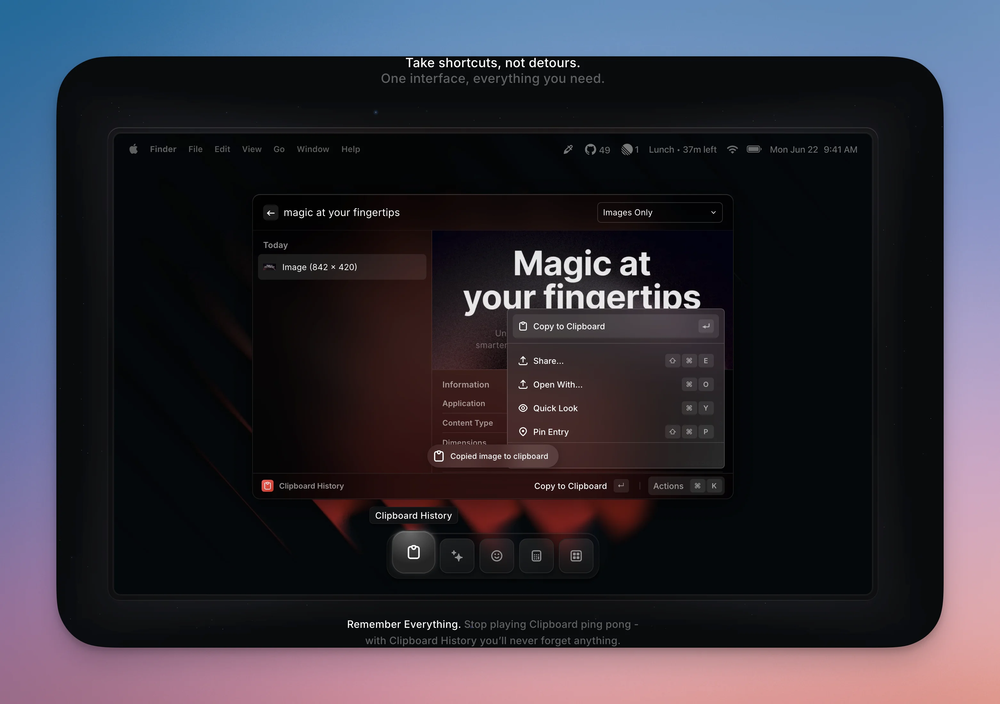
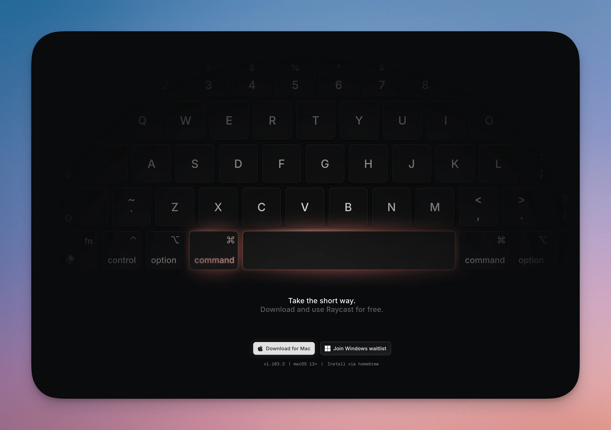
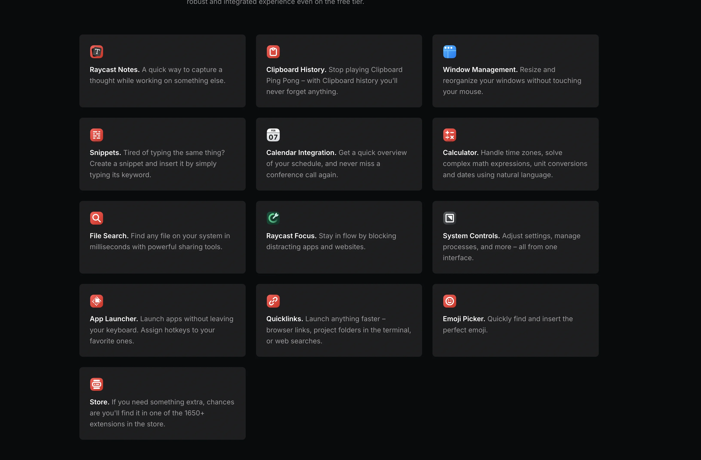

HIntroduction : Pourquoi Spotlight ne suffit plus

Soyons honnêtes deux secondes : **Spotlight, c’était cool en 2010**. Mais en 2025, ouvrir une app ou chercher un fichier, c’est le strict minimum. Si tu bosses sur Mac et que tu passes encore 50% de ton temps à cliquer dans le Dock ou à fouiller dans le Finder, on a un problème.

T’as déjà calculé combien de temps tu perds par jour à :

- Chercher un fichier noyé dans tes dossiers
- Copier une URL que t’as écrasée 3 secondes après
- Basculer entre 12 fenêtres ouvertes pour trouver la bonne
- Retaper « cordialement, » pour la 47ème fois cette semaine

Spoiler : **c’est beaucoup trop**.

C’est là que **Raycast** débarque. Un launcher macOS gratuit, ultra-puissant, extensible à l’infini, qui transforme ton Mac en véritable **machine de guerre productive**. Et le meilleur ? Tu vas te demander comment t’as fait pour vivre sans.

- - - - - -


- [Raycast, c’est quoi exactement ?](#raycast-cest-quoi-exactement)
- [Installation et premiers pas (spoiler : c’est bête comme chou)](#installation-et-premiers-pas-spoiler-cest-bete-comme-chou)
  - [Étape 1 : Télécharge Raycast](#etape-1-telecharge-raycast)
  - [Étape 2 : Lance Raycast](#etape-2-lance-raycast)
  - [Étape 3 : Explore les commandes de base](#etape-3-explore-les-commandes-de-base)
- [Les features qui changent la vie](#les-features-qui-changent-la-vie)
  - [🗂️ Clipboard History : ne perdez plus jamais un copier-coller](#%F0%9F%97%82%EF%B8%8F-clipboard-history-ne-perdez-plus-jamais-un-copier-coller)
  - [🪟 Window Management : organisez votre bureau en 2 secondes](#%F0%9F%AA%9F-window-management-organisez-votre-bureau-en-2-secondes)
  - [📝 Snippets : arrêtez de retaper les mêmes trucs](#%F0%9F%93%9D-snippets-arretez-de-retaper-les-memes-trucs)
  - [🔗 Quicklinks : vos URLs favorites à portée de doigts](#%F0%9F%94%97-quicklinks-vos-ur-ls-favorites-a-portee-de-doigts)
  - [🔢 Calculator : le seul calculateur qui vous comprend](#%F0%9F%94%A2-calculator-le-seul-calculateur-qui-vous-comprend)
- [Les extensions indispensables (même si vous débutez)](#les-extensions-indispensables-meme-si-vous-debutez)
- [Raycast vs Spotlight vs Alfred : le match sans pitié](#raycast-vs-spotlight-vs-alfred-le-match-sans-pitie)
- [Version gratuite vs Pro : avez-vous vraiment besoin de payer ?](#version-gratuite-vs-pro-avez-vous-vraiment-besoin-de-payer)
  - [Version gratuite (0€) :](#version-gratuite-0-%E2%82%AC)
  - [Version Pro (96$/an) :](#version-pro-96-an)
- [Cas d’usage concrets (comment je gagne 2h par jour)](#cas-dusage-concrets-comment-je-gagne-2-h-par-jour)
  - [Cas 1 : Workflow dev](#cas-1-workflow-dev)
  - [Cas 2 : Rédaction d’articles](#cas-2-redaction-darticles)
  - [Cas 3 : Meetings](#cas-3-meetings)
- [Conclusion : Faut-il craquer ?](#conclusion-faut-il-craquer)
- [🔗 Articles connexes qui pourraient t’intéresser](#%F0%9F%94%97-articles-connexes-qui-pourraient-tinteresser)
- [💡 Ressources utiles](#%F0%9F%92%A1-ressources-utiles)


Raycast, c’est quoi exactement ?

Imagine Spotlight. Maintenant imagine qu’on lui donne des **stéroïdes**, une **API extensible**, un **store d’extensions**, de l’**IA intégrée**, et qu’on le rende **100x plus rapide**. Voilà Raycast.

Concrètement, c’est un **launcher** (comme Alfred ou Spotlight), mais qui va **bien plus loin** :

- ⌨️ **Contrôle tout au clavier** : apps, fichiers, actions, services web
- 🧩 **Extensions gratuites** : GitHub, Docker, Notion, Slack, Jira, Spotify…
- 🤖 **IA intégrée** : ChatGPT, Claude, Gemini directement dans la barre de recherche
- 📋 **Clipboard History** : historique de tous tes copier-coller (avec recherche)
- 🪟 **Window Management** : redimensionne tes fenêtres en une touche
- ⚡ **Snippets** : templates réutilisables pour emails, code, réponses types
- 🔗 **Quicklinks** : ouvre tes sites favoris en 3 lettres

Et tout ça, c’est **gratuit**. Oui, tu as bien lu.

- - - - - -

Installation et premiers pas (spoiler : c’est bête comme chou)

### Étape 1 : Télécharge Raycast

Va sur [raycast.com](https://raycast.com/) et clique sur « Download ». C’est un `.dmg` classique, aucun piège.

```bash
# Ou en CLI si t'es du genre à flex avec Homebrew
brew install --cask raycast

```

Keyword: ;mail
Snippet: 
Bonjour,

J'espère que tu vas bien. Je reviens vers toi concernant...

Cordialement,
Brandon


Tape `;mail` n’importe où → Le texte se remplace automatiquement.

**Cas d’usage :**

- Emails types
- Commandes CLI fréquentes (`docker ps -a`, `git log --oneline`)
- Réponses support client
- Signatures d’emails

- - - - - -

### 🔗 Quicklinks : vos URLs favorites à portée de doigts

Les Quicklinks, c’est des **bookmarks sous stéroïdes**.

**Exemple :**

```bash
Name: Gmail
Link: https://mail.google.com
Alias: gm

```

Name: GitHub Search
Link: https://github.com/search?q={Query}
Alias: gh


Tape `gh raycast` → Recherche « raycast » sur GitHub.

- - - - - -

### 🔢 Calculator : le seul calculateur qui vous comprend

Pas besoin de lancer une commande. Tape juste ton calcul :

50 * 12           → 600
15% de 1200       → 180
sqrt(144)         → 12
2^10              → 1024


Appuie sur **Entrée** → Le résultat est copié dans ton clipboard.

**Bonus :** L’historique de tes calculs est sauvegardé. Pratique pour retrouver un calcul d’il y a 2h.

- - - - - -

Les extensions indispensables (même si vous débutez)

Raycast a un **Store d’extensions** gratuit. Voici les must-have :

Extension | Utilité | Commande | **GitHub** | Voir tes repos, issues, PRs | `gh` | **Docker** | Gérer tes containers | `docker` | **Brew** | Installer/mettre à jour des apps | `brew search` | **Port Manager** | Voir les ports ouverts, kill un process | `port` | **Translator** | Traduction instantanée | `translate` | **Spotify** | Contrôler la lecture | `spotify` | **Color Picker** | Récupérer des couleurs à l’écran | `color` | 

**Pour installer une extension :**

1. Tape `store` dans Raycast
2. Cherche l’extension
3. Clique sur « Install »

Pas de compte requis. Pas de paiement. **C’est ça qui est beau.**

**Envie d’aller plus loin ?** 👉 J’ai rédigé un guide complet sur les [10 Extensions Raycast indispensables pour développeurs et sysadmins](https://brandonvisca.com/10-extensions-raycast-indispensables-pour-developpeurs-et-sysadmins/) avec installation détaillée, configuration, et cas d’usage concrets pour chaque extension. Docker, GitHub, SSH Manager… tout y est.

- - - - - -

Raycast vs Spotlight vs Alfred : le match sans pitié

Feature | Spotlight | Alfred | Raycast | **Prix** | Gratuit | £34 (Powerpack) | Gratuit | **Extensions** | ❌ | ✅ (payant) | ✅ (gratuit) | **Clipboard History** | ❌ | ✅ (payant) | ✅ (gratuit) | **Window Management** | ❌ | ❌ | ✅ | **IA intégrée** | ❌ | ❌ | ✅ (Pro) | **Snippets** | ❌ | ✅ (payant) | ✅ (gratuit) | **Interface** | Basique | Old school | Moderne | **Vitesse** | Correcte | Rapide | Ultra-rapide | 

**Verdict :** Si tu débutes, **Raycast écrase tout**. Si t’es un power user d’Alfred depuis 10 ans, tu peux rester sur Alfred (mais teste quand même Raycast, sérieux).

- - - - - -

Version gratuite vs Pro : avez-vous vraiment besoin de payer ?

### Version gratuite (0€) :

- Toutes les features de base
- Clipboard History (3 mois max)
- Extensions illimitées
- Window Management
- Snippets
- Quicklinks

### Version Pro (96$/an) :

- **Raycast AI** : ChatGPT, Claude, Gemini dans Raycast
- **Cloud Sync** : sync entre plusieurs Macs
- **Clipboard illimité**
- **Thèmes personnalisés**
- **Traduction AI**

**Mon avis :** La version gratuite est **largement suffisante** pour 90% des utilisateurs. Si tu bosses avec plusieurs Macs ou si tu veux de l’IA intégrée, le Pro peut valoir le coup. Mais ne paie pas si t’en as pas besoin.

- - - - - -

Cas d’usage concrets (comment je gagne 2h par jour)

### Cas 1 : Workflow dev

1. ⌘ + Espace → `docker ps` (voir mes containers)
2. ⌘ + Espace → `gh` (voir mes PRs GitHub)
3. ⌘ + Espace → `port 3000` (voir quel process écoute sur le port 3000)

### Cas 2 : Rédaction d’articles

1. ⌘ + Espace → `;intro` (snippet pour intro d’article)
2. ⌘ + Shift + V → Retrouver une source copiée il y a 1h
3. ⌘ + Espace → `translate` (traduire un terme technique)

### Cas 3 : Meetings

1. ⌘ + Espace → `schedule` (voir mon calendrier)
2. ⌘ + Espace → `join meeting` (rejoindre une réunion en 1 clic)

**Résultat :** J’estime gagner **~2h par jour** en éliminant les frictions inutiles.

- - - - - -

Conclusion : Faut-il craquer ?

Si t’es sur Mac et que tu veux **booster ta productivité sans effort**, installe Raycast. C’est gratuit, c’est rapide, et tu vas te demander comment t’as fait sans.

**Les 3 raisons d’installer Raycast maintenant :**

1. **C’est gratuit** (et meilleur que des tools payants)
2. **Ça s’installe en 2 minutes**
3. **Tu vas gagner un temps fou** dès le premier jour

Alors oui, il y a une légère courbe d’apprentissage. Mais franchement, après 2-3 jours d’utilisation, tu ne reviendras jamais en arrière.

- - - - - -

🔗 Articles connexes qui pourraient t’intéresser

- **[Arc Browser : 7 alternatives après son abandon](https://brandonvisca.com/arc-browser-alternatives-apres-abandon/)** : Si tu cherches un navigateur productif comme Raycast pour le web
- **[Arc Search : Redéfinir la navigation avec l’IA](https://brandonvisca.com/arc-search-redefinir-la-navigation-internet-avec-lia/)** : L’IA au service de la navigation, comme Raycast pour les apps
- **[Notion Sites : Création de sites web révolutionnée](https://brandonvisca.com/notion-sites-creation-de-sites-web/)** : Notion s’intègre avec Raycast via une extension dédiée
- Autre outil indispensable : [AppCleaner](/appcleaner-mac-alternative-gratuite-cleanmymac/) pour désinstaller proprement tes apps

- - - - - -

💡 Ressources utiles

- [Site officiel Raycast](https://raycast.com/)
- [Store d’extensions](https://raycast.com/store)
- [Documentation Raycast](https://manual.raycast.com/)
- [Raycast vs Alfred (comparatif officiel)](https://www.raycast.com/raycast-vs-alfred)
