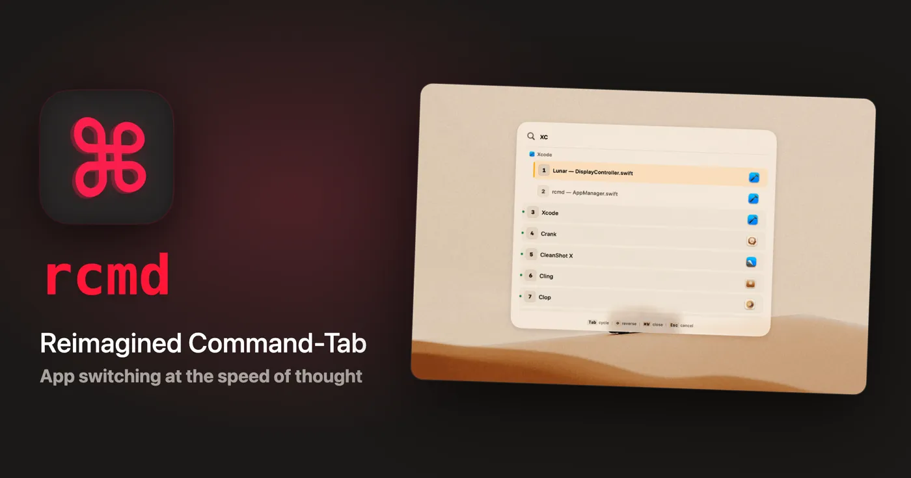
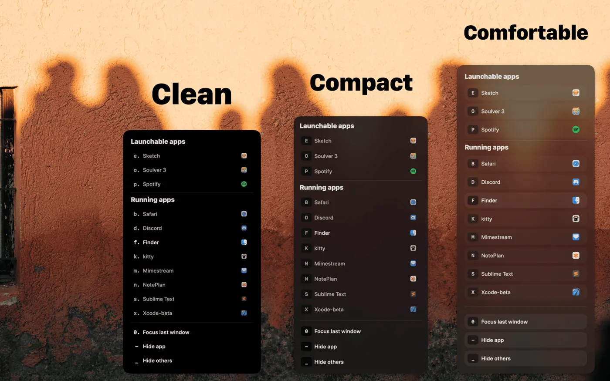
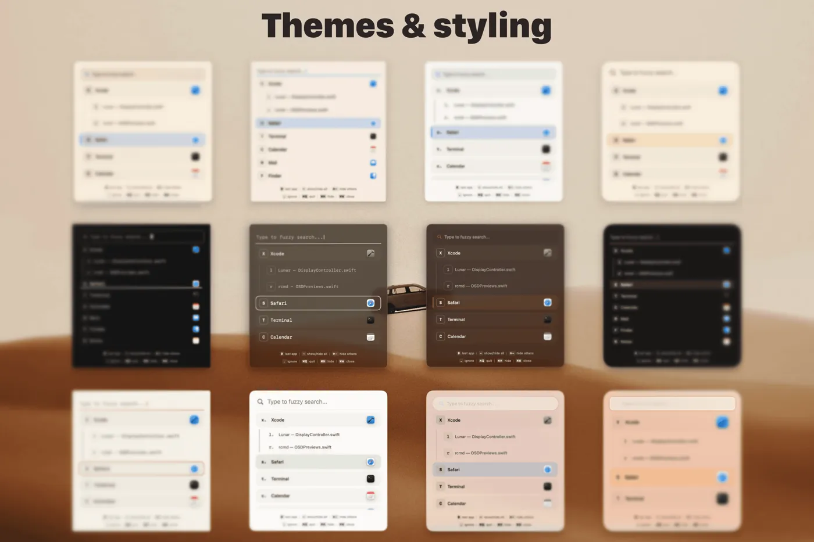
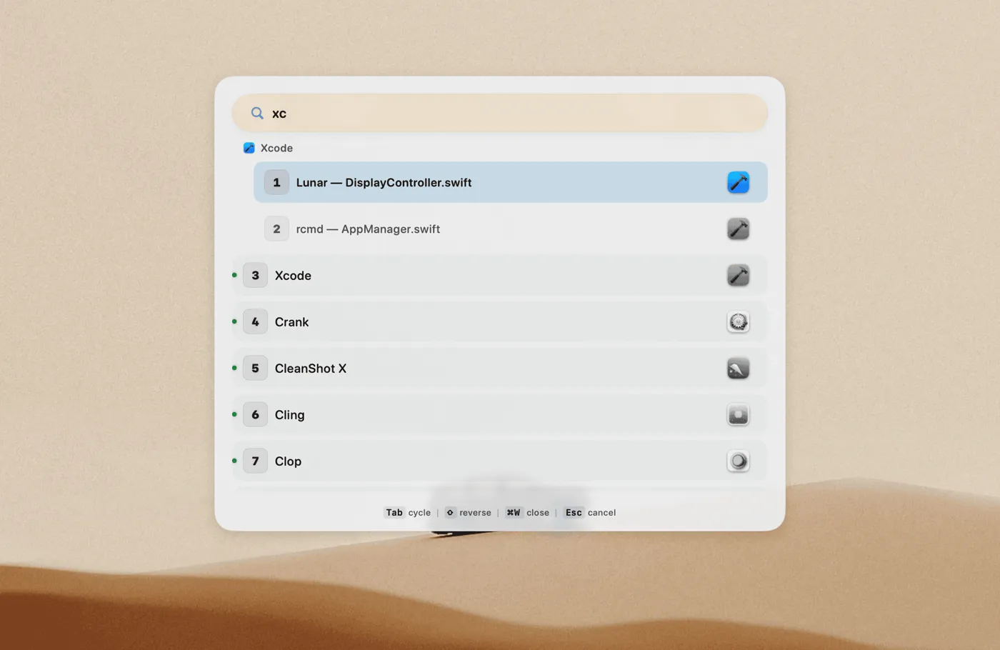
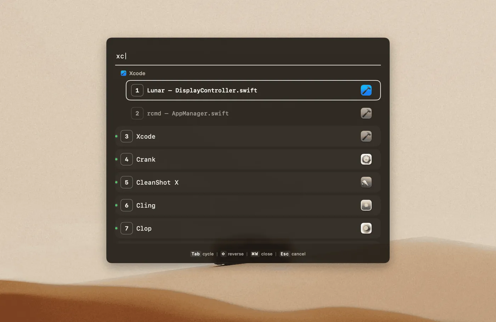
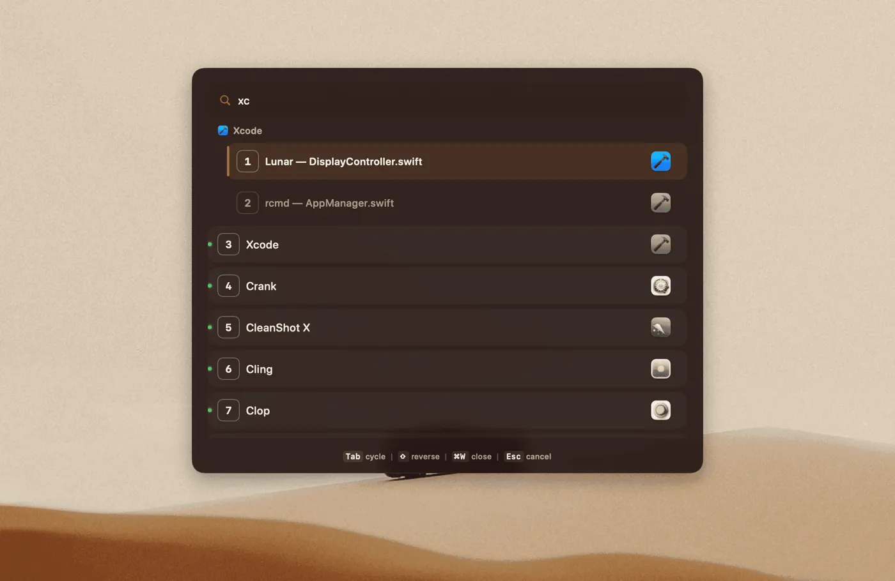

---

## Table des matières

## Introduction : Cmd+Tab, c'est 2005

Soyons honnêtes deux secondes : **Cmd+Tab sur macOS, c'est pratique, mais c'est lent**.

Tu veux passer de Safari à iTerm2 ? Cmd+Tab, Tab, Tab, Tab... ah merde j'ai dépassé, Shift+Tab pour revenir.

**Le constat** : Tu perds 3-4 secondes à chaque fois. Sur une journée de travail, ça fait **facilement 5-10 minutes de perdues** juste à naviguer entre tes apps.

Et si je te disais qu'il existe un outil qui te permet de **switcher vers n'importe quelle app en une seule combinaison de touches** ?

Genre Right Command + S = Safari. Right Command + I = iTerm2. Right Command + V = VS Code.

**Instantané. Précis. Zero friction.**

Bienvenue dans le monde de **rcmd**, l'outil développé par [The Low Tech Guys](https://lowtechguys.com/) qui repense complètement le switch d'apps sur macOS.

💡 **Ce que tu vas apprendre dans ce guide** :
- Installer rcmd via Homebrew ou le Mac App Store
- Configurer tes raccourcis personnalisés
- Les nouvelles fonctionnalités (fuzzy search, Spaces, Stages, thèmes)
- Pourquoi c'est différent de Raycast, Alfred ou AltTab
- Troubleshooting des problèmes courants

Let's go ! 🚀

---

> 💡 **TL;DR**
> - Cmd+Tab est lent (3 à 4 Tab à chaque fois pour atteindre la bonne app)
> - rcmd remplace ça par Right Command + la lettre de l'app : accès direct en 0,2 s
> - Un raccourci dédié par app (Right Cmd + S pour Safari, + V pour VS Code)
> - Nouveau : fuzzy search, Space switching instantané, 16 thèmes, Stages (workspaces)
> - Prix : 15 € one-time (5 Macs), 14 jours d'essai, mode Free ensuite

| App | Raccourci rcmd | Gain vs Cmd+Tab |
|-----|----------------|-----------------|
| Safari | Right Cmd + S | 4 secondes → 0.2s |
| iTerm2 | Right Cmd + I | 3 secondes → 0.2s |
| VS Code | Right Cmd + V | 4 secondes → 0.2s |

**Résultat concret** : 10 min/jour gagnées = **60h économisées/an**

**Installation** : 2 minutes chrono (Homebrew ou Mac App Store)

**Prix** : 15 € one-time (jusqu'à 5 Macs) — 14 jours d'essai gratuits

---

## Qu'est-ce que rcmd ?

<video controls style="width:100%;border-radius:8px"><source src="/images/rcmd-demo-app-switch-assign.mp4" type="video/mp4"></video>

**rcmd** (prononcé "are-command"), c'est un app switcher reimaginé par [The Low Tech Guys](https://lowtechguys.com/) pour macOS 13.0+. Il transforme la façon de naviguer entre tes applications.

### Le concept en 3 mots

**Right Command + Lettre = App**

C'est tout. Pas de menu. Pas d'interface lourde. Juste tes doigts, ton clavier, et la vitesse de l'éclair.



### Pourquoi c'est génial ?

✅ **Muscle memory parfaite** : Ton cerveau associe chaque app à sa première lettre
✅ **Zéro latence** : Pas d'overlay lourd, switch instantané
✅ **Léger** : Invisible en arrière-plan, zéro impact sur les performances
✅ **Compatible Apple Silicon** : Optimisé M1/M2/M3/M4
✅ **14 jours d'essai** : Tu testes sans risque avant d'acheter

---

## ⚠️ Changement important : le passage au payant

**Historique rapide** : rcmd était gratuit en V2 via le Mac App Store. Le développeur a annoncé un changement de modèle.

**Situation actuelle (2026)** :
- 💰 **Prix** : 15 € en achat unique
- 🖥️ **Licence** : Jusqu'à 5 Macs
- 🍺 **Installation** : `brew install rcmd` (hors Mac App Store) ou téléchargement direct
- 🆓 **Mode Free** : Après les 14 jours d'essai, un mode gratuit limité reste accessible (le switch instantané d'app reste fonctionnel)

**Ce qui n'a pas changé** :
- Pas d'abonnement mensuel
- Pas de fonctions cachées derrière un paywall
- Développement actif et réactif

---

## Installation de rcmd

### Via Homebrew (recommandé)

```bash
brew install rcmd
```

### Via le site officiel

1. **Télécharge rcmd** : [lowtechguys.com/rcmd](https://lowtechguys.com/rcmd/)
2. Déplace l'app dans `/Applications`
3. Lance et autorise dans Réglages Système > Confidentialité et sécurité > Accessibilité

### Premiers pas

1. **Accessibilité** : Autoriser dans Réglages Système > Confidentialité
2. **Touche de déclenchement** : Par défaut = Right Command (⌘ droite)
3. **Lancer au démarrage** : Activé dans les préférences



---

## Configuration essentielle en 5 minutes

### Réglages de base recommandés

```
✅ Trigger Key : Right Command (par défaut)
✅ Cycle behavior : Enabled (pour apps avec même lettre)
✅ Launch at login : Enabled
✅ Show in menu bar : Disabled (minimalisme FTW)
```

**Pourquoi Right Command ?**
- Ta main droite est déjà sur les lettres
- Aucun conflit avec les raccourcis système existants
- Muscle memory plus naturelle que Left Command

💡 **Claviers externes ?** Si ton clavier n'a pas de Right Command distinct, tu peux changer la trigger key dans les settings (Control, Option, etc.)

---

## Utilisation : Les bases en 3 exemples

### Exemple 1 : Switcher vers une app

Tu veux ouvrir **Safari** ?

```
Right Command + S = Safari se lance/devient active
```

Simple, rapide, efficace.

### Exemple 2 : Apps avec même première lettre

Tu as **Safari**, **Spotify** et **Slack** ?

Première pression : Right Command + S → Safari
Deuxième pression : Right Command + S → Spotify
Troisième pression : Right Command + S → Slack

**Cycle automatique** entre les apps qui commencent par la même lettre.

### Exemple 3 : Assigner une lettre custom

Tu veux que **Music.app** s'ouvre avec Right Command + U au lieu de M ?

1. Active Music.app
2. Presse Right Command + Right Option + U
3. C'est fait ! Désormais, Right Command + U = Music

---

## 🆕 Fonctionnalités avancées (V2+)

rcmd a énormément évolué. Voici ce qui a été ajouté au-delà du simple switch d'apps :

### 1. Fuzzy search

<video controls style="width:100%;border-radius:8px"><source src="/images/rcmd-demo-fuzzy-search.mp4" type="video/mp4"></video>

Tu ne te souviens pas de la lettre exacte ? Pas de souci.

**Right Command + tape le nom de l'app** → rcmd filtre et trouve instantanément.

Exemple : "ter" trouve iTerm2, Terminal, Hyper...

### 2. Instant Space switching

<video controls style="width:100%;border-radius:8px"><source src="/images/rcmd-demo-space-switching.mp4" type="video/mp4"></video>

Tu travailles avec plusieurs Spaces virtuels ?

- **Right Command + chiffre** = Switch vers le Space correspondant
- **Sans animation de glissement** (si configuré)
- Tu peux aussi **déplacer une fenêtre vers un autre Space** et la suivre, le tout depuis le clavier

### 3. Stages : sauvegarder des layouts de fenêtres

**Stages** te permet de sauvegarder et restaurer des configurations de fenêtres complètes.

Cas d'usage concret :
- Tu as un layout "Développement" (VS Code + iTerm2 + Safari)
- Un layout "Écriture" (Obsidian + Music)
- Un layout "Admin" (iTerm2 + Snipe-IT + Grafana)

Un raccourci → tout se remet en place.

### 4. Window jumping

- **⌥ + lettre** = Saute vers une fenêtre spécifique (pas juste l'app)
- **Cmd + backtick** = Cycle entre les fenêtres de la même app

### 5. Keylume : hints à l'écran

rcmd s'intègre avec **Keylume**, le clavier virtuel companion, pour afficher les lettres assignées directement sur ton écran pendant l'utilisation.

### 6. 16 thèmes intégrés

rcmd propose maintenant **16 thèmes visuels** avec personnalisation étendue :


| Thème | Ambiance |
|-------|----------|
| Frost | Clair et épuré |
| Noir | Sobre et discret |
| Warm | Tons chaleureux |





### 7. Mouse follows the focused app

Une option pratique : **la souris suit automatiquement l'app qui vient de recevoir le focus**. Parfait quand tu switch entre plusieurs écrans.

### 8. Command-Tab replacement amélioré

rcmd peut remplacer le Cmd+Tab natif en filtrant :
- Les fenêtres minimisées
- Les fenêtres situées sur d'autres Spaces

Résultat : un Cmd+Tab qui ne te montre que ce qui est réellement utile.

---

## rcmd vs les alternatives : Le match sans pitié

### rcmd vs Cmd+Tab (macOS natif)

| Critère | rcmd | Cmd+Tab |
|---------|------|---------|
| **Vitesse** | ⚡ Instantané | 🐌 3-4 Tab parfois |
| **Précision** | 🎯 Touche dédiée par app | 🎲 Ordre chronologique |
| **Muscle memory** | ✅ Lettre = toujours même app | ❌ Position change constamment |
| **Visuel** | 🚫 Minimaliste (ou thème) | 👁️ Overlay obligatoire |
| **Prix** | 15 € one-time | Gratuit |

**Verdict** : rcmd gagne haut la main sur la vitesse et la prévisibilité.

---

### rcmd vs Raycast / Alfred

| Critère | rcmd | Raycast | Alfred |
|---------|------|---------|--------|
| **Focus** | Switch + search + Spaces | Launcher complet | Launcher + workflows |
| **Simplicité** | ⭐⭐⭐⭐⭐ | ⭐⭐⭐ | ⭐⭐ |
| **Latence** | 0 ms | ~50 ms | ~50 ms |
| **Prix** | 15 € | Gratuit (Pro = 96$/an) | Gratuit (Powerpack = 59€) |
| **Courbe apprentissage** | 2 min | 1-2 jours | 1 semaine |

**Verdict** : rcmd est **complémentaire** à Raycast/Alfred.

**Usage idéal** :
- **rcmd** pour switcher entre apps, rechercher fuzzy, gérer les Spaces
- **Raycast** pour lancer des commandes, snippets, extensions

Perso, j'utilise les deux en parallèle. Chacun excelle dans son domaine.

---

### rcmd vs AltTab

**AltTab** est une autre alternative open source qui améliore Cmd+Tab.

| Critère | rcmd | AltTab |
|---------|------|--------|
| **Approche** | Touche dédiée + search + Spaces | Cmd+Tab amélioré |
| **Prévisualisation fenêtres** | ⌥ + lettre | ✅ (avec thumbnails) |
| **Vitesse** | ⚡ Plus rapide | 🐌 Légèrement plus lent |
| **Simplicité** | Plus simple | Plus de features |
| **Prix** | 15 € | Gratuit |

**Verdict** : Si tu veux juste **switcher vite** et gérer les Spaces, prends rcmd. Si tu veux **voir** tes fenêtres avant de switcher, prends AltTab.

---

## Cas d'usage concrets (comment je gagne 10 min/jour)

### Workflow 1 : Développeur

```
Right Command + I = iTerm2 (terminal)
Right Command + V = VS Code (éditeur)
Right Command + S = Safari (docs/Stack Overflow)
Right Command + N = Notion (notes)
Right Command + P = Postman (API testing)
```

**Avant rcmd** : Cmd+Tab x4 = 4 secondes
**Avec rcmd** : Right Command + lettre = 0.2 seconde

**Gain sur 8h de dev** : ~10 minutes/jour

---

### Workflow 2 : Rédaction d'articles (mon cas)

```
Right Command + O = Obsidian (rédaction markdown)
Right Command + S = Safari (recherche web)
Right Command + F = Firefox (vérif rendu)
Right Command + I = iTerm2 (déploiement)
Right Command + M = Music (concentration)
```

**Résultat** : Je ne quitte plus mon clavier. Zéro friction cognitive.

---

### Workflow 3 : Admin système

```
Right Command + I = iTerm2 (SSH serveurs)
Right Command + L = LocalWP (tests WordPress local)
Right Command + S = Safari (docs techniques)
Right Command + N = Notion (runbooks)
Right Command + U = Uptime Kuma (monitoring)
```

**Effet** : Réactivité accrue pour les incidents. Pas de temps perdu à chercher la bonne app.

---

## Troubleshooting : Les pièges à éviter

### Problème 1 : Right Command ne fonctionne pas

**Symptômes** : Rien ne se passe quand tu appuies sur Right Command + lettre.

**Causes possibles** :
1. Ton clavier externe envoie le mauvais keycode
2. Tu as mappé Right Command à autre chose dans Réglages Système

**Solution** :

1. **Vérifier les keycodes** avec l'app [KeyCodes](https://files.alinpanaitiu.com/KeyCodes.zip)
2. **Changer la trigger key** dans les settings rcmd (essaye Right Option ou Right Control)

---

### Problème 2 : Conflit avec Raycast/Alfred

**Symptôme** : rcmd et Raycast se marchent dessus sur certaines touches.

**Solution** :

1. Dans Raycast : Utilise Cmd+Space (pas Right Command)
2. Dans rcmd : Utilise Right Command uniquement
3. **Aucun conflit** = usage complémentaire optimal

---

### Problème 3 : Une app ne se lance pas

**Symptôme** : Right Command + S ne fait rien, alors que Safari est installé.

**Causes** :
1. Safari n'est pas dans `/Applications`
2. Le nom de l'app a changé

**Solution** :

1. Vérifie que l'app est bien dans `/Applications`
2. Assigne manuellement la touche : Ouvre Safari, puis Right Command + Right Option + S

---

### Problème 4 : Fuzzy search ne trouve pas une fenêtre

**Symptôme** : Tu tapes le nom d'une fenêtre mais elle n'apparaît pas.

**Solution** :

1. Vérifie que la fenêtre n'est pas minimisée (peut être exclue selon les réglages)
2. Active l'option "Include minimized windows" dans les préférences si nécessaire
3. Pour les fenêtres sur d'autres Spaces, assure-toi que l'option de suivi inter-Spaces est activée

---

## Alternatives et comparaisons

### Si rcmd ne te convient pas, essaie :

**1. [Raycast](/raycast-macos-outil-productivite-ultime/)** (launcher complet)
- Plus de features (snippets, extensions, AI)
- Courbe d'apprentissage plus longue
- Gratuit avec version Pro

**2. [AltTab macOS : Gestion Fenêtres Style Windows (Alternative Gratuite 2025)](/alttab-macos-gestion-fenetres-windows/)** (Cmd+Tab amélioré)
- Prévisualisation des fenêtres
- Plus visuel que rcmd
- Gratuit et open source

**3. Contexts** (payant, 10$)
- Switch par fenêtre (pas par app)
- Recherche fuzzy
- Plus complexe

**4. Witch** (payant, 14$)
- Très customisable
- Lourd en features
- Overkill pour la plupart

---

## Conclusion : Faut-il adopter rcmd ?

**La réponse courte : OUI**, si tu passes beaucoup de temps à switcher entre apps sur macOS.

**Les 3 raisons d'installer rcmd** :

1. ✅ **C'est rapide** : Accès direct aux apps en 0.2s
2. ✅ **Ça s'installe en 2 minutes** (Homebrew ou manuel)
3. ✅ **Impact immédiat** sur ta productivité

**Ce que j'aime** :
- Vitesse de l'éclair
- Muscle memory parfaite
- Fuzzy search et Space switching
- Stages pour sauvegarder mes layouts
- 16 thèmes pour matcher mon setup

**Ce qui pourrait freiner** :
- Payant (15 €) — mais pas cher pour un achat unique à vie
- Pas de preview des fenêtres intégrée (mais ⌥ + lettre fait le job)
- Courbe d'apprentissage de 2-3 jours pour oublier Cmd+Tab

**Mon verdict perso** : Je l'utilise **tous les jours depuis plus d'un an**, et je ne reviendrais jamais en arrière. Combiné avec [Raycast](/raycast-macos-outil-productivite-ultime/) et Ice, c'est la trinité productivité macOS.

**Temps d'adaptation** : 2-3 jours pour que tes doigts oublient Cmd+Tab. Après, c'est du velours.

Alors, prêt à switcher à la vitesse de la lumière ? 🚀

---

## 🔗 Articles connexes qui pourraient t'intéresser

- **[Raycast : L'outil qui transforme macOS en machine de productivité](/raycast-macos-outil-productivite-ultime/)** : Complémentaire à rcmd pour les commandes et snippets
- **Ice : Le gestionnaire de barre de menu gratuit pour macOS** : Garde ta barre de menu propre pendant que rcmd tourne
- **[iTerm2 : Guide complet configuration macOS](/iterm2-guide-configuration-macos-2025/)** : Optimise ton terminal (que tu vas ouvrir avec Right Command + I)
- **[Installation Homebrew sur macOS](/installation-homebrew-macos/)** : Indispensable pour installer rcmd et plein d'autres outils

---

## 💡 Ressources utiles

- [Site officiel rcmd](https://lowtechguys.com/rcmd/)
- [FAQ officielle rcmd](https://lowtechguys.com/rcmd/#faq)
- [Low Tech Guys (tous leurs outils)](https://lowtechguys.com/)
- [Download direct rcmd](https://lowtechguys.com/rcmd/#download)

---

## Articles connexes

- [Cling : Recherche fuzzy fichiers 10x plus rapide](/cling-recherche-fuzzy-fichiers-macos/)
- [Lunar : Contrôle la luminosité de tes écrans externes sur macOS (enfin !)](/lunar-luminosite-ecrans-externes-macos/)
- [Grila vs Fantastical : Comparatif honnête après 6 mois (2025)](/grila-vs-fantastical-comparatif-2025/)
- [AltTab macOS : Gestion Fenêtres Style Windows (Alternative Gratuite 2026)](/alttab-macos-gestion-fenetres-windows/)
