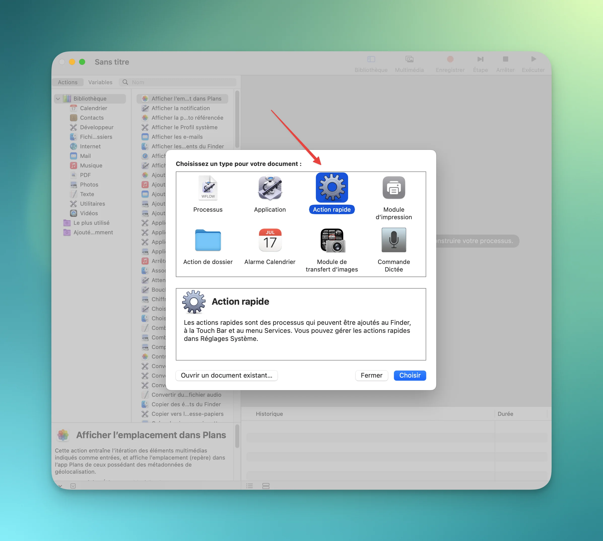
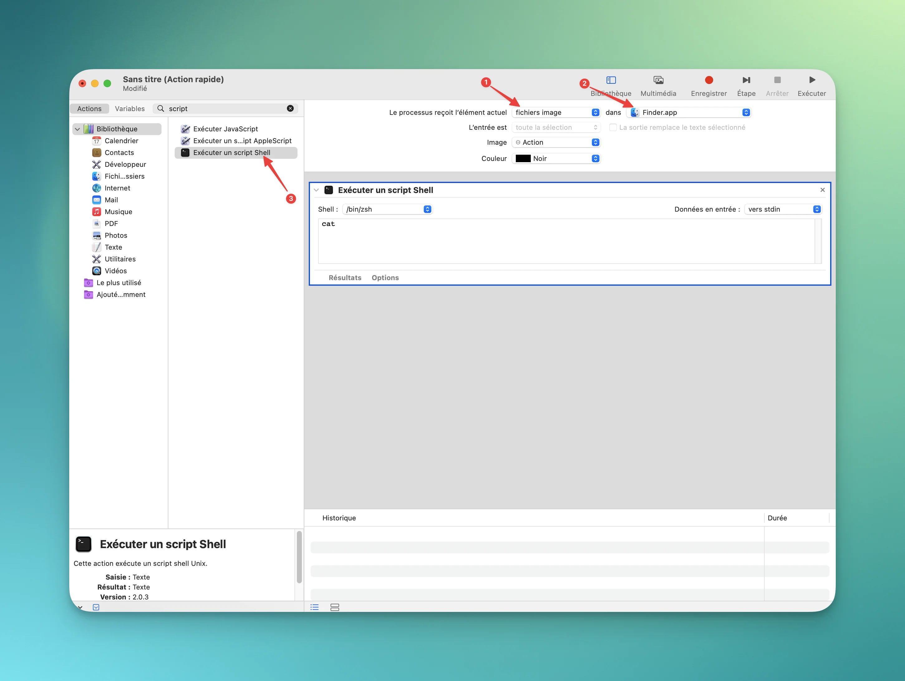

- [📊 Pourquoi vos images sont-elles si lourdes ?](#%F0%9F%93%8A-pourquoi-vos-images-sont-elles-si-lourdes)
  - [Le problème technique expliqué simplement](#le-probleme-technique-explique-simplement)
  - [Comparaison concrète](#comparaison-concrete)
- [🛠️ La solution : automatiser la compression WebP](#%F0%9F%9B%A0%EF%B8%8F-la-solution-automatiser-la-compression-web-p)
  - [Ce qu’on va construire ensemble](#ce-quon-va-construire-ensemble)
- [🚀 Étape 1 : Installer le compresseur WebP (2 minutes)](#%F0%9F%9A%80-etape-1-installer-le-compresseur-web-p-2-minutes)
  - [Prérequis : Homebrew](#prerequis-homebrew)
  - [Installation de l’outil de compression](#installation-de-loutil-de-compression)
  - [Vérification](#verification)
- [⚙️ Étape 2 : Créer l’action automatique (5 minutes)](#%E2%9A%99%EF%B8%8F-etape-2-creer-laction-automatique-5-minutes-1)
  - [Lancement d’Automator](#lancement-d-automator)
  - [Le script (votre version) :](#le-script-votre-version)
  - [Sauvegarde](#sauvegarde)
  - [Sauvegarde](#sauvegarde-1)
- [📁 Étape 3 : Test en conditions réelles (2 minutes)](#%F0%9F%93%81-etape-3-test-en-conditions-reelles-2-minutes)
  - [Premier test](#premier-test)
- [🎛️ Optimisations selon vos besoins](#%F0%9F%8E%9B%EF%B8%8F-optimisations-selon-vos-besoins)
  - [Ajuster la compression par usage](#ajuster-la-compression-par-usage)
  - [Mode « compression extrême »](#mode-compression-extreme)
- [🚨 Troubleshooting : problèmes courants](#%F0%9F%9A%A8-troubleshooting-problemes-courants)
  - [❌ « cwebp non trouvé »](#%E2%9D%8C-cwebp-non-trouve)
  - [❌ « Permission denied »](#%E2%9D%8C-permission-denied)
  - [❌ Images corrompues/inutilisables](#%E2%9D%8C-images-corrompues-inutilisables)
- [📈 Impact concret sur vos projets](#%F0%9F%93%88-impact-concret-sur-vos-projets)
  - [Site web / Blog](#site-web-blog)
  - [Stockage iCloud/Google](#stockage-i-cloud-google)
  - [Envoi par email](#envoi-par-email)
- [🎯 Aller plus loin : workflow professionnel](#%F0%9F%8E%AF-aller-plus-loin-workflow-professionnel)
  - [Automatisation avancée](#automatisation-avancee)
  - [Intégration avec vos outils](#integration-avec-vos-outils)
  - [Monitoring des gains](#monitoring-des-gains)
- [💡 Ce qu’il faut retenir](#%F0%9F%92%A1-ce-quil-faut-retenir)
  - [Les gains concrets](#les-gains-concrets)
  - [Utilisation optimale](#utilisation-optimale)


**Le scénario classique :** Vous avez 200 photos de vacances à 8 Mo chacune. Résultat ? 1,6 Go d’espace bouffé, des temps de chargement interminables et un iCloud qui sature.

**La réalité :** 90% de vos images sont **sur-dimensionnées** pour leur usage réel. Une photo Instagram n’a pas besoin de peser 5 Mo, une image de blog peut faire 200 Ko au lieu de 2 Mo.

**La solution :** Le format WebP peut **diviser le poids de vos images par 2 à 5** sans aucune différence visible à l’œil nu. Le problème ? macOS ne sait pas le faire nativement.

**Promesse de cet article :** En 10 minutes, vous automatiserez la compression d’images sur votre Mac. Plus jamais de galère avec des fichiers trop lourds.

- - - - - -

📊 Pourquoi vos images sont-elles si lourdes ?


### **Le problème technique expliqué simplement**

**JPEG/PNG = formats anciens :**

- JPEG : créé en 1992 (oui, ça date !)
- PNG : optimisé pour la transparence, pas la compression
- **Résultat :** beaucoup de « gras » dans le fichier

**WebP = format moderne :**

- Développé par Google en 2010
- Compression **25 à 80% plus efficace**
- Supporté par tous les navigateurs modernes
- **Même qualité visuelle**

### **Comparaison concrète**

Format | Taille fichier | Temps de chargement | 
:--: | :--: | :--: 
JPEG original | 2,4 Mo | 8 secondes | 
PNG optimisé | 1,8 Mo | 6 secondes | 
**WebP** | **0,7 Mo** | **2 secondes** | 

> **💡 Impact réel :** Sur un site de 50 images, vous passez de 120 Mo à 35 Mo. Vos visiteurs vous remercieront !

- - - - - -

🛠️ La solution : automatiser la compression WebP


### **Ce qu’on va construire ensemble**

1. **Installation d’un compresseur professionnel** (2 minutes)
2. **Création d’une action « clic droit »** dans le Finder (5 minutes)
3. **Test sur vos vraies images** (2 minutes)

**Résultat final :** Sélection d’images → Clic droit → Magie ✨

- - - - - -

🚀 Étape 1 : Installer le compresseur WebP (2 minutes)

### **Prérequis : Homebrew**

Si vous n’avez pas encore Homebrew installé sur votre Mac, suivez d’abord 👉 **[ce guide complet d’installation d’Homebrew sur macOS](https://brandonvisca.com/installation-homebrew-macos/)**.

Une fois Homebrew en place, revenez ici et continuez.

### **Installation de l’outil de compression**

```bash
# Dans le Terminal
brew install webp

```

cwebp -version
# Devrait afficher : 1.3.2 (ou plus récent)


> **🧠 Pourquoi cwebp ?** C’est l’outil **officiel de Google** pour WebP. Plus fiable et performant que les alternatives tierces ou les apps payantes.

- - - - - -

⚙️ Étape 2 : Créer l’action automatique (5 minutes)

### **Lancement d’Automator**

1. **Applications** → **Automator** → **Nouvelle action rapide**
2. **Configuration en haut à droite *« Le processus reçoit l’élément actuel »* :**
  - Le flux reçoit : **fichiers image**
  - Dans : **Finder**

### **Le script (votre version) :**

Glissez **« Exécuter un script Shell »** et collez ce code :

```bash
for FILE in "$@"
do
  /opt/homebrew/bin/cwebp -q 85 "$FILE" -o "${FILE%.*}.webp"
done

```

# Photos réseaux sociaux (compression agressive)
-q 60    # Gain: ~80%, qualité acceptable

# Images de blog/e-commerce (équilibré)  
-q 85    # Gain: ~70%, qualité excellente

# Portfolio/galerie pro (compression légère)
-q 95    # Gain: ~40%, qualité maximale


### **Mode « compression extrême »**

Pour maximiser les gains, ajoutez ces options :

```bash
# Remplacez la ligne de compression par :
"$CWEBP_PATH" -q 75 -m 6 -sharp_yuv -af "$FILE" -o "$OUTPUT"

# -m 6 : méthode de compression max
# -sharp_yuv : améliore les détails  
# -af : filtre anti-aliasing

which cwebp
# Si rien → pas installé
# Si chemin → modifiez le script

```


**Solution :**

```bash
# Réinstallation propre
brew uninstall webp
brew install webp

```

# Vérifier une image WebP
cwebp -info mon_image.webp


- - - - - -

📈 Impact concret sur vos projets

### **Site web / Blog**

**Avant :** 50 images × 2 Mo = 100 Mo  
**Après :** 50 images × 0,6 Mo = 30 Mo  
**Gain :** Site 3× plus rapide, meilleur SEO Google

### **Stockage iCloud/Google**

**Avant :** 1000 photos = 8 Go  
**Après :** 1000 photos = 2,4 Go  
**Gain :** 5,6 Go récupérés = 2 mois d’iCloud gratuits

### **Envoi par email**

**Avant :** 1 photo = pièce jointe refusée  
**Après :** 5 photos = envoi instantané

- - - - - -

🎯 Aller plus loin : workflow professionnel

### **Automatisation avancée**

```bash
# Script de batch processing d'un dossier entier
find ~/Pictures -name "*.jpg" -exec cwebp -q 85 {} -o {}.webp \;

```

# Script pour calculer l'espace économisé total
du -sh ~/Pictures/**/*.{jpg,png} ~/Pictures/**/*.webp


- - - - - -

💡 Ce qu’il faut retenir

### **Les gains concrets**

✅ **70% d’espace disque économisé** en moyenne  
✅ **Sites web 3× plus rapides** (chargement images)  
✅ **Processus 100% automatisé** (plus de manipulation manuelle)  
✅ **Qualité visuelle identique** (imperceptible à l’œil nu)  
✅ **Compatible tous navigateurs** modernes

### **Utilisation optimale**

- **Photos réseaux sociaux :** -q 60 (gain max)
- **Images e-commerce :** -q 85 (équilibre parfait)
- **Portfolio pro :** -q 95 (qualité premium)
