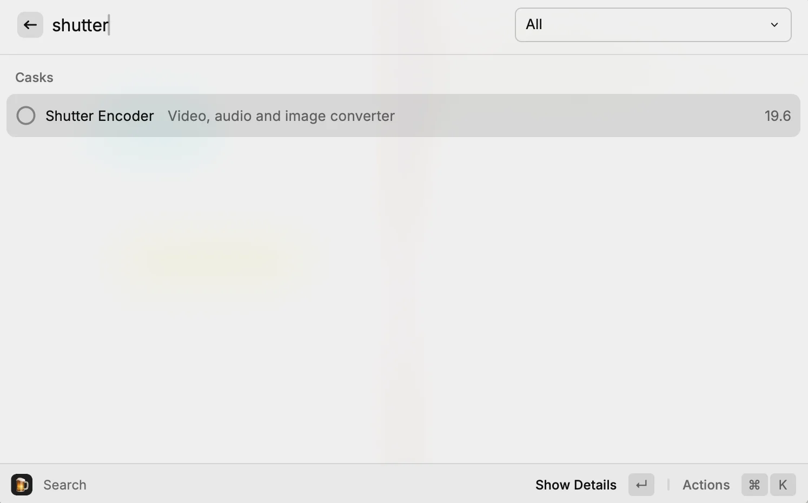

TL;DR

HandBrake c’est bien pour compresser des vidéos rapidement. Mais dès que tu veux faire du trimming, ajouter des sous-titres hardcodés, ou du color grading basique, t’es coincé. HandBrake fait **une chose** : la compression. Point.

**Shutter Encoder Mac** change la donne. Compression, édition non-destructive, sous-titres, filtres, batch processing, le tout dans une interface gratuite qui embarque FFmpeg (le couteau suisse vidéo).

Dans ce guide, je te montre comment installer Shutter Encoder Mac, l’utiliser en mode simple pour compresser rapidement, et exploiter ses fonctions avancées pour éditer, sous-titrer, et automatiser le traitement de dizaines de vidéos.

- - - - - -

Pourquoi HandBrake ne suffit plus

HandBrake est excellent pour **convertir et compresser**. Mais si tu veux :

- **Trimmer une vidéo** (couper le début/fin)
- **Ajouter des sous-titres permanents** (hardcodés dans la vidéo)
- **Ajuster les couleurs** (saturation, contraste, LUT)
- **Traiter 50 fichiers d’un coup** avec les mêmes réglages
- **Extraire l’audio** d’une vidéo en MP3/FLAC

HandBrake te dira : « Utilise un autre outil ».

Shutter Encoder fait **tout ça**, gratuitement, avec FFmpeg intégré (pas besoin d’installer quoi que ce soit).

- - - - - -

Shutter Encoder Mac vs HandBrake : comparaison complète

Fonctionnalité | HandBrake | Shutter Encoder Mac | **Compression vidéo** | ✅ Excellent | ✅ Excellent | **Presets multiples** | ✅ Nombreux | ✅ + personnalisables | **Édition (trim, crop)** | ❌ | ✅ Non-destructif | **Sous-titres hardcoded** | ⚠️ Compliqué | ✅ Drag &amp; drop | **Color grading** | ❌ | ✅ LUT + filtres | **Batch processing** | ⚠️ Limité | ✅ Illimité | **Extraction audio** | ❌ | ✅ MP3, FLAC, WAV… | **Interface** | Simple | Plus complexe (mode simple dispo) | **Encodeurs** | x264, x265, VP9 | Tous (FFmpeg) | **Prix** | Gratuit | Gratuit | 

Si tu fais juste de la compression basique, garde HandBrake. Si tu veux **plus de contrôle**, Shutter Encoder devient indispensable.

- - - - - -


- [Pourquoi HandBrake ne suffit plus](#pourquoi-hand-brake-ne-suffit-plus)
- [Shutter Encoder Mac vs HandBrake : comparaison complète](#shutter-encoder-mac-vs-hand-brake-comparaison-complete)
- [Installation de Shutter Encoder Mac](#installation-de-shutter-encoder-mac)
  - [Téléchargement direct ](#telechargement-direct-recommande)
  - [Via Homebrew](#via-homebrew-si-disponible)
  - [Première configuration](#premiere-configuration)
- [Mode simple : compression rapide point-and-click](#mode-simple-compression-rapide-point-and-click)
  - [Compresser une vidéo rapidement](#compresser-une-video-rapidement)
- [Fonctions avancées de Shutter Encoder Mac](#fonctions-avancees-de-shutter-encoder-mac)
  - [1. Trimming et édition non-destructive](#1-trimming-et-edition-non-destructive)
  - [2. Ajouter des sous-titres permanents](#2-ajouter-des-sous-titres-permanents)
  - [3. Color grading et filtres](#3-color-grading-et-filtres)
  - [4. Batch processing : traiter 50 vidéos d’un coup](#4-batch-processing-traiter-50-videos-dun-coup)
  - [5. Extraction audio](#5-extraction-audio)
- [Cas d’usage concrets](#cas-dusage-concrets)
  - [Cas 1 : Réduire la taille d’une vidéo pour upload web](#cas-1-reduire-la-taille-dune-video-pour-upload-web)
  - [Cas 2 : Convertir MKV → MP4 pour compatibilité](#cas-2-convertir-mkv-%E2%86%92-mp-4-pour-compatibilite)
  - [Cas 3 : Ajouter des sous-titres permanents pour grand-mère](#cas-3-ajouter-des-sous-titres-permanents-pour-grand-mere)
  - [Cas 4 : Batch processing de 50 vidéos GoPro](#cas-4-batch-processing-de-50-videos-go-pro)
- [Performance : M-series vs Intel](#performance-m-series-vs-intel)
- [Comparaison : Shutter Encoder vs Compressor (Apple)](#comparaison-shutter-encoder-vs-compressor-apple)
- [Erreurs fréquentes avec Shutter Encoder Mac](#erreurs-frequentes-avec-shutter-encoder-mac)
  - [« L’encodage échoue avec une erreur FFmpeg »](#lencodage-echoue-avec-une-erreur-f-fmpeg)
  - [« L’encodage est très lent »](#lencodage-est-tres-lent)
  - [« Les sous-titres ne s’affichent pas correctement »](#les-sous-titres-ne-saffichent-pas-correctement)
- [Tips et astuces pour optimiser Shutter Encoder Mac](#tips-et-astuces-pour-optimiser-shutter-encoder-mac)
  - [1. Créer des presets personnalisés](#1-creer-des-presets-personnalises)
  - [2. Automatiser avec des scripts](#2-automatiser-avec-des-scripts)
  - [3. Utiliser le mode « Watch folder »](#3-utiliser-le-mode-watch-folder)
- [Conclusion : Shutter Encoder Mac, l’outil qui remplace 5 logiciels](#conclusion-shutter-encoder-mac-loutil-qui-remplace-5-logiciels)
- [FAQ Shutter Encoder Mac](#faq-shutter-encoder-mac)
  - [Shutter Encoder est-il vraiment gratuit ?](#faq-question-1763549601941)
  - [Shutter Encoder fonctionne-t-il sur M1/M2/M3 ?](#faq-question-1763549612824)
  - [ Puis-je encoder en AV1 avec Shutter Encoder ?](#faq-question-1763549628929)
  - [Quelle différence avec FFmpeg en ligne de commande ?](#faq-question-1763549640261)
  - [Les fichiers encodés sont-ils compatibles avec tous les devices ? ](#faq-question-1763549650281)
- [Liens utiles](#liens-utiles)


Installation de Shutter Encoder Mac

### Téléchargement direct 

1. Va sur [shutterencoder.com](https://www.shutterencoder.com/)
2. Télécharge la version macOS (fichier `.pkg`)
3. Double-clic sur le `.pkg` pour installer
4. Lance **Shutter Encoder** depuis `/Applications`

**Bon à savoir** : Shutter Encoder embarque FFmpeg et toutes les dépendances. Pas besoin d’installer quoi que ce soit d’autre.

### Via Homebrew

Si t’utilises [Homebrew](../installation-homebrew-macos/.md), tu peux installer avec :

```bash
brew install --cask shutter-encoder

```

/Applications/Shutter\ Encoder.app/Contents/MacOS/Shutter\ Encoder \
  -i /path/to/videos/*.mp4 \
  -o /path/to/output \
  -preset "H.265" \
  -crf 28


Pratique pour automatiser via cron ou scripts Bash.

### 3. Utiliser le mode « Watch folder »

Shutter Encoder peut surveiller un dossier et encoder automatiquement tout ce qui y entre.

**Configuration** :

1. Menu **Fichier &gt; Watch folder**
2. Sélectionne le dossier à surveiller
3. Choisis le preset à appliquer
4. Active

Dès qu’un fichier vidéo entre dans ce dossier, Shutter Encoder l’encode automatiquement. Pratique pour des workflows automatisés (ex : récupération vidéos drone → compression auto).

- - - - - -

Conclusion : Shutter Encoder Mac, l’outil qui remplace 5 logiciels

Si je devais résumer Shutter Encoder en une phrase : **c’est l’outil qui fait ce que HandBrake, iMovie (pour le trim), Subtitle Edit, et FFmpeg en ligne de commande font séparément, mais dans une seule interface**.

Pour quelqu’un qui manipule régulièrement des vidéos (création de contenu, archivage, upload web), c’est un **must-have absolu**. Gratuit, complet, performant.

Et même si l’interface est plus complexe que HandBrake, le mode simple te permet de démarrer rapidement. Tu peux creuser les fonctions avancées au fur et à mesure.

Prochaine étape : si tu gères beaucoup de fichiers Mac, jette un œil à mon guide [Homebrew](../installation-homebrew-macos/.md) pour installer tes outils en ligne de commande rapidement.

Et toi, tu utilises quoi pour compresser/éditer tes vidéos ? HandBrake, Adobe Media Encoder, ou un autre outil ? Dis-moi en commentaire.

- - - - - -

FAQ Shutter Encoder Mac

### **Shutter Encoder est-il vraiment gratuit ?**

Oui, 100% gratuit et open-source. Le développeur accepte les donations, mais l’app reste entièrement fonctionnelle sans payer.

### **Shutter Encoder fonctionne-t-il sur M1/M2/M3 ?**

Oui, optimisé pour Apple Silicon avec hardware acceleration (VideoToolbox). Performances excellentes sur M-series.

###  **Puis-je encoder en AV1 avec Shutter Encoder ?**

Oui, Shutter Encoder supporte AV1 via FFmpeg. Attention : très lent à encoder, mais compression maximale (idéal pour archivage).

### **Quelle différence avec FFmpeg en ligne de commande ?**

Shutter Encoder est une interface graphique pour FFmpeg. Si tu maîtrises FFmpeg CLI, t’as plus de contrôle. Sinon, Shutter Encoder rend FFmpeg accessible sans mémoriser 150 commandes.

### **Les fichiers encodés sont-ils compatibles avec tous les devices ?** 

Ça dépend du codec. H.264 (MP4) est compatible partout. H.265 fonctionne sur les devices récents (2016+). Pour maximiser compatibilité, utilise H.264.

- - - - - -

Liens utiles

- [Site officiel Shutter Encoder](https://www.shutterencoder.com/) (source de téléchargement)
- [Guide d’installation Homebrew](https://brandonvisca.com/installation-homebrew-macos/) (pour outils en CLI)
- [Documentation FFmpeg](https://ffmpeg.org/documentation.html) (sous le capot de Shutter Encoder)

## Articles connexes

- [Oh My Zsh + Powerlevel10k : Transformez votre terminal en ma](/installation-oh-my-zsh-powerlevel10k-guide-complet/)
- [Clop : Compresse tes images et vidéos automatiquement sur ma](/clop-compression-images-videos-macos/)
