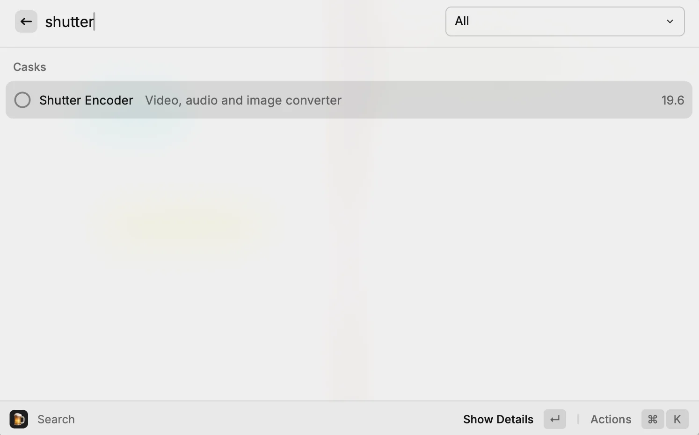

> 💡 **TL;DR**
> - HandBrake ne fait qu'une chose, la compression : impossible de trimmer, sous-titrer ou étalonner
> - Shutter Encoder ajoute l'édition non-destructive, les sous-titres, les filtres et le batch processing
> - Interface gratuite qui embarque FFmpeg, le couteau suisse de la vidéo

- - - - - -

## Table des matières

## Pourquoi HandBrake ne suffit plus

HandBrake est excellent pour **convertir et compresser**. Mais si tu veux :

- **Trimmer une vidéo** (couper le début/fin)
- **Ajouter des sous-titres permanents** (hardcodés dans la vidéo)
- **Ajuster les couleurs** (saturation, contraste, LUT)
- **Traiter 50 fichiers d’un coup** avec les mêmes réglages
- **Extraire l’audio** d’une vidéo en MP3/FLAC

HandBrake te dira : « Utilise un autre outil ».

Shutter Encoder fait **tout ça**, gratuitement, avec FFmpeg intégré (pas besoin d’installer quoi que ce soit).
- - - - - -
## Shutter Encoder Mac vs HandBrake : comparaison complète

| Fonctionnalité | HandBrake | Shutter Encoder Mac |
| --- | --- | --- |
| **Compression vidéo** | ✅ Excellent | ✅ Excellent |
| **Presets multiples** | ✅ Nombreux | ✅ + personnalisables |
| **Édition (trim, crop)** | ❌ | ✅ Non-destructif |
| **Sous-titres hardcoded** | ⚠️ Compliqué | ✅ Drag & drop |
| **Color grading** | ❌ | ✅ LUT + filtres |
| **Batch processing** | ⚠️ Limité | ✅ Illimité |
| **Extraction audio** | ❌ | ✅ MP3, FLAC, WAV… |
| **Interface** | Simple | Plus complexe (mode simple dispo) |
| **Encodeurs** | x264, x265, VP9 | Tous (FFmpeg) |
| **Prix** | Gratuit | Gratuit |

Si tu fais juste de la compression basique, garde HandBrake. Si tu veux **plus de contrôle**, Shutter Encoder devient indispensable.
- - - - - -- - - - - -
Ce genre de session passe beaucoup par le terminal. Si le tien est resté brut de décoffrage, [Oh My Zsh et Powerlevel10k](/installation-oh-my-zsh-powerlevel10k-guide-complet/) valent le détour.

- - - - - -

## Installation de Shutter Encoder Mac

### Téléchargement direct

1. Va sur [shutterencoder.com](https://www.shutterencoder.com/)
2. Télécharge la version macOS (fichier `.pkg`)
3. Double-clic sur le `.pkg` pour installer
4. Lance **Shutter Encoder** depuis `/Applications`

**Bon à savoir** : Shutter Encoder embarque FFmpeg et toutes les dépendances. Pas besoin d’installer quoi que ce soit d’autre.

### Via Homebrew



Si t’utilises [Homebrew](/installation-homebrew-macos/), tu peux installer avec :

```bash
brew install --cask shutter-encoder

```

**Note** : Au moment de la rédaction, Shutter Encoder n’est pas officiellement dans Homebrew Cask. Si la commande échoue, utilise le téléchargement direct.

### Première configuration

Au premier lancement, Shutter Encoder te demande de choisir un mode :

1. **Mode simple** (recommandé pour débuter) : Interface épurée, presets rapides
2. **Mode avancé** : Tous les réglages FFmpeg accessibles

Commence par le mode simple. Tu pourras basculer en mode avancé plus tard via **Préférences > Interface**.
- - - - - -
Shutter Encoder s’installe très bien via Homebrew. Pour gérer ensuite ses formules sans ligne de commande, [WailBrew fait le job](/wailbrew-interface-graphique-homebrew/).

- - - - - -

## Mode simple : compression rapide point-and-click

Le mode simple de Shutter Encoder ressemble à HandBrake : tu glisses un fichier, tu choisis un preset, tu lances.

### Compresser une vidéo rapidement

1. **Glisse ta vidéo** dans la fenêtre Shutter Encoder
2. **Choisis un preset** dans le menu déroulant :
   - **H.264** : Compatibilité maximale (tous les devices)
   - **H.265 (HEVC)** : Meilleure compression (fichiers plus petits)
   - **VP9** : Pour le web (YouTube, Vimeo)
   - **ProRes** : Édition vidéo (qualité max, fichiers énormes)
3. **Définis la qualité** :
   - **CRF 18-23** : Haute qualité (peu de compression)
   - **CRF 23-28** : Bonne qualité (compression équilibrée)
   - **CRF 28-35** : Basse qualité (compression maximale)
4. Clique sur **Démarrer**

Shutter Encoder encode et affiche la progression en temps réel.

**Exemple concret** : J’avais une vidéo 4K de 8 Go (clip GoPro brut). Avec le preset H.265 + CRF 28, j’ai obtenu un fichier de **1,2 Go** avec une qualité visuelle excellente. Compression : 85%.
- - - - - -
## Fonctions avancées de Shutter Encoder Mac

### 1. Trimming et édition non-destructive

Tu peux couper le début/fin d’une vidéo **sans réencoder tout le fichier**.

**Méthode rapide (sans réencodage)** :

1. Charge ta vidéo
2. Clique sur **Trim** (onglet en haut)
3. Définis le **point de départ** (IN) et **point d’arrivée** (OUT)
4. Coche **« Stream copy »** (copie les flux sans réencodage)
5. Clique sur **Démarrer**

Résultat : une vidéo coupée en **quelques secondes**, sans perte de qualité.

**Méthode avec réencodage** (si tu veux aussi compresser) :

1. Même processus, mais décoche **« Stream copy »**
2. Choisis un preset de compression (H.264, H.265…)
3. Shutter Encoder coupe **et** compresse

Pratique pour extraire un passage d’une longue vidéo.

### 2. Ajouter des sous-titres permanents

Contrairement à HandBrake où c’est la galère, Shutter Encoder rend ça trivial.

**Sous-titres hardcoded (brûlés dans la vidéo)** :

1. Charge ta vidéo
2. Glisse un fichier `.srt` ou `.ass` dans la zone **Subtitles**
3. Ajuste la **police, taille, couleur** dans les options
4. Choisis un preset de compression
5. Clique sur **Démarrer**

Les sous-titres sont intégrés définitivement dans la vidéo. Pratique pour partager avec des gens qui savent pas activer les sous-titres.

**Sous-titres softcoded (piste séparée)** :

1. Charge ta vidéo
2. Glisse le `.srt` dans la zone Subtitles
3. Coche **« Add as subtitle track »** (au lieu de burn-in)
4. Le fichier final contient une piste sous-titres activable

Utile pour garder la flexibilité (on/off à la lecture).

### 3. Color grading et filtres

Shutter Encoder embarque des filtres basiques pour ajuster les couleurs.

**Ajustements rapides** :

1. Onglet **Filtres**
2. Active **Color correction**
3. Ajuste :
   - **Luminosité** : -100 à +100
   - **Contraste** : -100 à +100
   - **Saturation** : -100 à +100
   - **Température** : Chaud/Froid

**LUT (Look-Up Tables)** :

1. Onglet **Filtres > LUT**
2. Importe une LUT `.cube` (téléchargeable gratuitement)
3. Shutter Encoder applique la LUT à toute la vidéo

J’utilise ça pour donner un look « cinéma » aux vidéos GoPro qui ont des couleurs plates.

### 4. Batch processing : traiter 50 vidéos d’un coup

La killer feature pour l’automatisation.

**Workflow batch** :

1. Glisse **toutes les vidéos** à traiter dans Shutter Encoder (ou un dossier entier)
2. Choisis un preset (H.264, H.265…)
3. Configure les options une seule fois (trim, sous-titres, filtres…)
4. Clique sur **Démarrer**

Shutter Encoder traite **toutes les vidéos** avec les mêmes réglages, en séquence.

**Exemple d’usage** : J’avais 30 clips GoPro à compresser pour un montage. Batch processing avec H.265 CRF 28. Temps total : 2h (automatisé pendant que je bossais). Gain d’espace : 45 Go → 8 Go.

### 5. Extraction audio

Tu veux juste l’audio d’une vidéo ? Shutter Encoder fait ça en 3 clics.

**Extraire en MP3** :

1. Charge ta vidéo
2. Preset : **Audio MP3**
3. Choisis le bitrate (128, 192, 256, 320 kbps)
4. Démarrer

**Extraire en FLAC** (sans perte) :

1. Preset : **Audio FLAC**
2. Démarrer

Pratique pour récupérer la musique d’une vidéo YouTube (après téléchargement via `yt-dlp`).
- - - - - -
Pour les images fixes plutôt que la vidéo, [Clop compresse automatiquement](/clop-compression-images-videos-macos/) tout ce qui passe par le presse-papiers, sans ouvrir la moindre application.

- - - - - -

## Cas d’usage concrets

### Cas 1 : Réduire la taille d’une vidéo pour upload web

**Contexte** : Tu as une vidéo de 500 Mo à uploader sur ton site, mais la limite est 100 Mo.

**Solution** :

1. Preset : **H.265** (meilleure compression que H.264)
2. CRF : **28-30** (compression agressive mais qualité acceptable)
3. Résolution : **1080p** (si c’était 4K, downscale à 1080p)
4. Démarrer

Résultat : fichier de ~80 Mo avec qualité visuelle correcte pour du web.

### Cas 2 : Convertir MKV → MP4 pour compatibilité

**Contexte** : Tu as des films en MKV, mais ton Apple TV ou ta TV ne lit que du MP4.

**Solution** :

1. Preset : **H.264** (compatibilité maximale)
2. Container : **MP4**
3. **Stream copy** (si les codecs sont déjà compatibles)
4. Démarrer

Si stream copy fonctionne, c’est quasi-instantané (pas de réencodage). Sinon, Shutter Encoder réencode en H.264 compatible.

### Cas 3 : Ajouter des sous-titres permanents pour grand-mère

**Contexte** : Ta grand-mère sait pas activer les sous-titres sur la TV.

**Solution** :

1. Charge la vidéo
2. Glisse le fichier `.srt`
3. Ajuste la taille de police (grande pour qu’elle voie bien)
4. Choisis **H.264** pour compatibilité
5. Démarrer

Les sous-titres sont intégrés. Elle voit directement le texte, aucun réglage à faire.

### Cas 4 : Batch processing de 50 vidéos GoPro

**Contexte** : Tu reviens de vacances avec 50 clips GoPro en 4K à 200 Mbps. Total : 80 Go. Tu veux compresser tout ça.

**Solution** :

1. Glisse les 50 vidéos dans Shutter Encoder
2. Preset : **H.265 CRF 26**
3. Résolution : **1080p** (downscale de 4K)
4. Démarrer

Shutter Encoder traite tout en automatique. Résultat : 80 Go → 10 Go, qualité parfaite pour archivage.
- - - - - -
## Performance : M-series vs Intel

J’ai testé Shutter Encoder sur 2 Macs différents avec la même vidéo (10 min 4K → H.265 CRF 28).

| Mac | Processeur | Temps d’encodage | Utilisation CPU |
| --- | --- | --- | --- |
| **MacBook Pro M1** (2020) | Apple M1 8-core | 4 min 30s | ~400% (tous les cores) |
| **MacBook Pro Intel** (2019) | Intel Core i7 6-core | 12 min 10s | ~500% |

Le M1 encode **2,7x plus vite** que l’Intel grâce aux encodeurs hardware H.265 intégrés dans la puce Apple Silicon.

**Bon à savoir** : Sur M-series (M1/M2/M3), Shutter Encoder utilise automatiquement les encodeurs **VideoToolbox** (hardware acceleration). Résultat : encodage ultra rapide avec consommation CPU réduite.

Sur Intel, FFmpeg utilise le CPU pur. C’est plus lent et ça chauffe.
- - - - - -
## Comparaison : Shutter Encoder vs Compressor (Apple)

Apple propose **Compressor** (50€), leur outil d’encodage professionnel. Voici comment Shutter Encoder se situe :

| Fonctionnalité | Shutter Encoder (gratuit) | Compressor (50€) |
| --- | --- | --- |
| **Presets** | ✅ Nombreux | ✅ Encore plus |
| **Batch processing** | ✅ | ✅ |
| **Intégration Final Cut** | ❌ | ✅ |
| **Distributed encoding** | ❌ | ✅ (sur plusieurs Macs) |
| **Sous-titres** | ✅ | ✅ |
| **Color grading** | ⚠️ Basique | ✅ Avancé |
| **Performance** | ✅ Hardware acceleration | ✅ Hardware acceleration |

**Mon avis** : Si tu fais juste de l’encodage pour web/archivage/upload, Shutter Encoder suffit largement. Si tu fais de la post-prod pro avec Final Cut, Compressor vaut le coup.
- - - - - -
## Erreurs fréquentes avec Shutter Encoder Mac

### « L’encodage échoue avec une erreur FFmpeg »

Si Shutter Encoder plante pendant l’encodage :

**Cause 1** : Fichier source corrompu

- **Solution** : Vérifie que la vidéo source se lit correctement dans VLC ou IINA

**Cause 2** : Paramètres incompatibles

- **Solution** : Réinitialise les préférences (Préférences > Réinitialiser)
- Ou utilise un preset par défaut (H.264 ou H.265)

**Cause 3** : Pas assez d’espace disque

- **Solution** : Vérifie l’espace disponible (encodage crée des fichiers temporaires)

### « L’encodage est très lent »

Si Shutter Encoder rame (1 FPS ou moins) :

**Solutions** :

1. **Vérifie que Hardware Acceleration est activée** : Préférences > Encoding > Hardware Acceleration (VideoToolbox sur Mac)
2. **Réduis la résolution** : Encode en 1080p au lieu de 4K
3. **Utilise H.264 au lieu de H.265** : H.265 est plus lent (meilleure compression, mais plus de calcul)
4. **Ferme les autres apps** : Libère du CPU

### « Les sous-titres ne s’affichent pas correctement »

Si les sous-titres sont mal positionnés ou illisibles :

**Solutions** :

1. **Change l’encodage du fichier .srt** : Convertis en UTF-8 (TextEdit > Format > Texte brut)
2. **Ajuste la taille de police** : Onglet Subtitles > Font Size
3. **Change la position** : Top, Center, Bottom (selon tes préférences)
- - - - - -
## Tips et astuces pour optimiser Shutter Encoder Mac

### 1. Créer des presets personnalisés

Si tu utilises toujours les mêmes réglages (ex : H.265 CRF 28 avec sous-titres), crée un preset custom :

1. Configure tous tes réglages
2. Menu **Préférences > Save current settings as preset**
3. Nomme ton preset (ex : « YouTube 1080p »)
4. Il apparaît dans le menu déroulant

Gain de temps énorme pour les tâches répétitives.

### 2. Automatiser avec des scripts

Shutter Encoder peut être lancé en CLI (ligne de commande) pour automatiser des tâches.

**Exemple : Batch processing automatique** :

```
/Applications/Shutter\ Encoder.app/Contents/MacOS/Shutter\ Encoder \
  -i /path/to/videos/*.mp4 \
  -o /path/to/output \
  -preset "H.265" \
  -crf 28

```

Pratique pour automatiser via cron ou scripts Bash.

### 3. Utiliser le mode « Watch folder »

Shutter Encoder peut surveiller un dossier et encoder automatiquement tout ce qui y entre.

**Configuration** :

1. Menu **Fichier > Watch folder**
2. Sélectionne le dossier à surveiller
3. Choisis le preset à appliquer
4. Active

Dès qu’un fichier vidéo entre dans ce dossier, Shutter Encoder l’encode automatiquement. Pratique pour des workflows automatisés (ex : récupération vidéos drone → compression auto).
- - - - - -
## Conclusion : Shutter Encoder Mac, l’outil qui remplace 5 logiciels

Si je devais résumer Shutter Encoder en une phrase : **c’est l’outil qui fait ce que HandBrake, iMovie (pour le trim), Subtitle Edit, et FFmpeg en ligne de commande font séparément, mais dans une seule interface**.

Pour quelqu’un qui manipule régulièrement des vidéos (création de contenu, archivage, upload web), c’est un **must-have absolu**. Gratuit, complet, performant.

Et même si l’interface est plus complexe que HandBrake, le mode simple te permet de démarrer rapidement. Tu peux creuser les fonctions avancées au fur et à mesure.

Prochaine étape : si tu gères beaucoup d’outils en ligne de commande sur Mac, mon guide [Homebrew](/installation-homebrew-macos/) explique comment les installer et les tenir à jour proprement.
- - - - - -
## FAQ Shutter Encoder Mac

### **Shutter Encoder est-il vraiment gratuit ?**

Oui, 100% gratuit et open-source. Le développeur accepte les donations, mais l’app reste entièrement fonctionnelle sans payer.

### **Shutter Encoder fonctionne-t-il sur M1/M2/M3 ?**

Oui, optimisé pour Apple Silicon avec hardware acceleration (VideoToolbox). Performances excellentes sur M-series.

### **Puis-je encoder en AV1 avec Shutter Encoder ?**

Oui, Shutter Encoder supporte AV1 via FFmpeg. Attention : très lent à encoder, mais compression maximale (idéal pour archivage).

### **Quelle différence avec FFmpeg en ligne de commande ?**

Shutter Encoder est une interface graphique pour FFmpeg. Si tu maîtrises FFmpeg CLI, t’as plus de contrôle. Sinon, Shutter Encoder rend FFmpeg accessible sans mémoriser 150 commandes.

### **Les fichiers encodés sont-ils compatibles avec tous les devices ?**

Ça dépend du codec. H.264 (MP4) est compatible partout. H.265 fonctionne sur les devices récents (2016+). Pour maximiser compatibilité, utilise H.264.
- - - - - -
## Liens utiles

- [Site officiel Shutter Encoder](https://www.shutterencoder.com/) (source de téléchargement)
- [Guide d’installation Homebrew](/installation-homebrew-macos/) (pour outils en CLI)
- [Documentation FFmpeg](https://ffmpeg.org/documentation.html) (sous le capot de Shutter Encoder)
