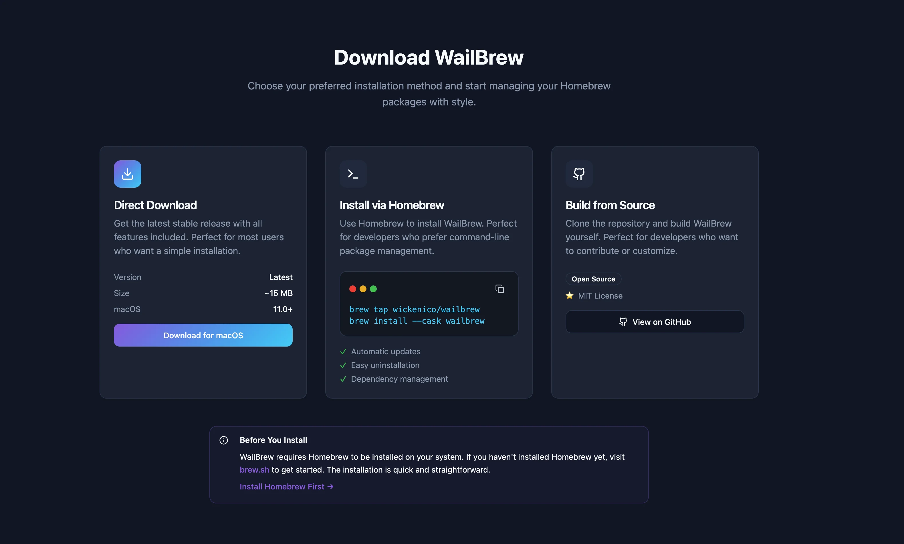

TL;DR

Homebrew, c’est le gestionnaire de paquets le plus puissant sur macOS. Mais soyons honnêtes : taper `brew install machin`, `brew upgrade truc`, et mémoriser 50 commandes, c’est chiant.

Surtout si t’es pas à l’aise avec le Terminal.

**WailBrew** change la donne en apportant une **interface graphique complète** pour Homebrew. Recherche d’apps, installation one-click, mises à jour groupées, tout ça sans toucher au Terminal.

Dans ce guide, je te montre comment installer WailBrew (prérequis : Homebrew déjà installé), utiliser l’interface pour gérer tes apps, et comprendre ce que WailBrew fait en arrière-plan. Je compare aussi avec les alternatives (Cork, Cakebrew) et te dis quand tu dois quand même retourner au Terminal.

- - - - - -


- [Le problème : Homebrew est puissant mais intimidant](#le-probleme-homebrew-est-puissant-mais-intimidant)
  - [Ce que WailBrew résout](#ce-que-wail-brew-resout)
- [Prérequis : installer Homebrew d’abord](#prerequis-installer-homebrew-dabord)
- [Installation de WailBrew macOS](#installation-de-wail-brew-mac-os)
  - [Téléchargement direct](#telechargement-direct)
  - [Via Homebrew (ironique mais pratique)](#via-homebrew-ironique-mais-pratique)
- [Interface de WailBrew : tour du dashboard](#interface-de-wail-brew-tour-du-dashboard)
  - [1. Onglet « Installed » (Apps installées)](#1-onglet-installed-apps-installees)
  - [2. Onglet « Search » (Recherche d’apps)](#2-onglet-search-recherche-dapps)
  - [3. Onglet « Updates » (Mises à jour)](#3-onglet-updates-mises-a-jour)
  - [4. Menu « Maintenance »](#4-menu-maintenance)
- [Utilisation : installer et gérer des apps avec WailBrew](#utilisation-installer-et-gerer-des-apps-avec-wail-brew)
  - [Installer une app en 3 clics](#installer-une-app-en-3-clics)
  - [Mettre à jour toutes les apps d’un coup](#mettre-a-jour-toutes-les-apps-dun-coup)
  - [Désinstaller une app proprement](#desinstaller-une-app-proprement)
- [Ce que WailBrew fait en arrière-plan](#ce-que-wail-brew-fait-en-arriere-plan)
  - [Mapping GUI → CLI](#mapping-gui-%E2%86%92-cli)
  - [Pourquoi c’est important ?](#pourquoi-cest-important)
- [Limites de WailBrew : quand tu dois retourner au Terminal](#limites-de-wail-brew-quand-tu-dois-retourner-au-terminal)
  - [1. Services système (daemons)](#1-services-systeme-daemons)
  - [2. Tap (repositories externes)](#2-tap-repositories-externes)
  - [3. Options d’installation avancées](#3-options-dinstallation-avancees)
  - [4. Dépannage / diagnostics](#4-depannage-diagnostics)
- [Comparaison : WailBrew vs alternatives](#comparaison-wail-brew-vs-alternatives)
  - [WailBrew vs Cork](#wail-brew-vs-cork)
  - [WailBrew vs Cakebrew](#wail-brew-vs-cakebrew)
  - [WailBrew vs Homebrew CLI pur](#wail-brew-vs-homebrew-cli-pur)
- [Workflow recommandé : WailBrew + Terminal](#workflow-recommande-wail-brew-terminal)
  - [Usage quotidien : WailBrew](#usage-quotidien-wail-brew)
  - [Cas avancés : Terminal](#cas-avances-terminal)
- [Tips et astuces pour optimiser WailBrew](#tips-et-astuces-pour-optimiser-wail-brew)
  - [1. Configurer les notifications](#1-configurer-les-notifications)
  - [2. Planifier les mises à jour automatiques](#2-planifier-les-mises-a-jour-automatiques)
  - [3. Exporter la liste d’apps installées](#3-exporter-la-liste-dapps-installees)
  - [4. Nettoyer régulièrement avec Cleanup](#4-nettoyer-regulierement-avec-cleanup)
- [Transition vers le Terminal : apprendre Homebrew CLI](#transition-vers-le-terminal-apprendre-homebrew-cli)
  - [Commandes essentielles à connaître](#commandes-essentielles-a-connaitre)
- [Conclusion : WailBrew, le pont entre GUI et Terminal](#conclusion-wail-brew-le-pont-entre-gui-et-terminal)
- [FAQ WailBrew macOS](#faq-wail-brew-mac-os)
  - [WailBrew est-il gratuit ? ](#faq-question-1764017937777)
  - [WailBrew fonctionne-t-il sans Homebrew ?](#faq-question-1764017946855)
  - [Puis-je utiliser WailBrew ET Homebrew CLI ?](#faq-question-1764017957629)
  - [WailBrew gère-t-il les services (PostgreSQL, Nginx…) ?](#faq-question-1764017967701)
  - [WailBrew fonctionne-t-il sur Apple Silicon (M1/M2/M3) ?](#faq-question-1764017978350)
  - [Quelle différence avec Cork ou Cakebrew ?](#faq-question-1764017987765)
- [Liens utiles](#liens-utiles)


Le problème : Homebrew est puissant mais intimidant

[Homebrew](../installation-homebrew-macos/.md) est LE gestionnaire de paquets macOS. Si t’es admin système ou développeur, c’est indispensable.

Mais pour beaucoup de gens, le Terminal fait peur. Taper des commandes, gérer des dépendances, comprendre la différence entre `formula` et `cask`… c’est une barrière à l’entrée.

### Ce que WailBrew résout

Avec WailBrew, tu fais tout ce que Homebrew fait, mais en **cliquant** au lieu de **taper** :

Action | Homebrew CLI | WailBrew GUI  | **Installer une app**  | `brew install nom-app` | Recherche &gt; Clic sur Install | **Mettre à jour toutes les apps** | `brew update && brew upgrade` | Clic sur « Update All » | **Désinstaller une app** | `brew uninstall nom-app` | Clic sur « Uninstall » | **Voir les apps installées**  | `brew list` | Liste visuelle avec icônes  | **Voir les apps obsolètes** | `brew outdated` | Badge rouge sur les apps | 

WailBrew ne remplace pas Homebrew. Il l’**enrobe** dans une GUI moderne.

- - - - - -

Prérequis : installer Homebrew d’abord

**WailBrew ne peut PAS fonctionner sans Homebrew**. C’est juste une interface graphique, pas un gestionnaire de paquets standalone.

Si t’as pas encore Homebrew, lis d’abord mon [guide d’installation Homebrew](https://brandonvisca.com/installation-homebrew-macos/). C’est une commande à copier-coller dans le Terminal, ça prend 2 minutes.

Une fois Homebrew installé, reviens ici pour installer WailBrew.

- - - - - -

Installation de WailBrew macOS

### Téléchargement direct

1. Va sur [wailbrew.com](https://wailbrew.com/) (ou le repo GitHub officiel)
2. Télécharge le fichier `.dmg`
3. Ouvre le DMG et glisse **WailBrew** dans `/Applications`
4. Lance WailBrew

Au premier lancement, WailBrew vérifie que Homebrew est installé. Si c’est bon, il affiche ton dashboard.

### Via Homebrew (ironique mais pratique)

Si tu veux installer WailBrew **avec** Homebrew (oui, c’est méta) :

```bash
brew install --cask wailbrew

```

## Homebrew CLI
brew search firefox
brew install --cask firefox

## WailBrew GUI
## Tape "firefox" > Clique Install


C’est plus rapide pour découvrir de nouvelles apps.

### 3. Onglet « Updates » (Mises à jour)

Liste toutes les apps qui ont une mise à jour disponible.

**Actions** :

- **Update All** : Met à jour toutes les apps d’un coup (équivalent : `brew upgrade`)
- **Update Selected** : Sélectionne les apps à mettre à jour (coche les cases)

WailBrew gère les dépendances automatiquement. Si une app A dépend de la lib B qui a une mise à jour, WailBrew met à jour B d’abord.

### 4. Menu « Maintenance »

WailBrew propose des actions de maintenance Homebrew :

- **Cleanup** : Supprime les anciennes versions (équivalent : `brew cleanup`)
- **Doctor** : Vérifie que Homebrew fonctionne bien (équivalent : `brew doctor`)
- **Update Homebrew** : Met à jour Homebrew lui-même (équivalent : `brew update`)

Ces actions sont accessibles via un menu déroulant. Pratique pour l’entretien mensuel.

- - - - - -

Utilisation : installer et gérer des apps avec WailBrew

### Installer une app en 3 clics

**Exemple : installer iTerm2**

1. Ouvre WailBrew
2. Onglet **Search**
3. Tape « iterm2 »
4. Clique sur **iTerm2** dans les résultats
5. Clique sur **Install**

WailBrew télécharge et installe iTerm2. Une notification macOS confirme l’installation.

Résultat : iTerm2 est dans `/Applications`, prêt à être lancé. Aucune commande Terminal nécessaire.

Si tu veux voir comment faire ça avec Homebrew CLI, check mon [guide iTerm2](https://brandonvisca.com/iterm2-guide-configuration-macos-2025/).

### Mettre à jour toutes les apps d’un coup

**Workflow mensuel** :

1. Ouvre WailBrew
2. Onglet **Updates**
3. Clique sur **Update All**

WailBrew met à jour toutes tes apps Homebrew (Casks + Formulas). Ça peut prendre 5-10 minutes selon le nombre d’apps.

**Équivalent Homebrew CLI** :

```bash
brew update
brew upgrade
brew cleanup

```

brew services start postgresql


WailBrew n’a pas d’interface pour gérer les services (start/stop/restart).

### 2. Tap (repositories externes)

Homebrew supporte les « taps » (repos tiers). Par exemple, installer des outils qui sont pas dans le repo officiel :

```bash
brew tap user/repo
brew install user/repo/tool

```

brew install vim --with-python3


### 4. Dépannage / diagnostics

Si Homebrew plante, `brew doctor` en CLI donne plus d’infos que l’interface WailBrew.

Pareil pour les logs détaillés : le Terminal reste plus pratique.

- - - - - -

Comparaison : WailBrew vs alternatives

Il y a d’autres GUI pour Homebrew. Voici comment elles se comparent.

### WailBrew vs Cork

**Cork** est l’autre GUI populaire pour Homebrew.

Fonctionnalité | WailBrew | Cork | **Interface** | Moderne, simple | Moderne, minimaliste | **Installation apps** | ✅ | ✅ | **Mises à jour groupées** | ✅ | ✅ | **Gestion services** | ❌ | ✅ (start/stop daemons) | **Gestion taps** | ❌ | ✅ (ajouter/retirer taps) | **Prix** | Gratuit | Gratuit | **Maintenance** | ✅ Actif | ✅ Actif | 

**Mon avis** : Cork est plus complet (gestion services, taps). WailBrew est plus simple et plus rapide pour l’usage basique (installer/mettre à jour des apps).

Si tu fais juste de la gestion d’apps classiques, WailBrew suffit. Si tu gères des services (PostgreSQL, Nginx…), Cork est mieux.

### WailBrew vs Cakebrew

**Cakebrew** est l’ancienne référence GUI Homebrew. Mais il est moins maintenu.

Fonctionnalité | WailBrew | Cakebrew | **Interface** | Moderne | Datée | **Performance** | ⚡ Rapide | 🐢 Plus lent | **Maintenance** | ✅ Actif (2024) | ⚠️ Moins actif | **Compatibilité Apple Silicon** | ✅ Natif | ⚠️ Rosetta parfois nécessaire | 

WailBrew a dépassé Cakebrew. Si tu utilises encore Cakebrew, migre vers WailBrew ou Cork.

### WailBrew vs Homebrew CLI pur

Aspect | WailBrew GUI | Homebrew CLI | **Courbe d’apprentissage** | Faible (interface intuitive) | Élevée (commandes à mémoriser) | **Vitesse** | Moyen (charge GUI) | Rapide (commandes directes) | **Contrôle** | Limité (options de base) | Total (toutes les options) | **Découvrabilité** | Excellente (recherche visuelle) | Moyenne (faut connaître les noms) | **Pour qui ?** | Débutants, usage occasionnel | Power users, automatisation | 

**Mon conseil** : Utilise WailBrew pour l’usage quotidien (installer/mettre à jour des apps). Garde le Terminal pour les cas avancés (services, taps, options custom).

- - - - - -

Workflow recommandé : WailBrew + Terminal

La meilleure approche, c’est de **combiner les deux**.

### Usage quotidien : WailBrew

- **Installer des apps** : WailBrew (recherche visuelle, one-click install)
- **Mettre à jour** : WailBrew (Update All mensuel)
- **Désinstaller** : WailBrew (liste visuelle, clic Uninstall)

### Cas avancés : Terminal

- **Gérer des services** : `brew services start/stop/restart`
- **Ajouter des taps** : `brew tap user/repo`
- **Options d’installation** : `brew install app --with-option`
- **Dépannage** : `brew doctor`, `brew config`

Avec cette approche, tu profites de la simplicité de WailBrew pour 90% des tâches, et tu passes au Terminal seulement quand c’est nécessaire.

Si t’es complètement débutant avec le Terminal, commence par WailBrew. Une fois que tu te sens à l’aise, apprends Homebrew CLI petit à petit. Mon [guide iTerm2](../iterm2-guide-configuration-macos-2025/.md) peut t’aider à apprivoiser le Terminal.

- - - - - -

Tips et astuces pour optimiser WailBrew

### 1. Configurer les notifications

WailBrew peut t’envoyer une notif macOS quand :

- Une installation est terminée
- Des mises à jour sont disponibles
- Une erreur survient

**Configuration** :

- **WailBrew &gt; Preferences &gt; Notifications**
- Active les notifications que tu veux

Pratique pour lancer une installation longue (ex : Docker) et être notifié quand c’est terminé.

### 2. Planifier les mises à jour automatiques

WailBrew peut vérifier automatiquement les mises à jour.

**Configuration** :

- **Preferences &gt; Updates**
- Coche **« Check for updates automatically »**
- Fréquence : Daily, Weekly, Monthly

WailBrew affiche un badge sur l’icône Dock quand des mises à jour sont dispo.

### 3. Exporter la liste d’apps installées

Si tu veux sauvegarder la liste de tes apps Homebrew (pour réinstaller sur un autre Mac) :

**Via WailBrew** :

- **Menu &gt; Export Installed Apps**
- Génère un fichier texte avec tous les noms d’apps

**Via Homebrew CLI** (plus complet) :

```bash
brew bundle dump --file=~/Brewfile

```

brew bundle install --file=~/Brewfile


### 4. Nettoyer régulièrement avec Cleanup

Homebrew garde les anciennes versions des apps (au cas où tu veux rollback). Mais ça consomme de l’espace disque.

**Nettoyer avec WailBrew** :

- **Menu &gt; Maintenance &gt; Cleanup**
- Supprime les anciennes versions

Ça peut libérer plusieurs gigas. Fais-le une fois par mois.

- - - - - -

Transition vers le Terminal : apprendre Homebrew CLI

WailBrew c’est parfait pour débuter, mais si tu veux devenir un power user macOS, tu dois apprendre Homebrew CLI.

### Commandes essentielles à connaître

**Installer une app** :

```bash
brew install nom-app          # Formula (CLI tool)
brew install --cask nom-app   # Cask (GUI app)

```

brew update                   # Met à jour Homebrew
brew upgrade                  # Met à jour toutes les apps
brew upgrade nom-app          # Met à jour une app spécifique


**Désinstaller** :

```bash
brew uninstall nom-app

```

brew list                     # Toutes les apps
brew list --cask              # Juste les Casks (GUI)
brew list nom-app             # Fichiers d'une app


**Rechercher** :

```bash
brew search firefox

```

brew info nom-app             # Détails + dépendances


**Nettoyage** :

```bash
brew cleanup                  # Supprimer anciennes versions
brew doctor                   # Vérifier que Homebrew va bien

```

## Articles connexes

- [Ice : L'alternative gratuite à Bartender qui révolutionne vo](/ice-macos-gestionnaire-barre-menu-gratuit-2025/)
- [Comment réduire la taille de vos images de 70% sur Mac (méth](/reduire-taille-images-mac-webp/)
