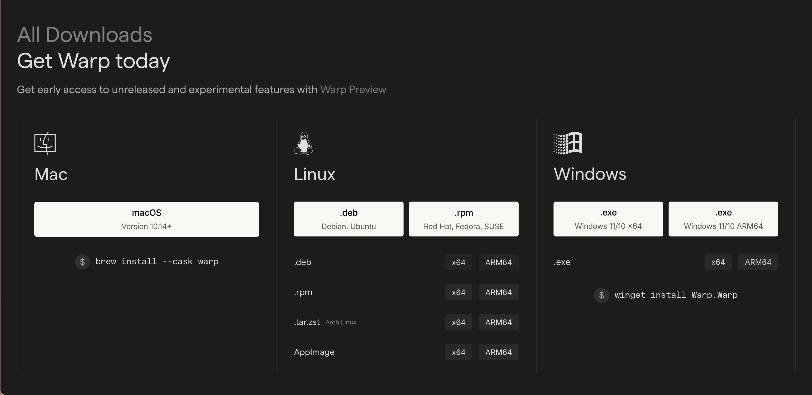

Quand le terminal rencontre l’IA (et ça change tout)
----------------------------------------------------


**Soyons honnêtes** : pendant des années, on a bidouillé nos terminaux avec Oh My Zsh, iTerm2, et des thèmes à n’en plus finir. Ça fonctionne, c’est solide, mais… **et si on pouvait faire mieux ?**

[Warp Terminal](https://www.warp.dev/) débarque en 2025 avec une promesse osée : **transformer le terminal en environnement de développement agentique**. Comprenez : un terminal qui **comprend ce que vous voulez faire**, qui **génère du code**, qui **détecte les erreurs**, et qui **peut même déployer en prod**.

**Spoiler alert :** Après 3 mois de test intensif sur mes serveurs de prod et mes projets perso, je ne suis plus sûr de vouloir revenir en arrière. Et pourtant, j’adore iTerm2.

> **Ce que vous allez apprendre :**  
> ✅ Ce qui rend Warp différent d’iTerm2 (vraiment différent)  
> ✅ Installation sur macOS, Linux, Windows  
> ✅ Les features IA qui changent la donne  
> ✅ Warp vs iTerm2 : comparatif sans langue de bois  
> ✅ Cas d’usage réels (Docker, SSH, debugging)  
> ✅ Est-ce que ça vaut le coup en 2025 ?

Warp Terminal c’est quoi exactement ?
-------------------------------------

### L’évolution : du terminal au ADE (Agentic Development Environment)

**Au début** (2022), Warp c’était « juste » un terminal moderne écrit en Rust, rapide comme l’éclair, avec une UI qui ne ressemblait à rien d’autre.

**Aujourd’hui** (2025), Warp se positionne comme un **Agentic Development Environment** — un outil qui intègre des agents IA capables de :

- Écrire du code adapté à votre codebase
- Exécuter des commandes système
- Déployer en production
- Monitorer les logs
- Débugger les erreurs en temps réel

**Concrètement** ? Vous tapez en langage naturel « configure nginx pour servir mon app Docker sur le port 8080 avec SSL », et Warp génère les commandes, les explique, et vous propose de les exécuter.

> **Fun fact :** Warp utilise un mix de modèles (OpenAI, Anthropic Claude, Google Gemini) pour obtenir les meilleurs résultats.

- - - - - -

Les features qui font la différence
-----------------------------------

### 1. **Agent Mode : Votre assistant DevOps personnel**

L’Agent Mode, c’est le game changer. Vous décrivez ce que vous voulez faire, et Warp :

1. Analyse votre environnement (OS, services installés, fichiers de config)
2. Génère les commandes nécessaires
3. Vous demande confirmation avant d’exécuter
4. Applique les changements
5. Vérifie que tout fonctionne

**Exemple concret :**

```bash
👤 Vous : "Installe Docker, crée un container PostgreSQL sur le port 5433, et monte un volume pour la persistance"

🤖 Warp : [Analyse votre système]
- Détection : macOS 14.x, Homebrew installé
- Action : Installation Docker via Homebrew
- Configuration : docker-compose.yml généré
- Exécution : docker-compose up -d
```

# Bloc 1 : Commande
```shell
docker ps -a
```

# Bloc 2 : Output (cliquable, copiable, partageable)
```shell
CONTAINER ID   IMAGE     STATUS    PORTS
abc123def456   nginx     Up 2h     0.0.0.0:80->80/tcp
```


- - - - - -

### 3. **Warp Drive : Netflix pour vos commandes**

**Warp Drive** = votre bibliothèque de commandes, runbooks, workflows. Vous (ou votre équipe) créez des :

- **Workflows** : commandes paramétrées réutilisables
- **Notebooks** : tutos interactifs
- **Rules** : automatisations contextuelles

**Exemple :** Vous créez un workflow « Backup PostgreSQL » avec des variables :

```bash
# Workflow : Backup PostgreSQL
docker exec ${CONTAINER_NAME} pg_dump -U ${DB_USER} ${DB_NAME} > backup_$(date +%Y%m%d).sql
docker ps --f<TAB>
→ --filter    --format    --filter-all
```

Et ça s’adapte à votre historique. Plus vous l’utilisez, plus c’est pertinent.

- - - - - -

Installation : Plus simple qu’iTerm2
------------------------------------


### Installation macOS (la méthode propre)

```bash
# Avec Homebrew
brew install --cask warp
```

### Ou téléchargement direct
*  https://www.warp.dev/

## Installation Debian/Ubuntu/Fedora
### Ajout du repo
```shell
wget -qO- https://releases.warp.dev/linux/keys/warp.asc | gpg --dearmor > warp.gpg
sudo install -o root -g root -m 644 warp.gpg /etc/apt/trusted.gpg.d/
sudo sh -c 'echo "deb [arch=amd64] https://releases.warp.dev/linux/deb stable main" > /etc/apt/sources.list.d/warp.list'
```

### Installation
```shell
sudo apt update
sudo apt install warp-terminal
```


**Fedora/RHEL :**
```bash
sudo dnf install warp-terminal
```

## Installation Windows 
### Via winget
```powershell
winget install warp.warp
```

### Ou téléchargement .exe
*  https://www.warp.dev/windows-terminal

> **Astuce :** Sur Windows, utilisez WSL2 pour avoir l’expérience complète.

- - - - - -

Configuration : Ce qui change par rapport à iTerm2
--------------------------------------------------

### Import de votre config existante

**Bonne nouvelle :** Warp détecte automatiquement :

- Votre shell (zsh, bash, fish)
- Votre config Oh My Zsh / Powerlevel10k
- Vos alias et fonctions
- Vos variables d’environnement

**Rien à refaire.** Ça marche out of the box.

- - - - - -

### Personnalisation : Themes & Polices

**Settings & Appearance**

**Themes populaires :**

- **Nord** (mon préféré)
- **Dracula**
- **Tokyo Night**
- **Solarized Dark**

**Polices recommandées :**

- **Fira Code** (ligatures ++)
- **JetBrains Mono**
- **Cascadia Code**

```bash
# Installation police via Homebrew
brew install font-fira-code
```

**Avec Warp + Agent Mode :**

```bash
👤 "Mon container nginx crash, pourquoi ?"

🤖 Warp :
- Détection : Container nginx (abc123)
- Analyse logs : Port 80 déjà utilisé
- Solution proposée :
  1. Identifier le processus : sudo lsof -i :80
  2. Modifier docker-compose.yml : ports: "8080:80"
  3. Restart : docker-compose up -d
```

"Configure nginx reverse proxy pour mon app sur localhost:3000, avec SSL Let's Encrypt, et redirection HTTP vers HTTPS"

**Warp génère :**

```bash
server {
    listen 80;
    server_name example.com;
    return 301 https://$server_name$request_uri;
}

server {
    listen 443 ssl http2;
    server_name example.com;

    ssl_certificate /etc/letsencrypt/live/example.com/fullchain.pem;
    ssl_certificate_key /etc/letsencrypt/live/example.com/privkey.pem;

    location / {
        proxy_pass http://localhost:3000;
        proxy_set_header Host $host;
        proxy_set_header X-Real-IP $remote_addr;
    }
}
```


- - - - - -

### Warp + Git : Pas révolutionnaire (mais efficace)

Warp reconnaît Git, suggère les commandes courantes, mais **ne remplace pas** un bon client Git (GitKraken, Fork, lazygit…).

**À utiliser pour :** commits rapides, pull, push, status.  
**Pas pour :** rebase complexes, merge conflicts.

- - - - - -

Migrer d’iTerm2 vers Warp (ou utiliser les deux)
------------------------------------------------

### Ma recommandation : **Cohabitation intelligente**

**iTerm2 pour :**

- SSH sur des serveurs de prod critiques
- Scripts automatisés qui tournent 24/7
- Travail offline (Warp nécessite internet pour l’IA)

**Warp pour :**

- Dev quotidien (Docker, npm, git…)
- Debugging rapide
- Collaboration avec l’équipe
- Apprendre de nouveaux outils (Kubernetes, Terraform…)

> **Mon setup actuel :**
> 
> - **Warp** = terminal principal (90% du temps)
> - **iTerm2** = backup et scripts automatisés (10%)
